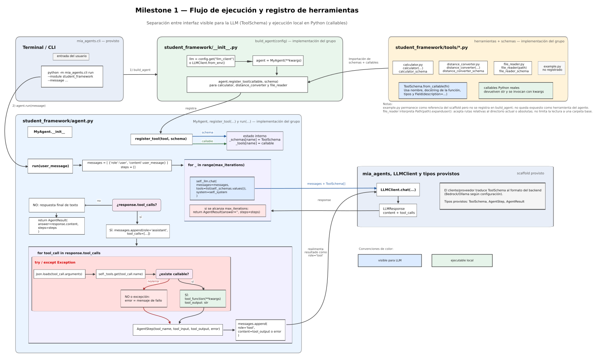

# Milestone 1 — Bucle del agente y herramientas

## 1. Alcance del Milestone

En este milestone trabajamos sobre el núcleo mínimo de un agente capaz de usar herramientas. La idea no era construir todavía un agente con memoria, reparación de salidas o evaluación compleja, sino implementar el flujo básico: recibir un mensaje del usuario, consultar al LLM, ejecutar herramientas cuando el modelo las solicita y devolver una respuesta final.

El punto de partida fue el esqueleto provisto por la cátedra. Sobre esa base, completamos la clase `MyAgent`, configuramos la construcción del agente desde `build_agent` y agregamos las tres herramientas requeridas para M1: una calculadora, un lector de archivos y una herramienta libre de conversión de distancias.

La implementación quedó concentrada principalmente en `student_framework`. En particular:

* `student_framework/__init__.py` construye el agente y registra las herramientas.
* `student_framework/agent.py` contiene el estado interno del agente, el registro de herramientas y el bucle principal.
* `student_framework/tools/*.py` contiene las herramientas y sus schemas.

El alcance se mantuvo deliberadamente acotado a M1. Por eso no se implementaron memoria conversacional entre ejecuciones, salida estructurada con reparación ni estrategias avanzadas de reintento. Esos puntos quedan fuera de esta etapa y corresponden a milestones posteriores.

## 2. Arquitectura general y flujo de información

La Figura 1 resume la arquitectura implementada y sirve como guía para el resto del informe. El diagrama muestra dos momentos distintos del sistema: primero, la construcción del agente y el registro de herramientas; después, la ejecución de `run(user_message)` y el ciclo agente-LLM-herramienta.



El diagrama separa los componentes provistos por el scaffold de los módulos implementados dentro de `student_framework`. Esta separación es importante porque el trabajo de M1 no consistió en reemplazar el framework, sino en completar el agente concreto que se conecta con las interfaces provistas.

En la parte superior de la figura se ve la etapa de construcción. `build_agent(config)`, definido en `student_framework/__init__.py`, obtiene el cliente LLM, instancia `MyAgent` y registra las herramientas disponibles. En la parte central se ve el estado interno del agente, donde cada herramienta queda representada de dos maneras: como schema visible para el LLM y como callable ejecutable localmente. En la parte inferior se ve el bucle de ejecución, donde el agente llama al LLM, procesa posibles `tool_calls`, ejecuta herramientas y realimenta sus resultados.

Las secciones siguientes recorren esas mismas partes del diagrama: primero la interfaz y el registro de herramientas, luego el bucle de ejecución y finalmente las herramientas concretas registradas en el agente.

La decisión de diseño más importante fue separar dos representaciones de cada herramienta:

* una representación visible para el LLM, guardada en `_schemas`;
* una representación ejecutable localmente en Python, guardada en `_tools`.

Ambas se indexan por el mismo nombre de herramienta. Esto permite que el agente le muestre al modelo una interfaz formal de las herramientas, pero conserve bajo control local la ejecución real de cada callable.

En otras palabras, el LLM no ejecuta código Python ni accede directamente a las funciones. El modelo solo recibe schemas. Si decide usar una herramienta, devuelve un `tool_call`, y el agente se encarga de resolver ese nombre contra su registro local y ejecutar la función correspondiente.

## 3. Diseño de la interfaz de herramientas

La parte superior de la Figura 1 muestra cómo se construye la interfaz de herramientas. Cada herramienta se implementó como una función Python tipada. Para describir sus argumentos usamos `Annotated` junto con `Field(description=...)`. A partir de esa firma, `ToolSchema.from_callable(fn)` genera el schema que después se expone al LLM.

Esto evita escribir manualmente un JSON Schema. El schema se deriva del callable: toma el nombre de la función, el docstring de la función, los tipos de los argumentos y las descripciones declaradas con `Field`. Luego, cuando el agente llama a `LLMClient.chat(...)`, el cliente LLM provisto traduce cada `ToolSchema` al formato esperado por el proveedor configurado.

Esa traducción queda delegada al framework. La implementación del agente no depende directamente de Bedrock ni de Ollama, sino del protocolo común expuesto por `LLMClient`.

Por ejemplo, en `file_reader`, el argumento `path` se declara como un `str` acompañado por una descripción. Esa descripción no es el valor del argumento; es metadato usado para que el schema le indique al modelo qué representa ese parámetro. Esta diferencia es importante: el LLM ve una descripción estructurada de la herramienta, pero no ve ni ejecuta su implementación.

El método `register_tool(tool, schema)` es el punto donde se conectan las dos caras de una herramienta. Por cada herramienta registrada, el agente guarda:

```python
self._schemas[schema.name] = schema
self._tools[schema.name] = tool
```

Esta separación permite que `run` pase al LLM únicamente:

```python
tools=list(self._schemas.values())
```

y que, si el modelo devuelve un `tool_call`, el agente pueda buscar la función real con:

```python
self._tools.get(tool_call.name)
```

El diseño queda así organizado alrededor de una correspondencia por nombre: el nombre que el LLM usa en el `tool_call` debe coincidir con el nombre registrado en `_schemas` y `_tools`.

## 4. Bucle de ejecución del agente

La parte inferior de la Figura 1 representa el flujo de ejecución de `run(user_message)`. Al comenzar, el agente construye una lista `messages` con el mensaje del usuario y una lista `steps` vacía para registrar las herramientas ejecutadas durante esa corrida.

Luego entra en un bucle limitado por `max_iterations`. En cada iteración se llama al cliente LLM con el contexto acumulado, los schemas de las herramientas registradas y el prompt de sistema:

```python
self._llm.chat(
    messages=messages,
    tools=list(self._schemas.values()),
    system=self._system,
)
```

A partir de la respuesta del LLM, el agente distingue dos casos.

Si la respuesta no contiene `tool_calls`, se interpreta como respuesta final. En ese caso, `run` devuelve un `AgentResult` con `answer=response.content` y con la lista de pasos acumulados. Si el modelo respondió sin pedir herramientas, esa lista queda vacía.

Si la respuesta contiene `tool_calls`, el agente no responde todavía al usuario. Primero agrega a `messages` la respuesta del asistente con las llamadas solicitadas, y luego procesa cada herramienta pedida por el modelo.

Para cada `tool_call`, el agente:

1. parsea los argumentos recibidos como JSON;
2. busca el callable correspondiente en `_tools`;
3. ejecuta la función si existe;
4. registra el resultado en un `AgentStep`;
5. agrega un mensaje con `role="tool"` a `messages`.

Ese mensaje con `role="tool"` es la forma en que el resultado vuelve al LLM. En la siguiente iteración, el modelo ya no ve solo el pedido original del usuario, sino también la observación producida por la herramienta.

Cada `AgentStep` conserva la trazabilidad de una invocación:

* `tool_name`: nombre de la herramienta solicitada;
* `tool_input`: argumentos recibidos desde el LLM;
* `tool_output`: salida producida por el callable;
* `error`: `None` si la ejecución fue exitosa, o un mensaje de error si hubo una falla.

El bucle termina normalmente cuando el LLM produce texto sin `tool_calls`. Como resguardo ante ciclos indefinidos, el bucle está acotado por `max_iterations`. Si ese límite se alcanza, el método devuelve un `AgentResult` válido con los pasos acumulados y `answer` vacío.

En M1 no se implementa todavía el recorte de historial mediante `max_history_messages`. Ese parámetro se acepta en el constructor porque forma parte del scaffold y será relevante en M2, pero en esta etapa el límite efectivo implementado es el de iteraciones del bucle.

## 5. Herramientas implementadas

Las herramientas registradas en `build_agent` son las que aparecen en la zona superior derecha de la Figura 1. Todas siguen el mismo patrón: callable tipado, schema generado con `ToolSchema.from_callable` y registro explícito en el agente.

El scaffold conserva además `student_framework/tools/example.py` como archivo ilustrativo del patrón de herramientas, pero esa herramienta de ejemplo no se registra en `build_agent`. Por lo tanto, no forma parte de las herramientas efectivamente expuestas por el agente.

### 5.1. `calculator`

La herramienta `calculator` implementa una operación binaria simple. Recibe dos operandos numéricos y un operador. Los operadores soportados son:

* `+`
* `-`
* `*`
* `%`

La herramienta no evalúa expresiones arbitrarias ni usa `eval`. Solo ejecuta la operación binaria indicada y devuelve el resultado como `str`, de acuerdo con el contrato esperado para las herramientas del agente.

### 5.2. `file_reader`

La herramienta `file_reader` implementa lectura de archivos de texto. Recibe una ruta mediante el argumento `path`, la interpreta con `Path(path).expanduser()`, verifica que exista y que corresponda a un archivo regular, y luego intenta leer su contenido como UTF-8.

La herramienta devuelve el contenido como string. No imprime directamente en consola: el contenido vuelve al agente como salida de herramienta, se incorpora a `messages` mediante un mensaje con `role="tool"` y queda disponible para que el LLM redacte la respuesta final.

También se agregó un archivo de ejemplo en `student_framework/examples/file_reader_demo.txt`, pensado para documentar y probar el uso del lector de archivos desde la CLI o desde el agente.

### 5.3. `distance_converter`

Como herramienta libre implementamos `distance_converter`, que convierte valores de distancia a partir de una tabla explícita de pares de unidades soportados. Las unidades contempladas son kilómetros, millas, metros y pies.

Esta herramienta sigue el mismo patrón que las herramientas obligatorias: se define como callable tipado, describe sus argumentos con `Annotated` y `Field(description=...)`, y expone su schema mediante `ToolSchema.from_callable`.

## 6. Validación y comportamiento observado

La implementación fue validada localmente con la suite pública de conformidad M1 provista en el repositorio. La corrida ejecutada finalizó con cinco tests exitosos.

Esa suite verificó los comportamientos básicos del milestone: la existencia de `build_agent`, el tipo de agente devuelto, el retorno de `AgentResult`, el comportamiento ante una respuesta sin herramientas, la firma de `register_tool` y la ejecución de una herramienta cuando el LLM mock devuelve un `tool_call`.

Además de los tests, se realizaron pruebas manuales mediante la CLI usando un modelo local con Ollama. Esas pruebas permitieron observar el uso efectivo de herramientas registradas en el flujo completo del agente.

No se realizaron pruebas manuales con AWS Bedrock en esta etapa. La compatibilidad con proveedores queda mediada por `LLMClient`, pero la validación empírica realizada para este informe fue local.

También se exploró el caso de pedir una herramienta inexistente. En pruebas manuales con una LLM real, el modelo tendió a responder en texto libre en lugar de emitir un `tool_call` desconocido. En esos casos no se generaron `AgentStep`, porque el agente solo registra pasos cuando recibe efectivamente llamadas de herramienta en `response.tool_calls`.

De todos modos, el bucle incluye una defensa para ese escenario: si el cliente LLM devuelve un `tool_call` cuyo nombre no existe en `_tools`, el agente no corta la ejecución con una excepción no controlada. En su lugar registra un `AgentStep` con `error` no nulo y realimenta ese error al LLM como resultado de herramienta.

## 7. Limitaciones conocidas

La implementación cubre el alcance funcional de M1, pero mantiene algunas limitaciones deliberadas o pendientes para etapas posteriores.

* El agente no conserva memoria conversacional entre llamadas sucesivas a `run`.
* `max_history_messages` se acepta en el constructor, pero no se aplica todavía al armado de `messages`.
* No se acumulan ni reportan explícitamente los tokens de entrada y salida en `AgentResult`; esos campos quedan sin uso en esta implementación de M1.
* `structured_call` queda como stub para M2; no se implementó salida estructurada ni reparación de respuestas inválidas.
* No se implementan reintentos sofisticados ante errores de herramientas o respuestas inválidas del modelo.
* `file_reader` no restringe la lectura a una carpeta base. Acepta rutas relativas, absolutas o con `~` según lo resuelto por `Path(path).expanduser()`, siempre que el archivo exista, sea regular y pueda leerse como UTF-8.
* `distance_converter` usa una tabla explícita de pares de conversión; si se pide un par no incluido, la herramienta devuelve un error.
* Si se alcanza `max_iterations`, el agente devuelve un `AgentResult` válido con `answer` vacío y los pasos acumulados.
* La validación manual se realizó con Ollama en entorno local; no se probó manualmente contra AWS Bedrock.
* La suite pública de conformidad ejecutada cubre los comportamientos básicos de M1, pero no todos los casos defensivos mencionados en el enunciado.

Estas limitaciones son consistentes con el alcance del Milestone 1. En esta etapa se priorizó implementar y comprender el bucle mínimo de agente, el registro de herramientas y la ejecución local de callables solicitados por el LLM.
