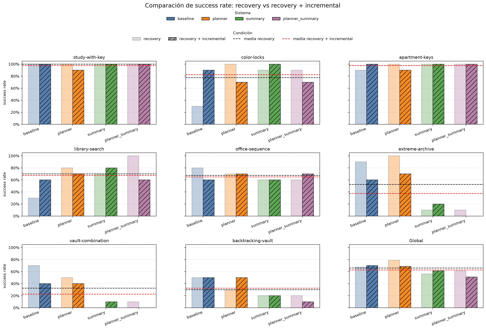
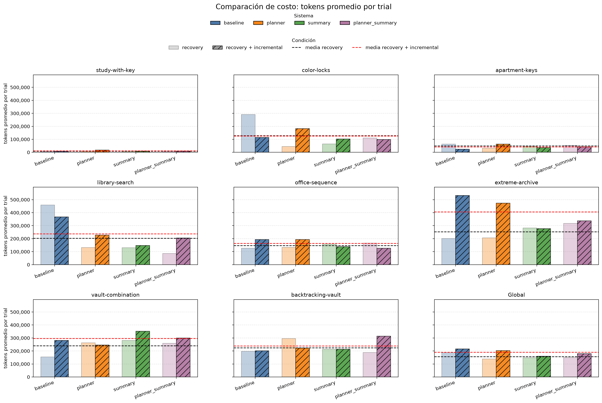
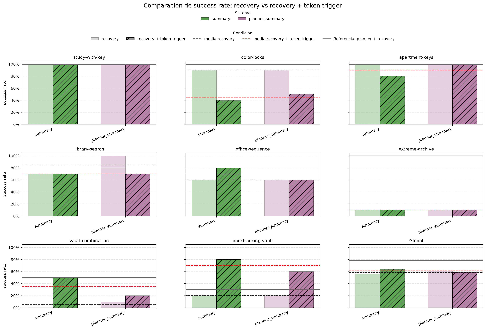
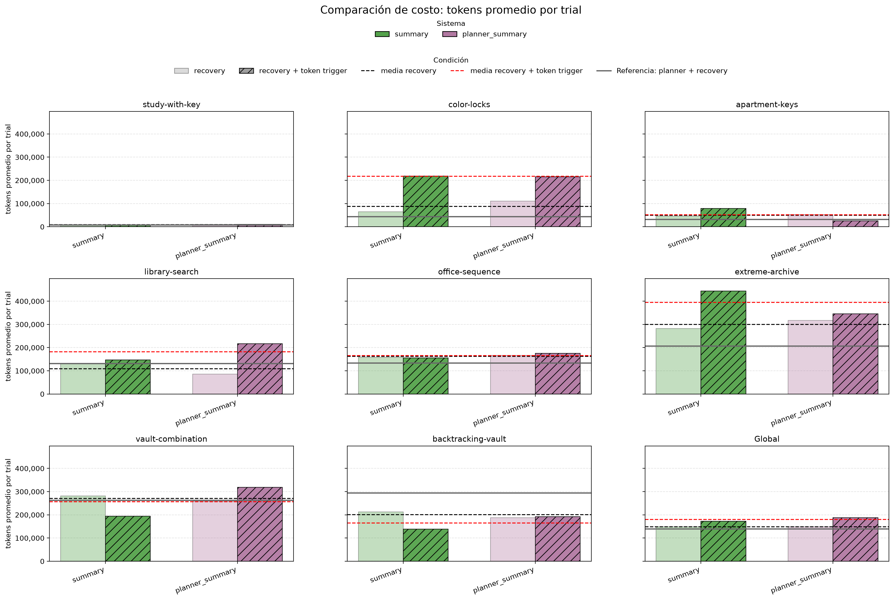
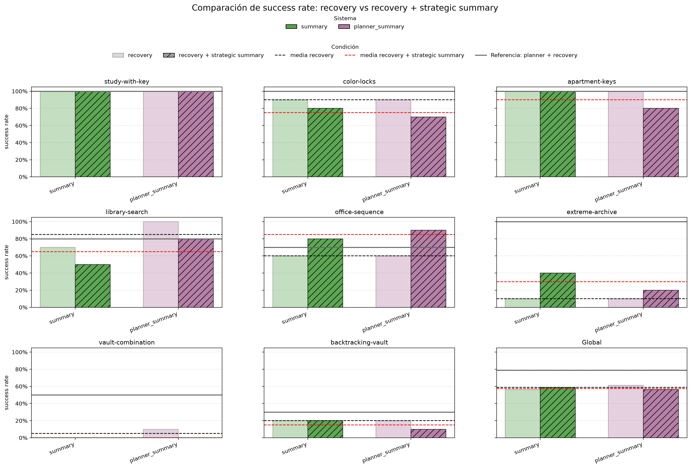
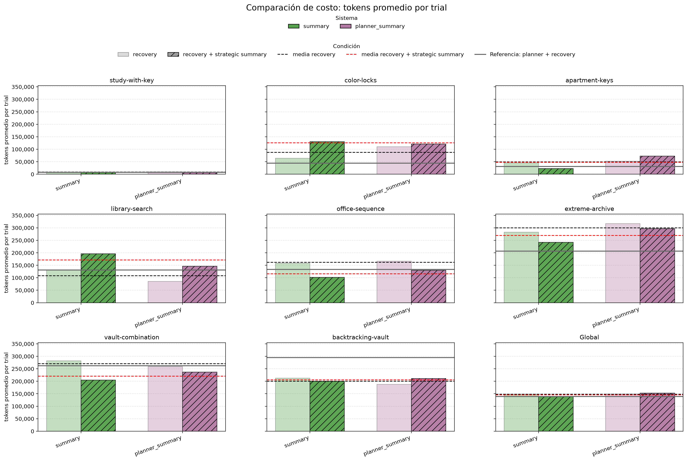

# Informe M3 — Evaluación de agentes autónomos en escape rooms

## Introducción

Este informe describe el trabajo realizado durante el Milestone 3 (M3) del proyecto integrador de Agentes Autónomos. El objetivo central de M3 es evaluar sistemáticamente el agente desarrollado en los milestones anteriores, comparar variantes de configuración y extraer conclusiones sobre sus capacidades y limitaciones.

Para ello se construyó una infraestructura de evaluación reproducible que permite ejecutar y persistir experimentos sobre múltiples escenarios de escape room, verificar el cumplimiento de los objetivos sobre el estado real del entorno y analizar el desempeño desde distintas dimensiones: éxito, errores, consumo, eficiencia, presión de contexto y calidad de planificación.

Las secciones siguientes describen la implementación del agente, la arquitectura de evaluación, el ground truth utilizado, las métricas calculadas, los experimentos corridos y los resultados obtenidos.

---

## 1. Implementación y configuraciones del agente

### 1.1 Base heredada de M1/M2

El agente base es `MyAgent`, implementado en `student_framework/agent.py`. El baseline inicial de M3 conserva el loop ReAct desarrollado en M1/M2, utilizando la misma lógica de interacción LLM–tools y la misma semántica de finalización. Sobre esta base se incorporan posteriormente mecanismos opcionales —como reparación de tool calls y gestión de contexto— y una variante PlannerAgent, lo que permite evaluar cada extensión respecto de una referencia común.

Los parámetros heredados relevantes son:

- **`max_iterations`**: tope de iteraciones del loop. Si el agente no llega a una respuesta final antes de agotarlo, el run termina con error.
- **`max_history_messages`**: introducido en M2, limita la cantidad de mensajes que se envían al LLM en cada llamada. Cuando el historial supera ese límite, los mensajes más antiguos se descartan (política de eliminación plana de M2) o se compactan, como se describe en [Gestión de contexto y estrategia de summarization](#15-gestión-de-contexto-y-estrategia-de-summarization).
- **`register_tool(tool, schema)`**: registra una herramienta callable junto a su esquema. Las herramientas del mundo se inyectan de esta forma antes de cada run.
- **`_structured_call_with_repair()`**: mecanismo heredado para realizar llamadas estructuradas al LLM, validar la respuesta contra un schema y realizar intentos de reparación cuando la salida no es válida. En M3 se reutiliza esta infraestructura para nuevas funcionalidades, como la generación estructurada del plan y la compactación del historial mediante LLM.

### 1.2 Configuración del sistema e integración con el entorno M3

Para M3 se separó explícitamente la configuración del agente de la configuración del modelo de lenguaje. Las variantes de comportamiento del agente se definen mediante `agent_config`, mientras que la selección y los parámetros del LLM se especifican de forma independiente mediante `llm_config`. Esta separación permite combinar una misma implementación del agente con distintos modelos, o mantener fijo el LLM y modificar únicamente el comportamiento del agente, facilitando comparaciones experimentales controladas.

Las configuraciones efectivas de los modelos se definen en [`eval/configs/llm_configs.py`](../eval/configs/llm_configs.py). Durante M3 se utilizaron tres modelos:

| Nombre | Proveedor | Modelo | Contexto configurado |
|---|---|---|---|
| `llama3.1` | Ollama (local) | `llama3.1` | 32 768 tokens |
| `qwen2.5:7b` | Ollama (local) | `qwen2.5:7b` | 32 768 tokens |
| `nova-lite` | AWS Bedrock | `amazon.nova-lite-v1:0` | - |

Los modelos locales se ejecutan vía Ollama; `nova-lite` se accede a través de Amazon Bedrock. En estas configuraciones la temperatura efectiva es `0.2`, fijada mediante `_ConfiguredLLMClient` independientemente del default del proveedor.

**Integración de las herramientas del mundo**

El framework desarrollado en M1/M2 incluía herramientas generales como `calculator`, `distance_converter`, `file_reader`. Estas herramientas no forman parte del dominio de las escape rooms y podrían introducir capacidades ajenas al entorno evaluado. Por este motivo, las configuraciones utilizadas en M3 establecen `register_default_tools=False`, evitando su registro automático.

En su lugar, para cada trial se construye una nueva instancia de World y se generan sus herramientas mediante:

`make_world_tools(world)`

Estas herramientas se incorporan al agente reutilizando la interfaz existente:

`agent.register_tool(tool, schema)`

De esta forma, no fue necesario modificar el mecanismo de registro de herramientas desarrollado en los milestones anteriores: M3 reutiliza la misma interfaz para conectar el agente con un nuevo dominio.

Las herramientas expuestas por mia_world permiten al agente observar y modificar el entorno mediante acciones como `look`, `examine`, `take`, `use` y, en los escenarios que incluyen navegación, `go`. Cada herramienta queda vinculada a la instancia de World correspondiente al trial en curso, por lo que sus ejecuciones modifican directamente el estado del entorno.

El estado resultante del World constituye posteriormente la fuente de verdad utilizada por el evaluador para determinar si el agente alcanzó el objetivo del escenario, como se describe en la sección de ground truth.

### 1.3 Reparación de tool calls

Como una de las primeras variantes evaluadas en M3, se habilitó la reparación de tool calls malformados mediante el parámetro `tool_call_repair_max_attempts`. Con valor `0`, una llamada inválida no activa intentos de reparación; con un valor positivo, el agente puede realizar nuevos intentos incorporando información sobre el error producido.

Esta variante no modifica la estrategia de razonamiento del agente, sino su capacidad de recuperarse ante errores de formato o schema en la invocación de herramientas. Esto permite evaluar por separado cuánto del desempeño del baseline está limitado por errores de tool calling y cuánto responde a problemas de planificación, navegación u otras capacidades.

### 1.4 Agente planificador (`PlannerAgent`)

[`PlannerAgent`](../student_framework/planner_agent.py) extiende `MyAgent` con una fase de planificación explícita que ocurre antes de entrar al loop ReAct.

Al recibir el primer mensaje del usuario, `PlannerAgent` llama a `_structured_call_with_repair()` con `purpose="planning"` para que el LLM genere un `Plan` estructurado. El [`Plan`](../student_framework/plan.py) contiene entre 1 y 12 instancias de `PlanStep`, cada una con una descripción de la acción a realizar. Si el LLM devuelve un plan inválido, por ejemplo con cero pasos, se reintenta hasta `planning_repair_max_attempts` veces.

Una vez generado el plan, su contenido se serializa como texto numerado y se inyecta en el mensaje inicial antes de llamar al loop ReAct de `MyAgent`:

```
{user_message}

Plan de acción:
1. {step_1}
2. {step_2}
...

{plan_guidance}
```

El parámetro `plan_guidance` permite configurar cómo el agente debe interpretar el plan (por defecto, como una guía flexible adaptable a las observaciones del entorno).

La planificación es, por diseño, estática: el plan se genera al comienzo y no existe un mecanismo de replanning durante el loop ReAct. Aunque el agente puede apartarse de la guía inicial a partir de nueva evidencia, el planificador no vuelve a invocarse cuando las observaciones contradicen o vuelven obsoleta la estrategia original.

A nivel de implementación, el flag `_initial_plan_generated` garantiza que la planificación ocurre solo en el primer turno. En intentos subsiguientes del mismo trial, el agente reutiliza el plan ya inyectado en el historial y entra directamente al loop ReAct. Los tokens consumidos durante la planificación se acumulan en el `AgentResult` final vía un `response_callback`.

### 1.5 Gestión de contexto y estrategia de summarization

#### 1.5.1 El problema que M2 no cubría

En M2, `max_history_messages` limitaba el historial enviado al modelo eliminando mensajes pertenecientes a **turnos ya cerrados**: dado un presupuesto de mensajes, la política descartaba trazas intermedias completas de turnos anteriores y, si no alcanzaba, mensajes `user` y respuestas finales viejas. Esa política asume que el exceso de contexto proviene de la acumulación de turnos.

En los escenarios de horizonte largo de M3 apareció un caso que esa asunción no contempla: **un único turno puede agotar el presupuesto por sí solo**. Un trial de `vault-combination` o `backtracking-vault` ejecuta decenas de rondas ReAct dentro del mismo turno, y cada ronda agrega al historial un mensaje `assistant` más un mensaje `tool` por cada tool call. Cuando todo el historial pertenece al turno activo, no hay ningún turno cerrado que se pueda descartar de forma segura, y el run muere por presupuesto de contexto sin haber cometido ningún error de razonamiento.

La evidencia confirma que el problema es real y no hipotético, y que aparece incluso sin forzarlo. En el [análisis de errores de la comparación histórica de tres modelos](../eval/results/historic/evaluations/m3-three-model-repair-comparison-eval-003/error_analysis.md), `context_overflow` explica **27 de 311 trials fallidos (9%)** con la ventana por defecto de 100 mensajes. En el [análisis de contexto del `m3-final-run-001`](../eval/results/evaluations/m3-final-eval-001/context_analysis.md), las variantes que corren a ventana 100 igualmente registran terminaciones por presupuesto tras 19 a 31 iteraciones ReAct. En todos los casos la terminación ocurre en el `attempt_index` 1: es presión **intra-turno**, no acumulación de turnos. El 48% de `context_overflow` del `m3-final-run-001` no sirve como motivación, porque proviene sobre todo de las variantes cuya ventana se redujo deliberadamente para activar el mecanismo, como se analiza en [Consecuencias observadas](#155-consecuencias-observadas).

Para tratar esta presión **intra-turno** se incorporó un mecanismo opcional de compactación: `MyAgent` acepta un `history_compactor`, un callable que recibe los mensajes que serían descartados y devuelve un texto que los reemplaza. Cuando no se configura compactor, el agente mantiene exactamente la política de eliminación plana de M2, de modo que el baseline de M3 sigue siendo comparable con M2.

#### 1.5.2 Decisiones de diseño transversales a ambas estrategias

Las siguientes decisiones son independientes de cómo se genere el resumen y se implementan en [`student_framework/agent.py`](../student_framework/agent.py). Los valores utilizados por las configuraciones experimentales, como `compaction_keep_recent_rounds`, se declaran en [`eval/configs/agent_configs.py`](../eval/configs/agent_configs.py).

**La unidad de compactación es la ronda de herramientas completa, no el mensaje.** `_closed_tool_rounds()` identifica rangos `[assistant con tool_calls, sus mensajes tool)` y la compactación reemplaza siempre rondas enteras. La alternativa —cortar por cantidad de mensajes— era más simple pero producía historiales inválidos: un mensaje `tool` sin su `assistant` correspondiente queda huérfano y las APIs de tool calling lo rechazan, y una respuesta con varios tool calls partida a la mitad deja llamadas sin resultado. Preferimos perder un poco de granularidad antes que emitir historiales que el proveedor pueda rechazar.

**Se conservan en crudo las últimas `compaction_keep_recent_rounds` rondas.** El resumen es, por definición, una pérdida de información; las observaciones más recientes son las que el agente necesita con más detalle para decidir la próxima acción. Fijamos el valor en 2 para todas las configuraciones evaluadas: suficiente para que el modelo vea el resultado de su última acción y el de la anterior, sin volver el mecanismo inútil por conservar demasiado.

**Si conservar esas rondas no alcanza, una segunda pasada compacta todas.** `_compact_active_turn()` itera sobre `(compaction_keep_recent_rounds, 0)`. La alternativa era fallar directamente cuando el presupuesto no se satisface conservando las rondas recientes, pero eso convertía el parámetro en una causa de muerte del run. Degradar la calidad del contexto es preferible a terminar la ejecución.

**El resumen se inyecta como mensaje con rol `user`, no `assistant`.** Un `assistant` sin `tool_calls` es, para la política de trimming heredada, la "respuesta final" de un turno, y es justamente lo que la segunda pasada elimina primero: el resumen sería el primer candidato a ser borrado. Con rol `user` el resumen sobrevive al mismo mecanismo que lo creó. Los resúmenes se prefijan (`[Resumen de contexto previo]` y `[Resumen de progreso del intento actual]`) para que el modelo distinga contexto reconstruido de observación directa del mundo, y `_merge_adjacent_user_messages()` fusiona mensajes `user` contiguos antes de la llamada, evitando que la inyección produzca secuencias de `user` consecutivos que algunos proveedores rechazan.

**Los resúmenes se fusionan en lugar de acumularse.** Cuando vuelve a aparecer presión de contexto, el rango a compactar arranca en el primer mensaje posterior al `user` del turno, de modo que el resumen anterior queda **incluido** en el nuevo rango y es reemplazado por uno solo. La alternativa —resumir sólo lo nuevo y dejar el resumen viejo intacto— hacía que los propios resúmenes se acumularan como mensajes independientes y volvieran a generar la presión que venían a resolver.

**El fallo del compactor no aborta el run por excepción.** `_compact_messages()` captura cualquier error, lo registra en la traza como evento `history_compaction` con su error y devuelve `None`; quien llama decide el fallback. En la eviction de historial cerrado el fallback es la eliminación plana de M2, que siempre está disponible. En la compactación intra-turno **no hay fallback seguro**: eliminar mensajes arbitrariamente fragmentaría rondas, así que el attempt termina de forma controlada con `context_overflow`. La `trial_config` determina después si esa terminación cierra el trial o puede abrir un nuevo attempt. La decisión fue preferir una terminación explícita y clasificable a un historial silenciosamente corrupto. Según el [análisis de contexto del `m3-final-run-001`](../eval/results/evaluations/m3-final-eval-001/context_analysis.md), se registraron **518 eventos de compactación y 88 fallas**, y esas fallas son parte de por qué las variantes con resumen terminan por presupuesto.

**El compactor recibe una copia de los mensajes.** `_compact_messages()` pasa un `deepcopy` del rango. Un compactor que mutara los mensajes que recibe —o, en la variante por LLM, un error en medio de la construcción del transcript— no puede dejar el historial del agente en un estado intermedio.

**Guarda de terminación.** La compactación sólo se aplica cuando el rango tiene al menos 2 mensajes (`end - start >= 2`). Reemplazar un único mensaje por un resumen no reduce la longitud del historial, y el bucle de trimming no terminaría nunca.

**La estrategia se declara con un string, no con un callable.** `build_agent` acepta `history_compaction: "deterministic" | "llm"` (además de un callable, que usan los tests). El motivo es de infraestructura de evaluación: las `agent_config` de `eval/` se persisten tal cual en el manifest del run, y un callable no es serializable. Con un string, el manifest documenta con precisión qué estrategia produjo cada resultado.

**El compactor por LLM se inyecta después de construir el agente.** `make_llm_history_compactor(agent)` necesita el agente para reusar su cliente LLM, y el agente necesita el compactor: la dependencia es circular. `set_history_compactor()` resuelve el ciclo en dos pasos en lugar de mover la construcción del cliente afuera del agente.

#### 1.5.3 Estrategia A — compactación determinística

[`deterministic_history_compactor`](../student_framework/context/summarizer.py) construye una representación compacta de las rondas seleccionadas **sin realizar llamadas adicionales al LLM**. Cada acción se plega en una línea `acción → resultado`, y las observaciones extensas se truncan a 200 caracteres.

Existe deliberadamente como **control experimental**: aísla cuánto del efecto de la gestión de contexto se explica por *comprimir* la trayectoria y cuánto requiere *resumirla con abstracción*. Su costo de inferencia es cero y no introduce modos de falla nuevos (no puede alucinar, no puede fallar el schema, no puede agotar el rate limit). Si esta estrategia bastara, la compactación por LLM no se justificaría.

Dos decisiones específicas:

**La deduplicación usa las observaciones completas, no las truncadas.** Las líneas se generan dos veces —una completa y una truncada— y se deduplica por la versión completa. Si se deduplicara por la truncada, dos observaciones distintas que comparten los primeros 200 caracteres (algo habitual en `extreme-archive`, donde veinte expedientes arrancan con la misma prosa burocrática) se fusionarían en una sola y el agente perdería justamente la diferencia que estaba buscando.

**Cuando dos observaciones distintas colisionan al truncarse, ambas se conservan completas.** La representación truncada sólo se usa si es inequívoca; si varias líneas completas distintas caen en la misma línea truncada, se emiten completas. El resumen crece, pero no miente. Las repeticiones exactas se colapsan con un sufijo `(xN)`, que además le informa al modelo que estuvo repitiendo la misma acción.

La estrategia es explícitamente *lossy*: no busca preservar la trayectoria, sino reducir su tamaño con reglas determinísticas y sin introducir un segundo proceso de interpretación.

#### 1.5.4 Estrategia B — summarization por LLM

[`make_llm_history_compactor()`](../student_framework/context/summarizer.py) usa el propio LLM del agente para producir una representación semántica de la trayectoria compactada. El objetivo no es comprimir mecánicamente cada observación, sino **identificar qué información sigue siendo relevante para continuar resolviendo el escenario**.

**El resumen es estructurado, no prosa libre.** Se pide un `TrajectorySummary` con cuatro campos:

| Campo | Contenido |
|---|---|
| `discovered_facts` | Hechos del mundo: objetos, ubicaciones, relaciones, códigos y combinaciones |
| `attempted_actions` | Acciones ya intentadas y su resultado, incluidas las fallidas |
| `open_subgoals` | Subobjetivos pendientes o plan parcial |
| `dead_ends` | Caminos que ya se sabe que no funcionan, y por qué |

La elección de estos cuatro campos responde a los modos de falla observados. `discovered_facts` y `open_subgoals` sostienen la continuidad del plan. `attempted_actions` y `dead_ends` atacan un problema medido en el [análisis de contexto del `m3-final-run-001`](../eval/results/evaluations/m3-final-eval-001/context_analysis.md): aproximadamente **32% de las acciones ejecutadas son repeticiones intra-trial** de una acción con la misma herramienta, los mismos argumentos y el mismo resultado. Un resumen que sólo preservara el estado del mundo, sin registrar qué ya se intentó y qué ya se descartó, invitaría al agente a re-explorar lo mismo con el contexto recién liberado. Un esquema cerrado además obliga al modelo a poblar las cuatro categorías en lugar de escribir un párrafo narrativo del que después hay que inferir el estado.

**Se piden literales textuales.** El prompt exige copiar textualmente códigos, claves, combinaciones y mensajes de error, y prohíbe inventar información ausente del fragmento. El modo de falla propio de un resumidor no es escribir de más: es **omitir o parafrasear el dato que después resulta clave**. En estos escenarios una llave de color, una combinación de tres núcleos o el texto exacto de un error de cerradura son irrecuperables si el resumen los abstrae a "encontré una pista".

**El transcript que ve el resumidor se trunca más largo que en la estrategia determinística**: 1.000 caracteres por observación, contra 200. La asimetría es intencional. En la estrategia determinística el truncado *es* el resultado final y va directo al historial, así que hay que ser agresivo; acá es sólo la entrada del resumidor, y darle más material mejora lo que puede extraer sin costo en el historial resultante, porque la salida está acotada por el esquema.

**Reusa `_structured_call_with_repair()` con `purpose="history_compaction"`.** Esto trae tres cosas sin código nuevo: validación de la salida contra el esquema con reparación cuando no valida (`history_compaction_repair_max_attempts`), y —crítico— esa maquinaria **arma su propio contexto y no toca `agent._history`**, por lo que es seguro invocarla desde adentro del propio trimming del historial. Un resumidor que construyera su llamada sobre el historial del agente sería reentrante sobre la estructura que está modificando.

**Los tokens del resumidor se contabilizan en el `AgentResult`.** El compactor corre dentro del trimming, donde no puede recibir por parámetro la clausura de acumulación de tokens del run; se expone como `agent._run_response_callback` para que su consumo no quede fuera de la medición. Sin esto, la estrategia más costosa aparecería como la más barata. Con `purpose` se separa el consumo del loop principal del introducido por el resumen. Según el [análisis de eficiencia del `m3-final-run-001`](../eval/results/evaluations/m3-final-eval-001/efficiency_analysis.md), `summary` gasta **48.691 tokens/trial en `agent` y 7.618 en `history_compaction`** (3,4 llamadas de compactación por trial), es decir, el resumen agrega aproximadamente 16% sobre el consumo del loop.

#### 1.5.5 Consecuencias observadas

Ambas estrategias se evaluaron contra un control barato —subir el presupuesto de mensajes sin compactar nada— para separar "el mecanismo aporta" de "el problema era simplemente falta de ventana". La evidencia disponible viene de dos contrastes, y ninguno de los dos permite atribuir el efecto de forma limpia. Conviene explicitar por qué.

**Contraste a ventana 100.** La evidencia corresponde a [los resultados estructurados](../eval/results/historic/evaluations/m3-context-comparison-eval-008/results.json) y al [análisis de presión de contexto](../eval/results/historic/evaluations/m3-context-comparison-eval-008/context_analysis.md) de `m3-context-comparison-eval-008` (`nova-lite`, `multi_attempt`, 80 trials por sistema):

| Sistema | Ventana | Compactación | Éxito | Compactaciones (eventos / fallas) |
|---|---:|---|---:|---:|
| `minimal` | 100 | — | 69% | 0 / 0 |
| `minimal_history_200` | 200 | — | **75%** | 0 / 0 |
| `minimal_compaction` | 100 | determinística | 68% | 8 / 0 |
| `minimal_summary` | 100 | por LLM | 62% | 13 / 4 |

El problema de este contraste es visible en la última columna: **con ventana 100 el mecanismo casi no se dispara** (8 y 13 activaciones en 80 trials). Las diferencias de éxito no son atribuibles a una compactación que apenas ocurrió. Lo único que este contraste sí muestra con claridad es que el control barato gana: **subir el presupuesto a 200 mensajes (75%) supera a las tres variantes**, incluido el baseline.

**Contraste a ventana 20.** La evidencia corresponde a [los resultados estructurados](../eval/results/evaluations/m3-final-eval-001/results.json) y al [análisis de presión de contexto](../eval/results/evaluations/m3-final-eval-001/context_analysis.md) de `m3-final-eval-001` (`nova-lite`, `multi_attempt`, 80 trials por sistema). La reducción de la ventana fue una decisión deliberada, precisamente para forzar que el mecanismo se active de manera observable:

| Sistema | Ventana | Compactación | Éxito | Compactaciones | `context_overflow` |
|---|---:|---|---:|---:|---:|
| `baseline` | 100 | — | **74%** | 0 | 0 |
| `planner` | 100 | — | 72% | 0 | 2 |
| `summary` | 20 | por LLM | 34% | 253 / 41 fallas | 33 |
| `planner_summary` | 20 | por LLM | 36% | 265 / 47 fallas | 35 |

Acá el mecanismo sí opera (518 eventos de compactación en total, con 88 fallas), pero la comparación mezcla dos cambios: el resumen y un presupuesto cinco veces menor. Lo que se puede afirmar es que **el resumen no compensa la reducción de ventana**: `context_overflow` sigue siendo el modo de falla dominante en las variantes con resumen (33 y 35 trials, contra 0 y 2 en las de ventana 100), y una de cada seis compactaciones falla, lo que por diseño termina el turno de forma controlada.

**El brazo que falta.** Para atribuir el efecto al mecanismo haría falta un control a **ventana 20 sin compactación**. Ese brazo no existe en ninguno de los dos runs, y no es una omisión menor: sin él, la caída de 74% a 34% no se puede repartir entre "la ventana chica lastima" y "el resumen pierde información necesaria". La hipótesis que la evidencia sugiere —pero no prueba— es que domina lo primero, ya que a ventana 20 el baseline tampoco tendría de dónde recortar.

**Balance.** Sobre este dataset no encontramos una configuración en la que la summarization por LLM se pague: donde el mecanismo no hace falta no cambia nada, y donde hace falta no alcanza. El [análisis de eficiencia del `m3-final-run-001`](../eval/results/evaluations/m3-final-eval-001/efficiency_analysis.md) muestra que el costo adicional está acotado y es medible, con aproximadamente 16% de tokens sobre el loop principal y 3,4 llamadas de compactación por trial. Para esta comparación, el resultado práctico es que ampliar la ventana resulta una alternativa más favorable que resumir; las estrategias posteriores evalúan políticas de activación distintas antes de descartar la summarization como mecanismo.

---

## 2. Arquitectura de evaluación

La infraestructura de evaluación se diseñó para separar la **ejecución del agente**, la **persistencia de la evidencia experimental** y el **cálculo posterior de métricas y análisis**. Esta separación permite reutilizar los mismos resultados para distintos análisis sin necesidad de volver a ejecutar los modelos.

La unidad lógica de evaluación se organiza jerárquicamente de la siguiente manera:

```text
Evaluation
└── Run
    └── Case
        └── Trial
            └── Attempt
                └── Iteraciones ReAct / acciones
```

Un **case** representa una condición experimental determinada por la combinación de escenario, configuración del agente, configuración del LLM y configuración del trial. Cada case se repite mediante varios **trials independientes**. A su vez, cada trial puede contener uno o más **attempts** consecutivos sobre el mismo agente y el mismo estado del mundo.

Esta distinción es importante porque un attempt no constituye una nueva repetición experimental: los attempts de un mismo trial comparten el progreso acumulado. La unidad utilizada posteriormente para calcular la tasa de éxito es el **trial**.

### 2.1 Ejecución de casos, trials y attempts


`eval/experiment.py` contiene la lógica de ejecución de una condición experimental y provee las funciones `run_trial()` y `run_case()`, además de un punto de entrada por CLI (`main()`) para realizar ejecuciones individuales durante el desarrollo.

`run_trial()` ejecuta una repetición independiente de un caso. Al comienzo del trial se crea una nueva instancia del mundo a partir del escenario, se construye el agente con la configuración correspondiente y se registran las herramientas generadas mediante `make_world_tools(world)`.

Dentro del trial pueden ejecutarse uno o más attempts, según la `trial_config`. Después de cada attempt se llama a `check_goal()` sobre el estado real del mundo para determinar si el objetivo fue alcanzado. Si el objetivo se cumple, el trial finaliza exitosamente, incluso si el attempt terminó además con una causa de error. Si el objetivo todavía no se alcanzó y el attempt termina con error, la `trial_config` determina si esa causa es fatal o recuperable. Una causa recuperable puede abrir un nuevo attempt mientras queden attempts disponibles y no se haya agotado su límite específico de recuperaciones. Cuando el attempt termina normalmente sin alcanzar el objetivo, se utiliza el `continuation_message` configurado para iniciar el siguiente.

Los attempts de un mismo trial **no reinician el entorno ni el agente**. Por lo tanto, conservan el estado del mundo, el inventario, las modificaciones realizadas sobre los objetos y el historial conversacional acumulado. Esto permite estudiar si el agente puede continuar una trayectoria incompleta sin perder el progreso alcanzado.

`run_case()` repite este procedimiento para ejecutar la cantidad de trials requerida para una misma condición experimental. A diferencia de los attempts, cada nuevo trial reconstruye el mundo y el agente desde cero, evitando contaminación de estado entre repeticiones.

La CLI de `eval/experiment.py` permite ejecutar un caso específico y obtener su resultado directamente, sin utilizar la capa de persistencia de corridas completas. Su objetivo principal es facilitar pruebas y desarrollo, mientras que las evaluaciones reproducibles utilizan el pipeline descripto en las secciones siguientes.

### 2.2 Configuraciones de trial

Las políticas que determinan cuántas oportunidades de continuación tiene el agente se definen en [`eval/configs/trial_configs.py`](../eval/configs/trial_configs.py).

| Configuración | `max_attempts` | Comportamiento |
|---|---:|---|
| `single_attempt` | 1 | Una única ejecución del agente |
| `single_continuation` | 2 | Un attempt inicial y una oportunidad de continuación |
| `multi_attempt` | 10 | Hasta diez attempts consecutivos sobre el mismo trial |
| `multi_attempt_recovery` | 10 | Extiende `multi_attempt` permitiendo recuperar terminaciones estructuradas del attempt |

En las continuaciones normales se utiliza el mensaje:

```text
El desafío todavía no está completado. Continuá.
```

`multi_attempt_recovery` declara como recuperables `max_iterations` y `context_overflow` y agrega feedback factual específico sobre la causa antes de continuar. Para evitar trayectorias patológicas, `max_iterations` puede abrir como máximo **una recuperación por trial**. `context_overflow` no tiene un límite específico adicional y queda acotado por el máximo global de diez attempts.

La separación entre trial y attempt permite distinguir dos preguntas experimentales diferentes. Los **trials** capturan la variabilidad entre ejecuciones independientes de una misma condición, mientras que los **attempts** permiten estudiar la capacidad del agente para continuar desde un estado parcialmente resuelto.

Por esta razón, varios attempts dentro de un mismo trial no se contabilizan como muestras independientes al calcular las métricas de desempeño.

### 2.3 Evidencia generada durante la ejecución

Además de determinar si el escenario fue resuelto, la infraestructura captura información detallada de cada ejecución. Esta evidencia permite reconstruir posteriormente qué hizo el agente y constituye la base para las métricas y análisis desarrollados en M3.

Para cada trial y sus attempts se conserva información como:

- respuesta y resultado del agente;
- secuencia de pasos ejecutados;
- llamadas al LLM;
- tool calls realizados y resultados devueltos por las herramientas;
- errores y retries;
- consumo de tokens;
- propósito (`purpose`) asociado a las distintas llamadas al modelo;
- estado de finalización de cada attempt;
- resultado de `check_goal()`, incluyendo `goal_achieved` y `goal_reason`;
- eventos necesarios para reconstruir la trayectoria seguida en el mundo.

La identificación del `purpose` permite atribuir el consumo del LLM a distintos componentes del sistema. De esta manera es posible distinguir, por ejemplo, el costo correspondiente al loop principal del agente del introducido por planificación, reparación de llamadas estructuradas o compactación del historial.

La evidencia capturada en este nivel no constituye todavía una métrica. Su función es preservar la información necesaria para que los análisis posteriores puedan calcularse sin volver a ejecutar al agente.

### 2.4 Corridas, persistencia y reanudación

Las ejecuciones destinadas a evaluación se organizan en **runs** persistidos. `eval/run_execution.py` coordina este proceso mediante `start_run()` y `resume_run()`.

Una run representa una unidad física de evidencia experimental: contiene los resultados obtenidos al ejecutar un conjunto previamente definido de sistemas, escenarios y trials.

`start_run()` inicializa una nueva corrida, mientras que `resume_run()` permite continuar una corrida previamente interrumpida. Ambas utilizan la lógica de `_execute_pending_trials()`, que compara el plan de ejecución de la corrida con los resultados ya disponibles y ejecuta únicamente los trials que todavía están pendientes.

La capa de persistencia mantiene separados dos tipos principales de artefactos:

- **`{run_id}.manifest.json`**: registra las condiciones bajo las cuales se creó la corrida, incluyendo sistemas, escenarios, trial configs y configuraciones efectivas, junto con información de trazabilidad del repositorio.

- **`{run_id}.json`**: contiene la evidencia experimental acumulada durante la ejecución, organizada por case, trial y attempt.

El manifest se conserva como registro de las condiciones originales del experimento y no se modifica retroactivamente para incorporar información que no hubiera sido persistida al momento de la corrida.

El archivo de resultados se actualiza progresivamente después de completar cada trial. La persistencia utiliza escritura atómica: el nuevo contenido se escribe primero en un archivo temporal y luego reemplaza al archivo anterior. De esta manera se reduce el riesgo de dejar resultados parcialmente escritos ante una interrupción.

La combinación de persistencia incremental y `resume_run()` permite detener y continuar corridas largas sin volver a ejecutar los trials ya completados.

Los **runs persistidos se consideran evidencia experimental primaria**. Una vez generados, los análisis posteriores se realizan sobre estos artefactos sin modificar sus resultados originales.

### 2.5 Evaluación y combinación de múltiples runs

Una vez disponibles los runs, `eval/evaluation.py` permite construir una **evaluation** mediante `start_evaluation()`.

A diferencia de una run, una evaluation es un **artefacto derivado**: no ejecuta nuevamente al agente, sino que consume la evidencia persistida y calcula sobre ella las métricas y análisis seleccionados.

La evaluación puede utilizar uno o varios runs. Para ello, `_group_cases()` agrupa los trials correspondientes a una misma condición experimental lógica, identificada por la combinación:

```text
(agent_config, llm_config, trial_config, scenario)
```

Esto permite combinar evidencia obtenida en distintos momentos. Por ejemplo, si una misma condición experimental fue ejecutada en dos runs independientes con 10 trials cada una, la evaluación puede agrupar los 20 trials dentro del mismo case lógico.

```text
Run A ── 10 trials ──┐
                     ├──→ mismo case → 20 trials
Run B ── 10 trials ──┘
```

De esta manera es posible reutilizar un baseline previamente ejecutado al compararlo con una nueva configuración, sin necesidad de volver a consumir recursos ejecutando nuevamente el modelo.

Para mantener la trazabilidad, los resultados conservan información sobre el run de origen de cada trial. Las evaluaciones se almacenan separadamente de los runs junto con su propio manifest, manteniendo diferenciada la evidencia experimental primaria de los resultados derivados.

### 2.6 Métricas y análisis derivados

Una vez agrupados los trials, la evaluación aplica las métricas y análisis configurados sobre la evidencia persistida.

Entre las métricas y análisis aplicados por esta capa se encuentran:

- `success_rate`, para cuantificar la proporción de trials exitosos;
- `error_analysis`, para caracterizar los modos de fallo;
- `tool_call_repair_analysis`, para estudiar la activación y el comportamiento de la reparación de tool calls;
- `efficiency_analysis`, para analizar consumo de tokens, llamadas al LLM, steps, herramientas y costo relativo por éxito;
- `context_analysis`, para estudiar la presión de contexto y el comportamiento de las estrategias de compactación.

Estos análisis operan exclusivamente sobre la evidencia persistida: no modifican los runs ni requieren volver a ejecutar los modelos. Esto permite incorporar nuevas métricas o modificar la forma de analizar los resultados y regenerar una evaluation a partir de la misma evidencia experimental.

La evaluación cualitativa mediante LLM-as-judge constituye un pipeline derivado separado. Parte de los mismos runs persistidos, construye datasets de casos trazables hacia sus trials de origen y aplica la rúbrica `planning-quality-v5` mediante anotación humana y evaluación automática. Su metodología se desarrolla en [Evaluación cualitativa mediante LLM-as-judge](#46-evaluación-cualitativa-mediante-llm-as-judge).

La definición, metodología e interpretación de las métricas y análisis cuantitativos se desarrolla en [Métricas y análisis](#4-métricas-y-análisis).

### 2.7 Reporting y artefactos de salida

La capa de reporting transforma los resultados estructurados de la evaluación en artefactos destinados a facilitar su inspección e interpretación.

A partir de una evaluation se generan salidas estructuradas y reportes legibles, incluyendo, según el análisis realizado:

- resultados de métricas y análisis en formato estructurado;
- reportes Markdown;
- tablas comparativas;
- gráficos de `success_rate`;
- desgloses de eficiencia, consumo y presión de contexto.

Separadamente del reporting automático de una evaluation, [`informes/scripts/plot_experiment_comparison.py`](scripts/plot_experiment_comparison.py) construye las figuras comparativas entre **condiciones experimentales ya persistidas** utilizadas en este informe. La función `plot_experiment_comparison` queda disponible como helper reutilizable para comparar condiciones y sistemas homólogos, mientras que la ejecución directa del script regenera de forma declarativa todas las comparaciones incorporadas al informe. En cada comparación se muestran por sistema y escenario tanto el `success_rate` como el consumo promedio de tokens por trial, utilizando la condición de referencia declarada para ese experimento.

Es importante distinguir estos reportes de la evidencia experimental original. Los archivos de una run contienen los resultados observados durante la ejecución del agente, mientras que los reportes son **representaciones derivadas** que pueden regenerarse cuando cambia una métrica, un análisis o una forma de visualización.

Por lo tanto, el flujo de información puede resumirse como:

```text
Ejecución
    ↓
Run
(evidencia primaria)
    ↓
Evaluation
(métricas y análisis)
    ↓
Reportes
(representación e interpretación)
```

### 2.8 Orquestación del pipeline

`eval/run.py` funciona como punto de entrada del pipeline completo de evaluación. Su función es coordinar las distintas capas: iniciar o retomar una corrida, ejecutar los trials pendientes, construir la evaluación correspondiente sobre los runs seleccionados y generar los artefactos derivados.

El flujo end-to-end queda representado de la siguiente manera:

```text
Configuraciones
 agent / LLM / trial / evaluación
              ↓
           run.py
              ↓
      run_execution.py
              ↓
        experiment.py
              ↓
      Agent + World + Tools
              ↓
       Trials / Attempts
              ↓
        Persistencia
              ↓
            RUN
     evidencia primaria
              ↓
       evaluation.py
              ↓
     Métricas y análisis
              ↓
        EVALUATION
      artefacto derivado
              ↓
          Reporting
              ↓
   Markdown / tablas / gráficos
```

Esta arquitectura desacopla la **generación de evidencia** de su **análisis posterior**. Como consecuencia, las ejecuciones costosas de los modelos pueden persistirse una única vez y reutilizarse posteriormente para comparar sistemas, incorporar nuevas métricas o regenerar reportes sin alterar la evidencia original.

La misma separación permite extender el pipeline más allá de la evaluación cuantitativa. Los trials persistidos pueden convertirse posteriormente en datasets derivados de casos, conservando la referencia al run y trial de origen. Sobre esos casos se construyen presentaciones canónicas para evaluación cualitativa, se seleccionan subconjuntos reproducibles para anotación humana y se persisten tanto las anotaciones como las evaluaciones realizadas mediante LLM-as-judge. De esta forma, ejecución, análisis cuantitativo, selección de casos, evaluación humana y evaluación automática comparten una misma cadena de trazabilidad hacia la evidencia experimental primaria.

En términos de infraestructura, el flujo implementado admite por lo tanto dos usos derivados de una misma evidencia:

```text
Configuración experimental
          ↓
Run persistido
(manifest + evidencia primaria)
          ↓
          ├── Evaluation
          │      ↓
          │   métricas y análisis
          │      ↓
          │   reportes y comparaciones
          │
          └── Dataset cualitativo
                 ↓
            casos canónicos
                 ↓
          anotación humana
                 ↓
          calibración del judge
                 ↓
           evaluación holdout
```

La metodología concreta utilizada para construir los casos, realizar la anotación humana y validar el LLM-as-judge se desarrolla en [Evaluación cualitativa mediante LLM-as-judge](#46-evaluación-cualitativa-mediante-llm-as-judge).

---

## 3. Ground truth

La evaluación utiliza como ground truth el **estado real del mundo simulado**, definido por cada escenario, en lugar de basarse en la respuesta textual del agente. De esta forma, un trial se considera exitoso únicamente cuando las acciones ejecutadas producen efectivamente el estado objetivo.

La verificación se realiza mediante `check_goal()` (`mia_world/goals.py`), que evalúa condiciones sobre el estado del `World`, como la apertura de un objeto, la ubicación del agente o la presencia de un ítem en el inventario. También permite combinar condiciones (`all_of`, `any_of`) y verificar secuencias de acciones mediante el `event_log`.

Cada escenario, definido declarativamente en `scenarios/`, especifica su **estado inicial, objetivo y condición de éxito**. Al finalizar cada attempt, `run_trial()` ejecuta `check_goal()` y persiste tanto el resultado (`goal_achieved`) como la razón de la evaluación (`goal_reason`).

Esta infraestructura, provista como parte del framework base, se utilizó sin modificar su lógica para evaluar de manera uniforme todas las configuraciones y experimentos de M3.

---

## 4. Métricas y análisis

Los análisis de M3 operan exclusivamente sobre la evidencia persistida por los runs y se invocan desde `eval/evaluation.py`. El conjunto de análisis aplicados a cada evaluation se configura en `eval/configs/evaluation_configs.py`.

### 4.1 Tasa de éxito (`success_rate`)

La métrica principal de evaluación cuantitativa es `success_rate`, definida en `eval/metrics.py`.

$$
\text{success rate} =
\frac{\text{trials exitosos}}
{\text{trials totales}}
$$

La unidad de medición es el **trial**: un trial es exitoso si `goal_achieved` es `True` en al menos uno de sus attempts. Los attempts adicionales dentro de un mismo trial no se contabilizan como unidades independientes, ya que comparten el estado del mundo y el agente.

La tasa de éxito se calcula por case (combinación de `agent_config`, `llm_config`, `trial_config`, escenario). Los resultados comparativos entre sistemas se obtienen agregando los trials de todos los cases de un mismo sistema, o agrupando por escenario para identificar casos de dificultad diferenciada.

### 4.2 Análisis de errores

[`analyze_errors()`](../eval/analyses/error_analysis.py) clasifica los trials fallidos a partir de la evidencia del último attempt de cada trial.

La taxonomía cubre ocho modos de fallo:

| Modo | Descripción |
|---|---|
| `context_overflow` | El historial superó `max_history_messages` y la ejecución terminó por presupuesto de contexto |
| `max_iterations` | El agente agotó el presupuesto de pasos sin alcanzar el objetivo |
| `hallucination` | El agente narró tool calls como texto en lugar de ejecutarlas, o declaró éxito cuando el objetivo no se cumplió |
| `wrong_tool_use` | Algún paso devolvió un error de herramienta |
| `gave_up_early` | El agente terminó voluntariamente en cuatro pasos o menos sin error |
| `planning_order` | En escenarios con goal de secuencia, las condiciones se cumplieron en orden incorrecto |
| `navigation_error` | En escenarios multi-sala, el agente no utilizó la herramienta `go` |
| `planning_failure` | El agente exploró múltiples pasos sin alcanzar el objetivo (modo residual) |

La clasificación se determina a partir del contenido del `agent_result` del último attempt: error del agente, respuesta final, pasos ejecutados y `goal_reason`. La asignación es secuencial: el primer criterio que se satisface determina el modo. `planning_failure` funciona como categoría residual para los trials que no encajan en ningún modo anterior.

El análisis permite obtener la distribución de fallos por modelo, sistema y escenario, facilitando la identificación de patrones que no resultan visibles únicamente a partir de `success_rate`.

### 4.3 Análisis de reparación de tool calls

`analyze_tool_call_repair()` en `eval/analyses/tool_call_repair_analysis.py` cuantifica la activación del mecanismo de reparación implementado con `tool_call_repair_max_attempts`.

El análisis opera sobre los eventos de traza de tipo `llm_call` con `purpose="tool_call_repair"`. Para cada sistema reporta:

- cantidad de trials en los que se activó al menos una reparación;
- total de llamadas físicas al LLM destinadas a reparación;
- respuestas recibidas y errores producidos durante esas llamadas;
- tokens de entrada y salida consumidos por las llamadas de reparación;
- cobertura de uso de tokens: si todas las llamadas de reparación devolvieron información de tokens completa.

La identificación de estas llamadas mediante su `purpose` permite separar el consumo introducido por la reparación del correspondiente al loop principal del agente, utilizando únicamente la evidencia persistida durante la ejecución.

### 4.4 Análisis de eficiencia y consumo

`analyze_efficiency()` en `eval/analyses/efficiency_analysis.py` produce un resumen cuantitativo del consumo de recursos por sistema, agrupando por la tripla `(agent_config, llm_config, trial_config)`.

Las métricas agregadas incluyen:

- **por trial**: attempts, retries, llamadas al LLM, ejecuciones de herramientas, steps, tokens de entrada, tokens de salida, tokens totales;
- **por éxito**: mismas métricas condicionadas a los trials en que se alcanzó el objetivo, para cuantificar el costo efectivo de resolver el escenario.

Las métricas de llamadas al LLM y de tokens se desglosan además por **`purpose`**. Esto permite distinguir el consumo del loop principal del agente (`"agent"`) del introducido por planificación (`"planning"`), reparación de tool calls (`"tool_call_repair"`) y compactación del historial (`"history_compaction"`).

Las ejecuciones de herramientas se desglosan por nombre de herramienta, ordenadas por frecuencia. La comparación entre sistemas con y sin una funcionalidad adicional —como reparación o planificación— puede realizarse sobre estas métricas sin ejecutar nuevamente los modelos.

### 4.5 Análisis de presión de contexto

`analyze_context()` en `eval/analyses/context_analysis.py` caracteriza la relación entre el tamaño del historial y el desempeño del agente, comparando estrategias de gestión de contexto.

El análisis mide las siguientes dimensiones:

**Terminaciones por presupuesto**: trials y attempts que terminaron porque el historial superó `max_history_messages` y no pudo obtenerse una representación que satisficiera el presupuesto. Se reporta en qué attempt_index ocurrió la terminación y cuántas iteraciones ReAct había ejecutado el agente al momento de la terminación.

**Presión estructural**: distribución de la cantidad de tool calls por iteración. Dado que cada iteración agrega al historial al menos un mensaje del assistant y un resultado por cada tool call, las iteraciones con múltiples tool calls ejercen una presión desproporcionada sobre el presupuesto disponible.

**Acciones repetidas intra-trial**: proporción de acciones cuya combinación de herramienta, argumentos y resultado ya había aparecido anteriormente en el mismo trial. La clave de comparación es estructural para argumentos JSON y literal para el resto, con la misma semántica que utiliza el LLM judge en `eval/llm_judge/cases.py`. Un ratio elevado indica que el agente está re-ejecutando acciones sin obtener nueva información.

**Re-derivación entre attempts**: de las acciones ejecutadas a partir del segundo attempt, qué proporción ya había sido ejecutada con el mismo resultado en attempts anteriores del mismo trial. Este indicador refleja si el agente reutiliza el progreso acumulado o vuelve a derivar información ya disponible en el historial.

**Ocupación de la ventana**: máximo de mensajes enviados al LLM en una única llamada y cantidad de llamadas realizadas estando la ventana en su límite máximo.

**Costo del compactor**: cuando está activa una estrategia de compactación, el análisis reporta la cantidad de eventos de compactación, la cantidad de fallos de compactación y los tokens de entrada y salida consumidos por el proceso, distinguibles en la traza por `purpose="history_compaction"`.

Los resultados se agregan por sistema (`agent_config` × `llm_config`) y por case completo, lo que permite comparar directamente el comportamiento de distintas estrategias de contexto ante los mismos escenarios.

### 4.6 Evaluación cualitativa mediante LLM-as-judge

Las métricas cuantitativas permiten determinar si un agente resuelve el escenario, cuánto cuesta hacerlo y qué modos de fallo aparecen, pero no describen por sí solas la **calidad de la trayectoria que conduce al resultado**. Dos trials pueden terminar ambos en fracaso y, sin embargo, diferir sustancialmente: uno puede mantener una estrategia correcta y cometer un error local de navegación, mientras otro puede perder información ya obtenida, ejecutar acciones desconectadas de sus propios subobjetivos o persistir sin revisar una estrategia que dejó de producir progreso.

Para cubrir esta dimensión, se incorporó una evaluación cualitativa mediante rúbrica y **LLM-as-judge**, tomando como unidad de análisis el **trial completo, incluidos todos sus attempts**. Esta elección es importante porque los attempts de un mismo trial comparten estado e historial: evaluar cada uno por separado ocultaría si el agente conserva, pierde o reinterpreta información obtenida anteriormente.

#### Rúbrica de calidad de planificación

La [rúbrica final `planning-quality-v5`](../eval/llm_judge/rubric.py) define una única dimensión general:

**Q1 — Calidad de la planificación durante la trayectoria**: capacidad del agente para construir y mantener una estrategia orientada al objetivo, fundamentarla en la información obtenida, traducirla en acciones coherentes y revisarla cuando nueva evidencia lo requiere.

Esta dimensión se descompone en cuatro criterios conceptualmente distintos:

| Criterio | Pregunta evaluada | Aplicabilidad |
|---|---|---|
| **Q1.1 — Consistencia factual con la evidencia** | ¿Las decisiones son compatibles con los hechos sobre el mundo que la trayectoria ya estableció? | Siempre |
| **Q1.2 — Estructuración de subobjetivos y dependencias** | ¿El agente identifica y mantiene una estructura razonable de subobjetivos y prerrequisitos? | Siempre |
| **Q1.3 — Consistencia de la ejecución con la estrategia** | ¿Las acciones elegidas implementan razonablemente la estrategia o el subobjetivo vigente? | Siempre |
| **Q1.4 — Monitoreo y replanificación** | Ante feedback adverso o falta observable de progreso, ¿el agente revisa adecuadamente su conducta o estrategia? | Condicional |

La separación entre estos criterios evita reducir la planificación a un único veredicto opaco. Por ejemplo, un agente puede conservar correctamente el objetivo y sus dependencias (**Q1.2 PASS**) pero utilizar una representación equivocada del mapa (**Q1.1 FAIL**), ejecutar acciones que no lo acercan al subobjetivo vigente (**Q1.3 FAIL**) y no corregirse pese a observar el estancamiento (**Q1.4 FAIL**).

La rúbrica incorpora además una **regla de materialidad**: un error aislado no provoca automáticamente un FAIL. La desviación debe afectar decisiones posteriores, sostener una secuencia basada en una premisa defectuosa, violar una dependencia relevante o producir un segmento sostenido sin progreso ni reducción razonable de incertidumbre. Esta distinción resultó necesaria para no confundir exploración, hipótesis posteriormente refutadas o errores locales corregidos con defectos persistentes de planificación.

Las fuentes de evidencia también se diferencian explícitamente. Las **acciones ejecutadas y las observaciones del entorno** constituyen la evidencia primaria para establecer hechos sobre el mundo. El reasoning del agente, los planes y los resúmenes de contexto son útiles para reconstruir qué información tenía disponible, qué creía y qué estrategia intentaba seguir, pero no sustituyen las observaciones originales para determinar qué ocurrió efectivamente.

Q1.4 requiere un tratamiento adicional porque la capacidad de replanificación sólo puede observarse si existe una oportunidad de hacerlo. Su aplicabilidad se determina de manera reproducible a partir de la trayectoria: continuaciones entre attempts, errores seguidos por una decisión posterior o episodios de repetición que permiten observar la reacción del agente. Estos disparadores sólo establecen que existe una **oportunidad de adaptación**; no implican por sí mismos un FAIL.

#### Presentación canónica y anotación humana

Para que la anotación humana y el LLM-as-judge evalúen exactamente la misma evidencia, cada trial se transforma en una **presentación canónica y ciega**. Se preserva la secuencia relevante de decisiones, acciones, observaciones, planes, resúmenes y terminaciones, pero se oculta la metadata que permitiría identificar el sistema que produjo la trayectoria. De esta manera se busca reducir el sesgo asociado a conocer de antemano si el caso pertenece al baseline, al planner o a una variante con summarization.

Cada elemento observable recibe además una referencia estable —por ejemplo, una iteración, una acción concreta o un resumen— que puede ser utilizada como evidencia del veredicto. Tanto el humano como el judge deben devolver no sólo `PASS` o `FAIL`, sino también una justificación y el conjunto mínimo de referencias necesario para verificarla.

Cuando existe compactación de historial, la presentación distingue el resumen generado de las rondas recientes que permanecieron disponibles en crudo para el agente. Esta decisión evita evaluar retrospectivamente al sistema con información distinta de aquella que efectivamente podía utilizar al tomar sus decisiones.


*La interfaz expone la trayectoria canónica del trial y permite emitir el veredicto de cada criterio junto con su justificación y las referencias concretas utilizadas como evidencia.*

La misma interfaz puede ejecutarse localmente desde la raíz del repositorio mediante:

```bash
python eval/llm_judge/annotate.py
```

Al iniciarse, levanta el reviewer cualitativo en un servidor local y abre automáticamente la interfaz en el navegador. Desde allí es posible recorrer de forma interactiva los casos del dataset configurado, inspeccionar la evidencia completa utilizada para cada criterio y revisar o realizar anotaciones.

#### Muestreo y separación dev/holdout

La anotación exhaustiva de los 320 trials del `m3-final-run-001` tendría un costo elevado y aportaría numerosos casos redundantes. Por este motivo se construyó el dataset cualitativo reproducible `m3-qualitative-final-v2`, con **12 casos** muestreados a partir de `m3-final-run-001`. Su [manifest](../eval/results/llm_judge/m3-qualitative-final-v2/manifest.json) conserva el run fuente, la configuración de sampling, la cantidad de casos y la asignación concreta a `dev` y `holdout`.

La longitud utilizada para el muestreo no corresponde al JSON crudo de la traza, sino a la cantidad de palabras de la **presentación canónica efectivamente utilizada para juzgar el caso**. Antes de fijar el dataset se estudió cómo varían simultáneamente la longitud y la tasa de éxito al considerar, dentro de cada combinación sistema × escenario, los subconjuntos acumulados de trayectorias más cortas. Este análisis se genera de forma reproducible mediante [`m3_qualitative_sampling_figures.py`](scripts/m3_qualitative_sampling_figures.py).


*El color representa la tasa de éxito y el número de cada celda la longitud media de la presentación en palabras. Los paneles consideran acumulativamente las trayectorias más cortas de cada combinación sistema × escenario.*

El gráfico muestra además una relación sistemática entre longitud y resultado: **al restringir el conjunto a percentiles menores —es decir, a las trayectorias más cortas— la tasa de éxito tiende a aumentar**. Este comportamiento es consistente con lo esperable para el dominio: cuando el agente encuentra una solución, el trial termina y deja de acumular interacciones, mientras que muchas trayectorias fallidas continúan explorando, repitiendo acciones o consumiendo iteraciones sin converger. La longitud de la trayectoria queda así asociada al resultado, por lo que seleccionar exclusivamente los casos más cortos introduciría un sesgo hacia ejecuciones exitosas. Esta observación también motivó no utilizar percentiles demasiado bajos y conservar, dentro del P50 elegido, un balance explícito entre éxitos y fallos.

Se adoptó como población elegible para el holdout el **corte P50**, es decir, los cinco trials de menor longitud dentro de cada celda de diez repeticiones. El objetivo no es representar únicamente trayectorias cortas, sino evitar que unos pocos casos excepcionalmente largos vuelvan prohibitiva la anotación sin perder diversidad de resultados. Sobre ese conjunto se realizó un muestreo reproducible balanceado: el holdout contiene **8 casos, uno por escenario, dos por cada uno de los cuatro sistemas y cuatro éxitos/cuatro fallos**.

El conjunto restante se utilizó para construir un **dev diagnóstico de 4 casos**, uno por sistema, destinado específicamente a ejercitar fenómenos relevantes para la rúbrica. Para las variantes correspondientes se exigió presencia observable de plan o summary y se priorizaron casos con múltiples attempts y oportunidades de evaluar Q1.4. De esta forma, `dev` y `holdout` cumplen funciones diferentes: el primero permite inspeccionar y calibrar el instrumento de evaluación; el segundo queda reservado para estimar su comportamiento fuera de los casos utilizados durante esa calibración.

#### LLM-as-judge y meta-evaluación

El judge final utiliza **Claude Opus 4.5** mediante Amazon Bedrock, con temperatura `0.0`. La configuración efectiva utilizada en calibración queda persistida en el [manifest de `m3-qualitative-judge-calibration-003`](../eval/results/llm_judge/m3-qualitative-final-v2/judge_evaluations/m3-qualitative-judge-calibration-003/manifest.json), y la utilizada fuera de muestra en el [manifest de `m3-qualitative-judge-holdout-001`](../eval/results/llm_judge/m3-qualitative-final-v2/judge_evaluations/m3-qualitative-judge-holdout-001/manifest.json). Se eligió deliberadamente un modelo de alta capacidad y de una familia diferente a `nova-lite`, que generó las trayectorias del `m3-final-run-001`. Esto no elimina los posibles sesgos de un evaluador automático, pero evita evaluar sistemáticamente una familia de modelos con otro ejemplar próximo de la misma familia.

El judge recibe, criterio por criterio, la misma presentación canónica que el anotador humano, junto con la definición de la dimensión, la regla de materialidad, las fronteras entre criterios y las reglas de evidencia. La salida es estructurada: `PASS` o `FAIL`, una justificación concreta y referencias canónicas verificables.

El LLM-as-judge se trata como un **instrumento de medición que también debe ser evaluado**, no como ground truth. Para ello se utilizó el split `dev` como conjunto de calibración. A partir de los desacuerdos con la anotación humana se realizaron extensiones acotadas del prompt del juez para precisar fronteras que habían resultado ambiguas —por ejemplo, distinguir un error local de ejecución de un defecto en la estructura estratégica, o establecer qué constituye una verdadera oportunidad de replanificación—. No se modificaron los pesos del modelo ni se proporcionó información sobre la solución de casos individuales: la calibración consistió únicamente en aclarar cómo aplicar de manera consistente la rúbrica general.

Una vez alcanzado un comportamiento estable, se **congelaron la rúbrica, la representación y el prompt del judge**. Recién entonces los ocho casos de holdout fueron anotados manualmente sin conocer las predicciones del modelo. Después se ejecutó una única evaluación automática sobre ese split y se compararon ambos conjuntos de decisiones. El holdout no se utilizó posteriormente para continuar calibrando el juez, preservando así su función como evaluación fuera de muestra y evitando adaptar el instrumento a los mismos ejemplos con los que luego se reporta su desempeño.

Como medida de acuerdo se reporta tanto la proporción de decisiones coincidentes como **Cohen's kappa (κ)**. El agreement observado es fácil de interpretar, mientras que κ descuenta la concordancia esperable por azar dadas las frecuencias marginales de PASS y FAIL. Esta combinación es especialmente útil en una meta-evaluación de este tipo, donde obtener muchos acuerdos sobre una clase dominante podría producir una impresión artificialmente alta de confiabilidad.

Finalmente, el proceso se diseñó para ser reproducible. El dataset conserva la identidad de origen de cada caso por separado de su presentación ciega; las versiones de la rúbrica y de la representación, la configuración efectiva del modelo, el fingerprint del prompt, las predicciones y las trazas del judge quedan persistidos junto con los resultados. En este sentido, el LLM-as-judge se trata como una condición experimental más y no como una evaluación externa imposible de reconstruir.

---

## 5. Resultados

Los resultados de esta sección provienen de `m3-final-eval-001`, derivada del run `m3-final-run-001`. La [configuración efectiva de la evaluación](../eval/results/evaluations/m3-final-eval-001/manifest.json) y sus [resultados estructurados](../eval/results/evaluations/m3-final-eval-001/results.json) quedan versionados junto con los análisis derivados. La condición experimental es común a los cuatro sistemas: modelo `nova-lite`, `trial_config` `multi_attempt`, los 8 escenarios del dataset y **10 trials por escenario**, es decir 80 trials por sistema y 320 en total.

Los modos de fallo se documentan en el [análisis de errores](../eval/results/evaluations/m3-final-eval-001/error_analysis.md), el consumo en el [análisis de eficiencia](../eval/results/evaluations/m3-final-eval-001/efficiency_analysis.md) y la presión de contexto y repetición en el [análisis de contexto](../eval/results/evaluations/m3-final-eval-001/context_analysis.md). Los experimentos comparativos que utilizan otra evidencia se tratan por separado en [Decisiones, mejoras y estrategias evaluadas](#6-decisiones-mejoras-y-estrategias-evaluadas).

Las figuras de esta sección se regeneran a partir de la evidencia persistida mediante [`scripts/informe_m3_figures.py`](../scripts/informe_m3_figures.py), sin volver a ejecutar los modelos.

### 5.1 Panorama general

Los valores de desempeño provienen de los [resultados de `m3-final-eval-001`](../eval/results/evaluations/m3-final-eval-001/results.json) y las métricas de consumo del [análisis de eficiencia](../eval/results/evaluations/m3-final-eval-001/efficiency_analysis.md).

| Sistema | Trials | Éxitos | Éxito | Tokens / trial | Tokens / éxito | Attempts / éxito |
|---|---:|---:|---:|---:|---:|---:|
| `baseline` | 80 | 59 | **74%** | 101.187 | **137.202** | 1,68 |
| `planner` | 80 | 58 | 72% | 116.047 | 160.065 | 1,72 |
| `summary` | 80 | 27 | 34% | **56.309** | 166.842 | 3,52 |
| `planner_summary` | 80 | 29 | 36% | 59.884 | 165.197 | 2,97 |
| **Total** | **320** | **173** | **54,1%** | — | — | — |

El agente resuelve algo más de la mitad de los trials. La mayor separación observada no aparece entre "con planner" y "sin planner", sino entre los dos sistemas que corren con ventana de 100 mensajes sin summarization (74% y 72%) y los dos que combinan ventana de 20 mensajes con compactación por LLM (34% y 36%). Como estas condiciones modifican simultáneamente la ventana y la política de gestión de contexto, este run no permite atribuir causalmente esa diferencia a una de las dos variables por separado. El efecto del planner, en cambio, es pequeño dentro de cada par de condiciones.

### 5.2 Desglose por escenario

El success rate por sistema y escenario proviene de los [resultados estructurados de la evaluación](../eval/results/evaluations/m3-final-eval-001/results.json). Las cifras de repetición utilizadas para interpretar escenarios concretos provienen del [análisis de contexto](../eval/results/evaluations/m3-final-eval-001/context_analysis.md).


Agregando por la dificultad declarada en el dataset:

| Sistema | easy | medium | hard | extreme |
|---|---:|---:|---:|---:|
| `baseline` | 100% | 75% | 75% | 63% |
| `planner` | 100% | 65% | 75% | 67% |
| `summary` | 100% | 50% | 25% | 7% |
| `planner_summary` | 90% | 50% | 45% | 3% |

Tres observaciones que el número global esconde:

**La dificultad declarada no ordena de forma monotónica el desempeño observado.** Para el baseline, `color-locks`, etiquetado `medium`, alcanza 50% de success, por debajo de `library-search` (70%) y `office-sequence` (80%), ambos etiquetados `hard`. Agregando los cuatro sistemas, los escenarios acumulan 32 fallos en `backtracking-vault`, 29 en `vault-combination`, 25 en `color-locks`, 18 en `library-search`, 18 en `office-sequence`, 17 en `extreme-archive`, 7 en `apartment-keys` y 1 en `study-with-key`.

En `color-locks` aparece además una tasa alta de repetición para el baseline: 48,3%, cercana al 48,8% de `office-sequence` y muy por encima del 0% observado en `study-with-key` y `extreme-archive`. La estructura encadenada de cofres es una explicación plausible para este patrón, porque acciones sobre etapas ya inspeccionadas pueden volver a aparecer durante la búsqueda. Sin embargo, estos datos no aíslan esa propiedad del escenario como causa del menor success rate.

**`extreme-archive` muestra un contraste fuerte entre políticas de contexto.** El [escenario versionado](../scenarios/04-extreme-archive.json) fue diseñado para acumular suficiente prosa como para ejercer presión sobre modelos con menor capacidad de contexto. En `m3-final-run-001`, `baseline` y `planner`, ambos con ventana 100 y sin summarization, alcanzan 100% de success. `summary` y `planner_summary`, que combinan ventana 20 con compactación por LLM, alcanzan 20% y 10%, respectivamente. El contraste es grande, pero estas condiciones difieren simultáneamente en tamaño de ventana y política de compactación, por lo que no permite identificar cuál de esos factores explica la caída.

**Los escenarios con backtracking se encuentran entre los de menor success observado.** En este run, `backtracking-vault` no supera el 40% en ninguno de los cuatro sistemas y `vault-combination` alcanza como máximo 60%. Ambos escenarios requieren volver a una sala anterior utilizando información u objetos obtenidos posteriormente, por lo que sus trayectorias incluyen dependencias de largo alcance. Los resultados son compatibles con que este tipo de estructura represente una dificultad para los agentes evaluados, pero el experimento no aísla el backtracking como causa del desempeño.

### 5.3 Modos de fallo

La clasificación y los conteos de esta subsección provienen del [análisis de errores de `m3-final-eval-001`](../eval/results/evaluations/m3-final-eval-001/error_analysis.md). Cuando se inspecciona el contenido concreto de un trial, la fuente primaria es el [run persistido `m3-final-run-001`](../eval/results/runs/m3-final-run-001.json).


De los 147 trials fallidos, la clasificación cubre el 100% y se concentra en tres modos:

| Modo | Trials | % de los fallos |
|---|---:|---:|
| `max_iterations` | 72 | 49% |
| `context_overflow` | 70 | 48% |
| `gave_up_early` | 5 | 3% |

**Cinco de los ocho modos de la taxonomía no aparecen en este run.** No se clasifica ningún trial como `hallucination`, `wrong_tool_use`, `navigation_error`, `planning_order` ni `planning_failure` entre los 320 trials. Algunos de estos modos sí aparecen en la [comparación con modelos locales](#61-selección-del-modelo), por lo que su ausencia acá caracteriza esta condición experimental y no implica que sean imposibles para `nova-lite`. En `m3-final-run-001`, 142 de los 147 fallos quedan concentrados en `max_iterations` y `context_overflow`; los cinco restantes corresponden a `gave_up_early`.

**Los dos modos dominantes son estructuralmente distintos.** `max_iterations` es el tope de 40 iteraciones: el agente sigue actuando de forma válida pero no converge. `context_overflow` es la ventana de historial: el turno no puede continuar porque el contexto necesario no cabe. El primero se reparte entre todos los sistemas de forma parecida (19, 18, 19 y 16 trials); el segundo está casi enteramente en los sistemas de ventana 20 (33 y 35, contra 0 y 2).

**`gave_up_early` merece una inspección separada porque no corresponde a un agotamiento de presupuesto.** Aparece en 5 trials en los que el agente termina voluntariamente sin error. Un ejemplo es `baseline` / `library-search` / trial 3, donde responde: *"I have examined all the objects in the room and used all the books I have in my inventory, but I still can't find a way to unlock the door or the safe. I should try to ask the User for help."* sin ejecutar pasos. En ese trial el agente abandona una tarea cuyo objetivo todavía no se cumplió. La taxonomía describe este comportamiento como terminación temprana; determinar por qué el modelo decide abandonar requeriría un análisis cualitativo adicional de la trayectoria.

### 5.4 Costo y eficiencia

Las métricas de consumo por trial, costo por éxito y desglose por `purpose` provienen del [análisis de eficiencia de `m3-final-eval-001`](../eval/results/evaluations/m3-final-eval-001/efficiency_analysis.md). La cantidad de calls de los caminos óptimos utilizada como referencia está declarada en el [dataset del enunciado de M3](../ENUNCIADO_M3.md).


El gráfico separa dos preguntas que se confunden con facilidad: cuánto cuesta *ejecutar* un trial y cuánto cuesta *resolver* un escenario.

**La condición `summary` consume menos tokens por trial pero más tokens por éxito.** `summary` registra 56.309 tokens por trial frente a 101.187 en `baseline`, una reducción de aproximadamente 44%, pero alcanza 166.842 tokens por éxito frente a 137.202. También registra 3,52 attempts por éxito frente a 1,68. Estos valores describen un tradeoff desfavorable entre consumo por ejecución y efectividad final bajo las configuraciones evaluadas. Como `summary` también utiliza una ventana de historial menor que el baseline, el contraste no permite atribuir esas diferencias únicamente al mecanismo de compactación.

**El desglose por `purpose` permite separar el consumo directo de los mecanismos añadidos.** Las llamadas con `purpose="planning"` representan 890 tokens por trial, un 0,8% del consumo de `planner`. Las llamadas con `purpose="history_compaction"` representan 7.618 tokens por trial en `summary`, un 13,5% de su consumo total. Estas cifras cuantifican únicamente el costo directo de las llamadas adicionales. No capturan posibles efectos indirectos sobre la longitud, cantidad de attempts o comportamiento de las trayectorias, que deben evaluarse con las métricas agregadas del sistema.

**Sobrecosto respecto del camino óptimo.** El dataset declara el número de llamadas de la solución óptima de cada escenario. Comparándolo con las ejecuciones de herramientas del baseline:

| Escenario | Óptimo | Ejecutadas | Sobrecosto |
|---|---:|---:|---:|
| study-with-key | 3 | 5,0 | ×1,7 |
| color-locks | 11 | 32,1 | ×2,9 |
| apartment-keys | 7 | 14,9 | ×2,1 |
| library-search | 7 | 22,8 | ×3,3 |
| office-sequence | 13 | 40,8 | ×3,1 |
| extreme-archive | 4 | 23,8 | **×6,0** |
| vault-combination | 21 | 40,2 | ×1,9 |
| backtracking-vault | 18 | 36,6 | ×2,0 |
| **Total** | **84** | **216,2** | **×2,6** |

El baseline ejecuta en promedio 2,6 veces la cantidad de calls declarada para las soluciones óptimas. El mayor sobrecosto relativo aparece en `extreme-archive` (×6,0): frente a un óptimo declarado de 4 calls, el baseline ejecuta en promedio 23,8. Este resultado muestra que el agente evaluado utiliza muchas más acciones que la trayectoria óptima en ese escenario, pero no permite concluir que una búsqueda exhaustiva sea necesaria ni que no exista una estrategia de exploración más eficiente. En `vault-combination` y `backtracking-vault` el sobrecosto relativo es menor, aunque sus trayectorias absolutas continúan siendo largas.

### 5.5 Presión de contexto y repetición

Los conteos de acciones, repetición intra-trial y re-derivación entre attempts provienen del [análisis de presión de contexto de `m3-final-eval-001`](../eval/results/evaluations/m3-final-eval-001/context_analysis.md).

Dos indicadores del análisis de contexto describen cómo el agente gasta sus acciones:

| Indicador | Global | `baseline` | `planner` | `summary` | `planner_summary` |
|---|---:|---:|---:|---:|---:|
| Acciones ejecutadas | 8.354 | 2.162 | 2.394 | 1.863 | 1.935 |
| Acciones repetidas intra-trial | 32,2% | 32,6% | 39,3% | 30,6% | 24,4% |
| Acciones re-derivadas entre attempts | 50,5% | 61,0% | 82,5% | 37,2% | 27,2% |

**Aproximadamente una de cada tres acciones satisface el criterio de repetición.** Una acción se clasifica como repetida cuando la misma herramienta, con los mismos argumentos, ya había producido el mismo resultado anteriormente en el trial. El 32,2% global muestra que la re-ejecución de acciones conocidas constituye una fracción relevante de las trayectorias. Esta métrica identifica repetición estructural, pero no determina por sí sola si cada repetición era evitable o si el agente necesitaba volver a ejecutar la acción debido a cambios posteriores en el estado o en el contexto disponible.

**Los attempts posteriores re-ejecutan con frecuencia acciones ya realizadas.** De las acciones ejecutadas a partir del segundo attempt, el 50,5% ya había sido ejecutado con idéntico resultado en un attempt anterior del mismo trial. Los attempts comparten agente y estado del mundo, como se describe en [Ejecución de casos, trials y attempts](#21-ejecución-de-casos-trials-y-attempts), por lo que la acción forma parte de la trayectoria previa del trial. Sin embargo, la métrica no establece que su observación original siguiera necesariamente presente en la ventana efectiva de contexto cuando se tomó la nueva decisión. Por eso interpretamos el indicador como **re-derivación observable**, no como prueba directa de que el agente ignoró información que tenía visible. En `planner` alcanza 82,5%, fenómeno retomado en [Planner explícito](#63-planner-explícito).

### 5.6 Validación del LLM-as-judge

Antes de utilizar el LLM-as-judge para escalar la evaluación cualitativa a un conjunto mayor de trayectorias, se realizó una **meta-evaluación contra anotaciones humanas**. El objetivo no fue asumir al juez automático como ground truth ni exigir que reprodujera perfectamente cada decisión humana, sino determinar si aplicaba de manera suficientemente consistente la [rúbrica de calidad de planificación](#rúbrica-de-calidad-de-planificación) como para utilizarlo posteriormente como instrumento de evaluación.

La evidencia completa de esta meta-evaluación está preservada en el [reporte de calibración sobre `dev`](../eval/results/llm_judge/m3-qualitative-final-v2/reports/m3-qualitative-judge-calibration-003.md) y el [reporte de validación sobre `holdout`](../eval/results/llm_judge/m3-qualitative-final-v2/reports/m3-qualitative-judge-holdout-001.md).

#### Calibración sobre dev

La calibración se realizó exclusivamente sobre los **4 casos del split `dev`**, que contienen 15 criterios aplicables en total. A partir de los desacuerdos observados se extendió levemente el prompt del judge para explicitar algunas fronteras de interpretación de la rúbrica, manteniendo sin cambios el modelo y la representación de los casos.

En particular, las aclaraciones buscaron evitar tres confusiones: convertir automáticamente un error local en un defecto estratégico, juzgar retrospectivamente una estrategia utilizando información que el agente todavía no poseía y considerar cualquier error o repetición como evidencia suficiente de falta de replanificación. Estas modificaciones no incorporaron soluciones específicas de los escenarios, sino reglas generales para aplicar de forma más consistente los criterios definidos previamente.

La configuración finalmente congelada obtuvo:

- **14 acuerdos sobre 15 decisiones (93,3%)**;
- **Cohen's κ = 0,865**.

Q1.1, Q1.3 y Q1.4 alcanzaron acuerdo completo en dev. El único desacuerdo restante correspondió a Q1.2: ante una trayectoria de exploración incompleta, el judge interpretó la omisión de una alternativa como un defecto en la estructura de subobjetivos, mientras que la anotación humana consideró razonable la estrategia general y atribuyó el problema a su ejecución.

Se decidió **detener la calibración manteniendo ese desacuerdo**. Continuar modificando las instrucciones hasta reproducir exactamente las 15 decisiones de sólo cuatro casos habría aumentado el riesgo de sobreajustar el instrumento al conjunto de desarrollo. En términos del diseño experimental, el objetivo del split `dev` era permitir la construcción y calibración del evaluador, no maximizar artificialmente una métrica que luego se reportaría sobre los mismos ejemplos.

[Reporte completo de calibración en dev](../eval/results/llm_judge/m3-qualitative-final-v2/reports/m3-qualitative-judge-calibration-003.md)

#### Validación fuera de muestra

Una vez congelados la rúbrica, la representación de los casos y el prompt del judge, se realizó la evaluación sobre los **8 casos del split `holdout`**. Estos casos habían sido separados antes de la calibración y fueron anotados humanamente sin conocer las predicciones del judge.

Q1.4 resultó aplicable en seis de los ocho trials, por lo que la comparación contiene **30 decisiones humanas ↔ LLM**:

| Criterio | n | Agreement | Cohen's κ |
|---|---:|---:|---:|
| Q1.1 | 8 | 75,0% | 0,467 |
| Q1.2 | 8 | **100,0%** | **1,000** |
| Q1.3 | 8 | 87,5% | 0,714 |
| Q1.4 | 6 | **100,0%** | **1,000** |
| **Global** | **30** | **90,0%** | **0,769** |

El resultado global es de **27 acuerdos sobre 30 decisiones**, equivalente a un **agreement de 0,900 y un Cohen's κ de 0,769**. El primero mide directamente la proporción de decisiones coincidentes, mientras que κ corrige esa concordancia por la esperable debido a las distribuciones marginales de PASS y FAIL. Utilizar ambas medidas evita interpretar como alta confiabilidad un acuerdo que pudiera explicarse principalmente por predominio de una de las clases.

El comportamiento fuera de muestra resulta además consistente con lo observado durante la calibración. Q1.2 y Q1.4 alcanzan acuerdo perfecto en holdout, mientras que Q1.3 presenta un único desacuerdo. La principal fuente de divergencia es Q1.1, con dos decisiones diferentes sobre ocho y κ = 0,467. Los valores por criterio deben interpretarse con cautela debido al reducido tamaño de cada subconjunto; por ese motivo, el resultado global constituye la evidencia más robusta sobre la concordancia del instrumento.

[Reporte completo de validación en holdout](../eval/results/llm_judge/m3-qualitative-final-v2/reports/m3-qualitative-judge-holdout-001.md)

#### Análisis de los desacuerdos

Los tres desacuerdos del holdout fueron inspeccionados cualitativamente en lugar de tratar el agreement como una métrica suficiente por sí sola.

En uno de ellos, correspondiente a Q1.1, el agente vuelve a intentar utilizar llaves cuya incompatibilidad con una cerradura ya había sido observada explícitamente. La anotación humana considera que esas nuevas decisiones reutilizan una hipótesis factual ya refutada, mientras que el judge restringe el criterio a contradicciones más explícitas en el razonamiento del agente. En este caso, la evidencia favorece la interpretación humana y muestra una limitación concreta del evaluador automático.

Los otros dos desacuerdos se encuentran en fronteras menos nítidas de la rúbrica. Uno involucra determinar cuándo una larga secuencia de acciones deja de implementar una estrategia que, considerada de forma abstracta, continúa siendo válida; el otro, cuándo una representación temporalmente incorrecta del inventario adquiere suficiente materialidad como para hacer fallar Q1.1. En ambos casos la interpretación del judge resulta defendible bajo la misma definición general, aun cuando no coincida con la referencia humana.

Este resultado es relevante porque muestra que los errores remanentes **no corresponden a una falla general o arbitraria del juez**, sino principalmente a fronteras de interpretación propias de una evaluación cualitativa. También refuerza la necesidad de no identificar las predicciones del LLM con ground truth: la referencia humana continúa siendo necesaria para calibrar y auditar el instrumento.

#### Alcance de la validación

El acuerdo fuera de muestra de **90,0% con κ = 0,769** se considera suficiente para utilizar el LLM-as-judge como un **proxy reproducible y escalable** de la evaluación cualitativa humana en experimentos posteriores. Su principal ventaja es permitir aplicar la misma rúbrica sobre un número de runs y sistemas para el cual una anotación humana exhaustiva tendría un costo considerable.

Esta conclusión no implica equivalencia perfecta entre humano y modelo. El tamaño del holdout es deliberadamente pequeño, Q1.1 conserva mayor incertidumbre que los demás criterios y la evaluación continúa dependiendo de una rúbrica cuya aplicación admite cierto grado de juicio. Por ello, el judge se utiliza como instrumento automatizado previamente validado, manteniendo las anotaciones humanas como referencia de calibración y auditoría.

Finalmente, el holdout **no se utilizó para realizar nuevas modificaciones del prompt después de observar estos resultados**. Mantener esta separación entre calibración y evaluación final preserva el significado de la comparación fuera de muestra y permite reportar el desempeño del juez sin adaptarlo retrospectivamente a los mismos casos utilizados para medirlo.

---

## 6. Decisiones, mejoras y estrategias evaluadas

Esta sección reúne las principales decisiones, mejoras y estrategias estudiadas durante M3. En cada caso se distingue la intervención propuesta de la comparación experimental utilizada para evaluarla: qué cambia, contra qué condición se compara, qué evidencia se utiliza y qué conclusión se obtiene. Cuando una comparación reutiliza evidencia de distintos runs, los trials se agrupan por condición experimental lógica mediante el mecanismo descrito en [evaluación y combinación de múltiples runs](#25-evaluación-y-combinación-de-múltiples-runs).

Antes de revisar las intervenciones conviene adelantar un resultado de [reparación de tool calls](#62-reparación-de-tool-calls), porque condiciona la lectura de las diferencias posteriores. En dos ocasiones se compararon configuraciones conductualmente idénticas y se observaron diferencias de 15 puntos porcentuales en un caso y de 1 punto en el otro. Con 80 trials por condición, utilizamos aproximadamente 10 puntos porcentuales como referencia práctica para no atribuir cambios pequeños directamente a la intervención. No se trata de un intervalo de confianza formal, sino de una referencia empírica obtenida con este mismo diseño experimental.

### 6.1 Selección del modelo

**Qué cambiamos.** El mismo agente (`minimal`, sin reparación ni compactación) sobre tres modelos: `llama3.1` y `qwen2.5:7b` vía Ollama local, y `nova-lite` vía Bedrock. `single_attempt`, 8 escenarios, 10 trials por caso, 80 trials por modelo.

**Evidencia.** La comparación está preservada en [`m3-three-model-repair-comparison-eval-003`](../eval/results/historic/evaluations/m3-three-model-repair-comparison-eval-003/results.json). La configuración y procedencia de los runs utilizados quedan registradas en su [manifest](../eval/results/historic/evaluations/m3-three-model-repair-comparison-eval-003/manifest.json), y los perfiles de fallo reportados a continuación provienen del [análisis de errores](../eval/results/historic/evaluations/m3-three-model-repair-comparison-eval-003/error_analysis.md).

**Qué pasó.**


| Modelo | Éxito | Perfil de fallos dominante |
|---|---:|---|
| `llama3.1` | **1%** | `hallucination` 30, `wrong_tool_use` 16 |
| `qwen2.5:7b` | **31%** | `planning_failure` 48 |
| `nova-lite` | **81%** | `max_iterations` 13 |

Lo relevante no es sólo el orden observado, sino que el perfil de fallos cambia de naturaleza entre modelos. `llama3.1` falla principalmente en la **mecánica**: narra las tool calls como texto en lugar de emitirlas, o las emite mal. `qwen2.5:7b` supera en mayor medida esos problemas y falla principalmente en la **estrategia**: ejecuta herramientas correctamente pero explora sin converger (48 de sus 55 fallos son `planning_failure`). En `nova-lite`, los fallos se desplazan nuevamente y aparece como modo dominante el **presupuesto** de ejecución, con terminaciones por `max_iterations`.

**Qué concluimos.** La capacidad base del modelo condiciona fuertemente qué mejoras del framework pueden evaluarse de forma útil. Un mecanismo específico puede corregir un fallo local, como ocurre con la reparación de tool calls, pero no necesariamente compensa las limitaciones dominantes del modelo ni mejora el desempeño end-to-end. Dado el 1% de success de `llama3.1`, el 31% de `qwen2.5:7b` y el 81% de `nova-lite` bajo esta configuración, las evaluaciones posteriores de planificación y contexto se concentraron en `nova-lite`, donde existe margen suficiente para observar el efecto de esas decisiones del framework.

### 6.2 Reparación de tool calls

**Qué cambiamos.** `tool_call_repair_max_attempts` de `0` a `3`, dejando todo lo demás fijo. Cuando una tool call es inválida, el agente recibe el error y puede reintentar. Se corrió sobre los tres modelos, 80 trials por condición.

**Evidencia.** Los success rates provienen de los [resultados de la comparación de tres modelos](../eval/results/historic/evaluations/m3-three-model-repair-comparison-eval-003/results.json). La activación del mecanismo y su consumo se encuentran en el [análisis de reparación de tool calls](../eval/results/historic/evaluations/m3-three-model-repair-comparison-eval-003/tool_call_repair_analysis.md), mientras que la desaparición de `wrong_tool_use` en las condiciones con reparación se verifica en el [análisis de errores](../eval/results/historic/evaluations/m3-three-model-repair-comparison-eval-003/error_analysis.md).

**Qué pasó.** El mecanismo se activa de forma muy desigual:

| Modelo | Trials con reparación | Éxito sin reparación | Éxito con reparación |
|---|---:|---:|---:|
| `llama3.1` | **32 / 80** | 1,3% | 3,8% |
| `qwen2.5:7b` | 1 / 80 | 31,2% | 27,5% |
| `nova-lite` | **0 / 80** | 81,2% | 66,2% |

**Qué concluimos.** El mecanismo tiene un efecto local claro cuando aparece el problema para el que fue diseñado, pero ese efecto no implica una mejora end-to-end. En la comparación con modelos locales, los fallos `wrong_tool_use` desaparecen en las condiciones con reparación. En `llama3.1`, donde la reparación se activa en 32 de 80 trials, el success rate pasa de 1,3% a 3,8%: se corrige un modo de fallo concreto, pero continúan dominando otras limitaciones del agente.

La comparación con `nova-lite` aporta además una advertencia metodológica. El mecanismo no se activó en ninguno de los 80 trials, de modo que `minimal` y `minimal_tool_repair` fueron conductualmente equivalentes durante esa corrida. Aun así, midieron 81,2% y 66,2%, una diferencia de 15 puntos porcentuales. El mismo par, evaluado posteriormente con `multi_attempt` en [`m3-nova-multi-attempt-eval-004`](../eval/results/historic/evaluations/m3-nova-multi-attempt-eval-004/results.json), difirió sólo 1 punto (69% frente a 70%).

Estos dos contrastes no permiten estimar formalmente la varianza del experimento ni establecer un umbral estadístico. Sí muestran que runs independientes pueden presentar diferencias apreciables aun sin una diferencia conductual efectiva. Por eso usamos aproximadamente 10 puntos porcentuales como referencia práctica para tratar con especial cautela las diferencias pequeñas, y exigimos evidencia adicional por escenario o sobre el mecanismo antes de atribuir causalmente un cambio de desempeño a una intervención.

### 6.3 Planner explícito

**Qué cambiamos.** `PlannerAgent` genera un `Plan` estructurado antes de entrar al loop ReAct y lo inyecta como guía en el mensaje inicial, como se describe en [Agente planificador (`PlannerAgent`)](#14-agente-planificador-planneragent). El contraste es `baseline` vs `planner` dentro del `m3-final-run-001`, misma ventana (100), mismo modelo, 80 trials cada uno.

**Evidencia.** Los success rates por escenario provienen de los [resultados de `m3-final-eval-001`](../eval/results/evaluations/m3-final-eval-001/results.json). El consumo de planificación, las acciones por trial y los tokens por éxito provienen del [análisis de eficiencia](../eval/results/evaluations/m3-final-eval-001/efficiency_analysis.md), y las métricas de repetición y re-derivación del [análisis de contexto](../eval/results/evaluations/m3-final-eval-001/context_analysis.md).

**Qué pasó.** Globalmente no hay diferencia: **74% vs 72%**, dentro de la referencia de variabilidad discutida en [reparación de tool calls](#62-reparación-de-tool-calls). Pero el desglose por escenario no es plano:

| Escenario | `baseline` | `planner` | Δ |
|---|---:|---:|---:|
| office-sequence | 80% | **100%** | +20 |
| vault-combination | 50% | 60% | +10 |
| library-search | 70% | 50% | −20 |
| color-locks | 50% | 40% | −10 |
| apartment-keys | 100% | 90% | −10 |
| resto | igual | igual | 0 |

`office-sequence` es el único escenario con goal **compuesto y ordenado**: hay que tener el `documento_confidencial` en el inventario *antes* de abrir la puerta, que se sella al abrirse. El [enunciado de M3](../ENUNCIADO_M3.md) lo identifica explícitamente como un caso que premia la descomposición y planificación del orden de subobjetivos, y es donde el planner pasa de 8/10 a 10/10.

El costo no está en el plan. La planificación consume 890 tokens por trial (0,8% del total); el sobrecosto real es que el planner ejecuta trayectorias más largas: 29,9 acciones por trial contra 27,0, y 160.065 tokens por éxito contra 137.202 (+17%).

También aparece un patrón desfavorable de repetición. Las acciones repetidas intra-trial pasan de 32,6% en `baseline` a 39,3% en `planner`, y la re-derivación entre attempts de 61,0% a 82,5%, el valor más alto entre los cuatro sistemas de esta evaluación. La naturaleza estática del plan ofrece una explicación plausible: al comenzar un nuevo attempt, el plan original continúa formando parte de la trayectoria y puede favorecer la reconstrucción de pasos ya recorridos. Sin embargo, esta comparación no incluye una variante con replanning dinámico y, por lo tanto, no permite atribuir causalmente el aumento de re-derivación a esa decisión de diseño.

**Qué concluimos.** El planner no muestra una mejora agregada bajo esta comparación y agrega aproximadamente 17% de tokens por éxito. El resultado de `office-sequence` (8/10 a 10/10, n=10) es consistente con la hipótesis de que una planificación inicial puede ayudar cuando las dependencias entre subobjetivos son inferibles desde el comienzo. Sin embargo, un único escenario y diez trials no permiten generalizar ese efecto. En escenarios donde la estrategia debe construirse durante la exploración, el plan estático también puede introducir rigidez, trayectorias más largas y mayor re-derivación entre attempts. La evidencia justifica conservar el planner como una estrategia relevante, pero no afirmar una ventaja general de la planificación explícita.

### 6.4 Gestión de contexto: compactación y summarization

**Qué cambiamos.** Cuatro políticas frente a la presión de contexto: no compactar con ventana 100, no compactar con ventana 200 (control barato), compactar de forma determinística y resumir con el LLM. El desarrollo completo, con las dos condiciones experimentales y sus tablas, está en [Consecuencias observadas](#155-consecuencias-observadas); acá va el resumen y la conclusión.

**Evidencia.** El contraste a ventana 100 está preservado en los [resultados de `m3-context-comparison-eval-008`](../eval/results/historic/evaluations/m3-context-comparison-eval-008/results.json) y su [análisis de contexto](../eval/results/historic/evaluations/m3-context-comparison-eval-008/context_analysis.md). El contraste a ventana 20 corresponde a los [resultados de `m3-final-eval-001`](../eval/results/evaluations/m3-final-eval-001/results.json), complementados por su [análisis de contexto](../eval/results/evaluations/m3-final-eval-001/context_analysis.md) y su [análisis de eficiencia](../eval/results/evaluations/m3-final-eval-001/efficiency_analysis.md).

**Qué pasó.** A ventana 100 el mecanismo casi no se dispara, con 8 y 13 compactaciones en 80 trials, y las cuatro variantes quedan entre 62% y 75%, con el **control barato a la cabeza (ventana 200, 75%)**. Para observar el mecanismo hubo que bajar la ventana a 20 en el `m3-final-run-001`, y ahí sí opera (518 compactaciones, 88 fallas), pero el éxito cae a 34% y 36%, con `context_overflow` como modo dominante.

**Qué concluimos.** En esta primera evaluación de gestión de contexto, la summarization por LLM no muestra una ventaja frente a las alternativas comparadas. Con ventana 100 se activa demasiado poco como para evaluar con claridad su efecto, mientras que con ventana 20 interviene con frecuencia pero las variantes con summary alcanzan sólo 34% y 36% de success. El control con ventana 200 obtiene 75% sin introducir compactación, frente a 69% del baseline con ventana 100. Esa diferencia es pequeña para el nivel de variabilidad observado entre runs, por lo que no demuestra una mejora causal por ampliar la ventana; sí muestra que aumentar el presupuesto de mensajes es una alternativa simple que, en esta comparación, no requiere incorporar summarization para alcanzar un desempeño al menos comparable.

Esta comparación no permite atribuir la caída observada al summary por sí solo. Como se detalla en [Consecuencias observadas](#155-consecuencias-observadas), falta una condición con ventana 20 y sin compactación que permita separar el efecto de reducir la ventana del efecto de resumir información. Tampoco permite concluir que la summarization sea intrínsecamente inefectiva: muestra que la política evaluada, donde la activación está fuertemente ligada al límite de mensajes, no produce una mejora suficiente.

Este resultado motivó separar posteriormente el límite de seguridad de la política que decide cuándo compactar. Esa separación se evalúa mediante dos estrategias posteriores comparadas contra la misma referencia de recovery: [Compactación activada por tokens](#67-compactación-activada-por-tokens) y [Summary estratégico con revisión periódica](#68-summary-estratégico-con-revisión-periódica).

### 6.5 Recuperación entre attempts

Antes de evaluar la recuperación apareció un contraste que conviene declarar aunque no constituya una comparación controlada. El mismo sistema (`minimal` / `nova-lite`) obtuvo **81% con `single_attempt`** en los [resultados de `m3-three-model-repair-comparison-eval-003`](../eval/results/historic/evaluations/m3-three-model-repair-comparison-eval-003/results.json) y **69% con `multi_attempt`** en los [resultados de `m3-nova-multi-attempt-eval-004`](../eval/results/historic/evaluations/m3-nova-multi-attempt-eval-004/results.json). Esto podría sugerir que disponer de hasta diez oportunidades de continuación empeora el resultado, algo contraintuitivo porque `multi_attempt` sólo puede agregar oportunidades respecto del primer attempt.

Los valores provienen de runs independientes y la diferencia de 12 puntos está en el mismo orden que los 15 puntos observados entre configuraciones conductualmente idénticas en [reparación de tool calls](#62-reparación-de-tool-calls). Por este motivo no atribuimos esa diferencia a la política de attempts.

**Qué cambiamos.** Mantuvimos `nova-lite`, los mismos cuatro sistemas, los ocho escenarios y diez trials por escenario, y modificamos únicamente la política frente a terminaciones controladas del attempt. La condición de referencia usa `multi_attempt`; la nueva condición usa `multi_attempt_recovery`, que permite continuar después de `max_iterations` y `context_overflow`. Para evitar ejecuciones patológicas, `max_iterations` puede abrir como máximo una recuperación por trial, mientras que `context_overflow` queda sujeto al límite global de diez attempts.

**Evidencia.** Los runs incluidos en la comparación quedan identificados en el [manifest de `m3-final-eval-002`](../eval/results/evaluations/m3-final-eval-002/manifest.json), y sus resultados están preservados en [`results.json`](../eval/results/evaluations/m3-final-eval-002/results.json). Los 134 trials que abrieron recuperación y los 33 éxitos posteriores provienen del [análisis de recuperación entre attempts](../eval/results/evaluations/m3-final-eval-002/attempt_recovery_analysis.md). El costo de ambas condiciones se obtiene del [análisis de eficiencia](../eval/results/evaluations/m3-final-eval-002/efficiency_analysis.md).

**Qué pasó.**


| Sistema | `multi_attempt` | `multi_attempt_recovery` | Δ |
|---|---:|---:|---:|
| `baseline` | 73,8% | 67,5% | −6,3 pp |
| `planner` | 72,5% | 78,8% | +6,3 pp |
| `summary` | 33,8% | 56,3% | **+22,5 pp** |
| `planner_summary` | 36,3% | 61,3% | **+25,0 pp** |
| **Global** | **54,1%** | **65,9%** | **+11,9 pp** |

La mejora agregada equivale a pasar de 173 a 211 éxitos sobre 320 trials. El efecto no es uniforme: las diferencias de `baseline` y `planner`, ambas de 6,3 pp, quedan dentro del rango que tratamos con especial cautela a partir de la variabilidad observada entre runs y no las interpretamos individualmente. `summary` y `planner_summary`, en cambio, muestran diferencias de 22,5 y 25,0 pp. Promediando los cuatro sistemas, el success rate aumenta en siete de los ocho escenarios; la única excepción es `extreme-archive`, con una diferencia de -5 pp.

El análisis interno del mecanismo aporta una señal complementaria al contraste entre runs: **134 trials efectivamente abrieron al menos una recuperación y 33 de ellos terminaron alcanzando el objetivo (24,6%)**. La recuperación, por lo tanto, no se limita a cambiar la configuración nominal del trial: existen trayectorias que continúan después de una terminación controlada y llegan posteriormente al goal.


El beneficio viene acompañado de un aumento considerable del consumo. Promediando los cuatro sistemas, el costo pasa de aproximadamente **83,4k a 155,8k tokens por trial**, un incremento de **86,9%**. La penalización es heterogénea: es moderada en `planner` y mucho mayor en `baseline`, `summary` y `planner_summary`. El aumento se explica por diseño: trayectorias que antes terminaban al alcanzar un límite ahora pueden continuar y consumir nuevos attempts, incluso cuando finalmente no logran resolver el escenario.

**Qué concluimos.** La recuperación de terminaciones aporta capacidad efectiva de rescate y mejora materialmente el desempeño de las configuraciones sometidas a mayor presión de contexto. La mejora global de 11,9 pp no se interpreta de forma aislada debido a la variabilidad observada entre runs. La señal se refuerza por dos evidencias adicionales: `summary` y `planner_summary` mejoran más de 20 pp respecto de sus condiciones de referencia, y 33 trials alcanzan el objetivo después de haber abierto efectivamente una recuperación.

El costo adicional es elevado, pero en este punto la recuperación se promueve como base para las intervenciones posteriores porque resuelve una limitación observable del protocolo y recupera trials que antes terminaban sin otra oportunidad de progresar. `m3-final-run-002` pasa así a ser la referencia para las estrategias siguientes.

Dentro de `m3-final-eval-002`, `planner + recovery` obtiene **63/80 éxitos (78,8%)**, el mayor success rate entre las cuatro condiciones de esa comparación y la mejor referencia obtenida dentro de la línea experimental final. La diferencia de 6,3 pp respecto del `planner` de `m3-final-run-001` no se atribuye por sí sola a la recuperación, porque se encuentra dentro del rango que tratamos con cautela a partir de la variabilidad observada entre runs. El valor de 78,8% se conserva como **benchmark externo para las intervenciones posteriores de esta línea experimental**: una nueva estrategia puede mejorar a su control homólogo y, aun así, no superar la referencia que habíamos decidido conservar.

### 6.6 Ejecución incremental

**Qué cambiamos.** Mantuvimos `nova-lite`, `multi_attempt_recovery`, los ocho escenarios, diez trials por escenario y las configuraciones internas de los cuatro sistemas. La única diferencia intencional entre las condiciones es el system prompt del agente. La nueva versión introduce como una única política de prompting varias instrucciones relacionadas: priorizar una acción con herramientas por iteración, observar su resultado antes de decidir la siguiente, evitar asumir que una acción tuvo éxito, revisar el curso de acción cuando no existe progreso y mantener una representación consistente de las conexiones observadas durante la navegación.

Las cuatro condiciones candidatas (`baseline_incremental`, `planner_incremental`, `summary_incremental` y `planner_summary_incremental`) se contrastan respectivamente con `baseline`, `planner`, `summary` y `planner_summary` de `m3-final-run-002`. De esta manera se conserva la recuperación entre attempts y se evalúa el efecto de la política incremental como conjunto. La comparación no permite atribuir una eventual diferencia a una instrucción individual del prompt. `m3-final-run-003` contiene **320 trials**.

**Evidencia.** Los runs incluidos en la comparación quedan identificados en el [manifest de `m3-final-eval-003`](../eval/results/evaluations/m3-final-eval-003/manifest.json), y sus resultados están preservados en [`results.json`](../eval/results/evaluations/m3-final-eval-003/results.json). La configuración candidata queda además registrada en el [manifest de `m3-final-run-003`](../eval/results/runs/m3-final-run-003.manifest.json). El consumo utilizado para comparar ambas condiciones proviene del [análisis de eficiencia](../eval/results/evaluations/m3-final-eval-003/efficiency_analysis.md).

**Qué pasó.**



| Sistema | Recovery | Recovery + incremental | Δ |
|---|---:|---:|---:|
| `baseline` | 67,5% | 70,0% | +2,5 pp |
| `planner` | **78,8%** | 68,8% | −10,0 pp |
| `summary` | 56,3% | 61,3% | +5,0 pp |
| `planner_summary` | 61,3% | 51,3% | −10,0 pp |
| **Global** | **65,9%** | **62,8%** | **−3,1 pp** |

La condición incremental obtiene 201 éxitos sobre 320 trials, frente a 211/320 para la condición de referencia. El efecto agregado es pequeño frente a la variabilidad empírica observada entre runs y, por sí solo, no permite afirmar que el nuevo prompt degrade el desempeño. Tampoco aparece, sin embargo, una señal consistente de mejora: `baseline` y `summary` aumentan 2,5 y 5,0 pp, mientras que `planner` y `planner_summary` caen 10,0 pp. En particular, el mejor resultado individual de esta comparación continúa siendo `planner` con recovery sin el prompt incremental, con 63/80 éxitos (78,8%).

Por escenario, tampoco se observa una mejora uniforme. Promediando los cuatro sistemas, `color-locks` mejora 5,0 pp y `backtracking-vault` 2,5 pp, mientras que `study-with-key`, `library-search` y `office-sequence` caen 2,5 pp, `extreme-archive` cae 15,0 pp y `vault-combination` 10,0 pp; `apartment-keys` permanece sin cambios.



El costo sí aumenta de forma consistente. Promediando los cuatro sistemas, el consumo pasa de aproximadamente **155,8k a 189,3k tokens por trial**, un incremento de **21,5%**. El aumento aparece en las cuatro familias: `baseline` pasa de 187,4k a 215,2k tokens/trial (+14,8%), `planner` de 139,3k a 203,3k (+45,9%), `summary` de 148,0k a 159,6k (+7,8%) y `planner_summary` de 148,5k a 179,1k (+20,6%).

**Qué concluimos.** La política de ejecución incremental no se promueve como nueva referencia experimental. No produjo una mejora de success rate que justifique sustituir a `multi_attempt_recovery` y, al mismo tiempo, incrementó el costo promedio un 21,5%. La siguiente familia de intervenciones vuelve por lo tanto a tomar como referencia la condición de recovery sin ejecución incremental. Para las modificaciones que sólo afectan a sistemas con summarization, los controles homólogos serán `summary` y `planner_summary`; `planner` se conserva además como referencia del mejor success rate individual observado en esta etapa.

### 6.7 Compactación activada por tokens

**Qué cambiamos.** La política de summarization utilizada anteriormente estaba ligada a `max_history_messages=20`. Esa ventana pequeña permitió forzar el mecanismo y observarlo, pero mezcla dos funciones diferentes: limitar cuánto historial puede conservar el agente y decidir cuándo conviene resumirlo. En las condiciones anteriores con ventana 100, en cambio, la summarization casi no se activaba, como se observa en [Gestión de contexto: compactación y summarization](#64-gestión-de-contexto-compactación-y-summarization).

La nueva estrategia separa ambas funciones. `max_history_messages=100` vuelve a actuar como límite de seguridad y la decisión de compactar pasa a depender de un trigger basado en los `input_tokens` observados en las llamadas del agente. Para seleccionar ese trigger analizamos la [evidencia primaria de `m3-final-run-002`](../eval/results/runs/m3-final-run-002.json) utilizando únicamente `baseline` y `planner`. Ambos conservan una ventana de 100 mensajes y no realizan summarization, por lo que permiten observar el crecimiento del contexto sin que el mecanismo que queremos diseñar altere esa evolución.

La unidad estadística es el **trial**, no la llamada al modelo. Para cada trial se calcula el máximo `input_tokens` alcanzado por una llamada del agente:

$$
M_i = \max_j T_{ij}
$$

donde $T_{ij}$ es el `input_tokens` de la llamada $j$ del trial $i$. De esta manera un trial largo no adquiere mayor peso estadístico sólo por contener más iteraciones. Sobre los diez máximos de cada combinación `sistema × escenario` se muestran los percentiles muestrales P25, P50, P75 y P100; P25, P50 y P75 utilizan interpolación lineal y P100 es el máximo observado. El panel global reúne los 80 trials de cada sistema, con diez trials por escenario.


La línea de aproximadamente 16k tokens se incluye únicamente como referencia de escala para `extreme-archive`, a partir del orden de magnitud alcanzado por estas trayectorias en la evidencia analizada. **No representa un límite de contexto de Nova Lite ni el threshold elegido.**

Como segunda vista se calcula, para cada threshold candidato $T$, la fracción de trials cuyo máximo observado cumple $M_i > T$.


Esta segunda figura es contrafactual: indica qué proporción de las trayectorias observadas habría superado cada threshold al menos una vez. **No estima la cantidad de compactaciones que producirá la nueva política**, porque una compactación modifica el historial y por lo tanto cambia la evolución posterior del contexto.

El análisis que sustenta esta elección se realizó directamente sobre `m3-final-run-002`; las figuras anteriores se generan de forma reproducible mediante [`plot_context_token_threshold.py`](scripts/plot_context_token_threshold.py) a partir de esa evidencia primaria.

Se adoptó un threshold de **8.000 input tokens**. La elección se apoya en tres observaciones complementarias:

- la curva global presenta alrededor de 8k un cambio de régimen, a partir del cual aumentar el threshold reduce más lentamente la cobertura;
- todos los trials de `extreme-archive` de ambos sistemas superan 8k, por lo que el threshold habría marcado esas trayectorias para compactación si existía una decisión posterior del agente;
- el threshold también alcanza parte de las trayectorias largas de otros escenarios —en particular `library-search`— sin hacer que la compactación sea ubicua: a 8k superan el threshold 23/80 trials de `baseline` (28,8%) y 13/80 de `planner` (16,3%).

Los 8.000 tokens se interpretan como un **trigger de gestión de contexto y no como un límite duro**. Una llamada que reporta más de 8k ya fue procesada por el modelo; esa observación deja una compactación pendiente para la próxima decisión del agente. Si existe una llamada posterior, el historial se compacta inmediatamente antes de construirla. Si la llamada que superó el threshold resulta ser la última del `run`, no se genera un summary que nunca sería consumido. La misma regla se conserva entre attempts: si una llamada posterior ocurre mediante un nuevo `run(...)` sobre la misma instancia, la compactación pendiente se consume antes de esa nueva decisión.

La compactación disparada por tokens reutiliza la política existente: preserva las dos rondas de herramientas más recientes en crudo y mantiene sin cambios el compactor por LLM, su esquema, su prompt y su política de reparación. Por lo tanto, esta etapa modifica **cuándo** se resume, pero no **qué información** intenta producir el resumidor. La modificación del contenido estratégico del summary queda separada para la intervención siguiente.

La condición candidata mantiene la recuperación entre attempts de `m3-final-run-002` y no utiliza el prompt de ejecución incremental, que no fue promovido en [Ejecución incremental](#66-ejecución-incremental). Como esta estrategia sólo afecta a los sistemas con summarization, `m3-final-run-006` evalúa únicamente:

- `summary_token_trigger`;
- `planner_summary_token_trigger`.

Sus controles homólogos son respectivamente `summary` y `planner_summary` de `m3-final-run-002`. Con los ocho escenarios y diez trials por escenario, el nuevo run contiene **160 trials**. Las variantes sin summarization no se repiten porque esta política no modifica su comportamiento.

El contraste evalúa la política completa de gestión de contexto. Respecto de los controles no cambia únicamente el trigger: las variantes candidatas restauran `max_history_messages=100` y desacoplan la compactación mediante el threshold de 8.000 tokens, mientras que `summary` y `planner_summary` utilizan la política anterior asociada a una ventana de 20 mensajes. Por lo tanto, las diferencias observadas no se atribuyen causalmente al threshold de 8.000 tokens por sí solo.

**Evidencia.** Los runs incluidos en la comparación quedan identificados en el [manifest de `m3-final-eval-006`](../eval/results/evaluations/m3-final-eval-006/manifest.json), y la configuración candidata está preservada en el [manifest de `m3-final-run-006`](../eval/results/runs/m3-final-run-006.manifest.json). Los success rates provienen de [`results.json`](../eval/results/evaluations/m3-final-eval-006/results.json), las terminaciones por presupuesto y compactaciones del [análisis de contexto](../eval/results/evaluations/m3-final-eval-006/context_analysis.md), y los costos del [análisis de eficiencia](../eval/results/evaluations/m3-final-eval-006/efficiency_analysis.md).

**Qué pasó.**



| Sistema | Recovery | Token trigger | Δ |
|---|---:|---:|---:|
| `summary` | 56,3% | **63,8%** | +7,5 pp |
| `planner_summary` | **61,3%** | 58,8% | −2,5 pp |
| **Agregado** | **58,8%** | **61,3%** | **+2,5 pp** |

Las barras comparan cada candidato con su control homólogo. La línea sólida incorpora como referencia externa a `planner + recovery`, el mejor sistema previo, con 63/80 éxitos (**78,8%**) en el agregado global. Esta referencia no forma parte del contraste causal de la intervención, pero permite mantener visible el desempeño que una nueva política debería alcanzar para convertirse en el sistema preferido.

El efecto sobre success es heterogéneo. `summary_token_trigger` mejora 7,5 pp respecto de `summary`, mientras que `planner_summary_token_trigger` cae 2,5 pp respecto de `planner_summary`. Los mayores aumentos aparecen en `backtracking-vault`, donde las tasas pasan de 20% a 80% y 60%, y en `vault-combination`, donde pasan de 0% a 50% y de 10% a 20%. En cambio, ambas variantes empeoran sustancialmente en `color-locks`. El agregado de los dos sistemas aumenta sólo 2,5 pp y ninguno se aproxima al 78,8% de `planner + recovery`.



La nueva política modifica fuertemente la dinámica de contexto. En `summary`, los trials con terminaciones por presupuesto pasan de 35/80 a 1/80 y los eventos de compactación de 693 a 81. En `planner_summary`, esos valores pasan de 30/80 a 1/80 y de 651 a 83. La combinación de una ventana de seguridad mayor y una activación independiente por tokens prácticamente elimina las terminaciones asociadas a presión de contexto y reduce fuertemente la cantidad de compactaciones.

Esto no produce una reducción del costo total. `summary` pasa de aproximadamente 148,0k a 172,9k tokens por trial (+16,9%) y `planner_summary` de 148,5k a 187,2k (+26,0%). Agregando ambos sistemas, el costo aumenta de 148,2k a 180,0k tokens/trial (**+21,5%**). El resultado es consistente con un tradeoff entre compactar menos y procesar historiales crudos mayores en las llamadas del agente, aunque esta comparación no descompone cuánto del cambio de costo corresponde a cada mecanismo. Las dos variantes quedan además por encima de los 139,3k tokens/trial de `planner + recovery`.

**Qué concluimos.** La política completa controla mejor los indicadores de presión de contexto observados: reduce drásticamente la cantidad de compactaciones y casi elimina las terminaciones por presupuesto. Ese cambio mecánico no se acompaña de una mejora suficiente del objetivo final. El success agregado aumenta 2,5 pp entre los sistemas afectados y el costo crece 21,5%; además, el mejor candidato permanece 15,0 pp por debajo de `planner + recovery` y es más costoso. Por lo tanto, esta política no se promueve como sistema final. Como la intervención combina una ventana de seguridad mayor con un criterio independiente de activación, el experimento no permite determinar cuánto de la mejora sobre presión de contexto corresponde a cada componente ni atribuirla al threshold de 8.000 tokens de forma aislada.

### 6.8 Summary estratégico con revisión periódica

**Qué cambiamos.** Esta segunda estrategia de gestión de contexto conserva la separación técnica entre límite de seguridad y activación de la compactación, pero persigue una hipótesis adicional. Una trayectoria puede entrar en un patrón repetitivo aun cuando el contexto todavía sea pequeño. En ese caso, esperar exclusivamente a superar 8.000 tokens puede no generar ninguna oportunidad de revisar explícitamente la estrategia.

La política agrega por eso una revisión periódica y modifica el contenido del summary para representar el estado estratégico vigente. La hipótesis es que condensar la evidencia negativa, los caminos descartados, el progreso y la estrategia actual puede ayudar a que decisiones posteriores abandonen cursos de acción improductivos. Se trata de una hipótesis evaluable, no de una garantía: el summary puede conservar una estrategia equivocada, perder información útil o no modificar las decisiones posteriores.

La siguiente condición trata por eso al summary como una representación del **estado estratégico vigente**, no sólo como un registro histórico. Se introduce el profile persistible `strategic_v1`, cuyo esquema distingue explícitamente:

- el subobjetivo vigente y la estrategia actualmente considerada razonable;
- los hechos confirmados;
- la evidencia negativa que contradice hipótesis o cursos de acción;
- las acciones ya intentadas y los callejones sin salida;
- las preguntas o alternativas todavía abiertas;
- el progreso ya consolidado;
- y un campo de contexto adicional para información relevante que no encaje naturalmente en las categorías anteriores.

El nuevo compactor reconstruye el estado necesario para continuar en lugar de producir una narración cronológica. Conserva los hechos confirmados, las acciones relevantes ya realizadas y sus resultados, el progreso, la evidencia negativa, los caminos descartados y las incertidumbres todavía útiles. Además identifica el subobjetivo y la estrategia vigentes y los evalúa frente a la evidencia acumulada. Si el agente está estancado, repite acciones sin progreso o la estrategia dejó de ser adecuada, el summary puede **replantear el subobjetivo o la estrategia** y proponer una alternativa respaldada por lo observado, evitando volver a acciones que ya fallaron bajo las mismas condiciones. Se mantienen las instrucciones de no inventar información y de preservar textualmente códigos, claves, combinaciones y mensajes de error relevantes.

Esta política se identifica explícitamente mediante `history_compaction_profile="strategic_v1"`. La ausencia del profile conserva el schema, prompt y formatter históricos, de manera que las condiciones anteriores mantienen su semántica original y el manifest distingue materialmente qué política de summarization produjo cada run.

#### Trigger periódico

Además del trigger por tokens, la estrategia incorpora `history_compaction_message_interval=20` como una segunda causa de compactación independiente de la presión observada de contexto. Su propósito es introducir oportunidades periódicas de reconstruir el estado estratégico incluso en trayectorias que no superen el threshold de 8.000 tokens. El valor de 20 mensajes corresponde a la política candidata evaluada y no surge de una búsqueda de hiperparámetros, por lo que no se interpreta como un intervalo óptimo.

El intervalo se define sobre **mensajes nuevos incorporados al historial**, no sobre el tamaño actual de la ventana. Se cuentan los mensajes `user`, las respuestas `assistant` y los resultados `tool` que efectivamente pasan a formar parte del historial del agente. No se cuentan las llamadas internas del planner, del mecanismo de reparación ni del propio compactor.

Cada intento de compactación disparado por periodicidad reinicia esta cuenta. Por lo tanto, el siguiente intento periódico requiere otros 20 mensajes nuevos, independientemente de cuántos mensajes hayan sido reemplazados o eliminados durante la compactación anterior. La cuenta se conserva entre attempts del mismo trial porque la instancia del agente y su trayectoria continúan siendo las mismas.

Al igual que el trigger por tokens, la periodicidad sólo produce una compactación si existe una decisión posterior del agente. Si el intervalo se alcanza al final de un `run(...)`, la revisión queda pendiente y puede consumirse al comienzo de un attempt posterior; no se genera un summary terminal que nunca vaya a ser utilizado.

Los triggers por tokens y por periodicidad son complementarios pero no acumulativos: si ambos están pendientes antes de la misma llamada del agente se realiza **un único intento de compactación**. Si un intento periódico falla, su contador igualmente se reinicia para evitar una cascada de reintentos en cada iteración; una llamada posterior puede volver a activar independientemente el trigger por tokens.

El límite `max_history_messages=100` continúa teniendo una función diferente: permanece como mecanismo de seguridad. En consecuencia, la política completa distingue tres escalas:

- `max_history_messages=100`: límite de seguridad del historial;
- más de 8.000 `input_tokens`: reacción a presión observada de contexto;
- 20 mensajes nuevos: revisión estratégica periódica aun cuando no exista presión alta de contexto.

#### Condición experimental

Esta condición constituye deliberadamente una **intervención compuesta**. Se modifican simultáneamente el contenido del summary —mediante `strategic_v1`— y su oportunidad de actuación —mediante el trigger periódico de 20 mensajes, además del trigger de 8.000 tokens—. Por lo tanto, una eventual diferencia de desempeño no puede atribuirse causalmente por separado al nuevo schema o a la periodicidad: se evalúa la política estratégica conjunta.

Experimentalmente, esta estrategia se trata como una alternativa paralela a [Compactación activada por tokens](#67-compactación-activada-por-tokens), no como una etapa cuya validez dependa de promover aquella condición. Ambas parten de la misma referencia `multi_attempt_recovery` de `m3-final-run-002`. Se mantienen `max_history_messages=100`, la preservación de las dos rondas de herramientas más recientes y la misma política de reparación del compactor.

Los sistemas candidatos de `m3-final-run-007` son:

- `summary_strategic`;
- `planner_summary_strategic`.

Sus controles homólogos son `summary` y `planner_summary` de `m3-final-run-002`. Con dos sistemas, un único trial config, ocho escenarios y diez trials por escenario, el run contiene **160 trials**.

**Evidencia.** Los runs incluidos en la comparación quedan identificados en el [manifest de `m3-final-eval-007`](../eval/results/evaluations/m3-final-eval-007/manifest.json), y la configuración candidata está preservada en el [manifest de `m3-final-run-007`](../eval/results/runs/m3-final-run-007.manifest.json). Los success rates provienen de [`results.json`](../eval/results/evaluations/m3-final-eval-007/results.json), las terminaciones por presupuesto, compactaciones, repetición y re-derivación del [análisis de contexto](../eval/results/evaluations/m3-final-eval-007/context_analysis.md), y las métricas de costo del [análisis de eficiencia](../eval/results/evaluations/m3-final-eval-007/efficiency_analysis.md).

**Qué pasó.**



| Sistema | Recovery | Estratégico + periódico | Δ |
|---|---:|---:|---:|
| `summary` | 56,3% | 58,8% | +2,5 pp |
| `planner_summary` | **61,3%** | 56,3% | −5,0 pp |
| **Agregado** | **58,8%** | **57,5%** | **−1,3 pp** |

Como en [Compactación activada por tokens](#67-compactación-activada-por-tokens), las barras representan los controles homólogos y la línea sólida conserva como benchmark a `planner + recovery` (**78,8%**). La intervención no produce una mejora global: `summary_strategic` aumenta 2,5 pp, pero `planner_summary_strategic` cae 5,0 pp. Existen efectos locales favorables, por ejemplo `office-sequence`, que pasa de 60% a 80% y 90%, y `extreme-archive`, que pasa de 10% a 40% y 20%, pero no se generalizan al conjunto de escenarios.



La política vuelve a resolver casi completamente la presión de contexto. Los trials con terminaciones por presupuesto pasan de 35/80 a 1/80 para `summary_strategic` y de 30/80 a 0/80 para `planner_summary_strategic`. Las compactaciones disminuyen de 693 a 351 y de 651 a 384, respectivamente.

En términos de costo, esta corrida no muestra el aumento global observado para la política activada únicamente por tokens. `summary_strategic` pasa de 148,0k a 138,2k tokens/trial (-6,6%), mientras que `planner_summary_strategic` pasa de 148,5k a 152,9k (+2,9%). Agregando ambos sistemas, el costo disminuye ligeramente de 148,2k a 145,5k tokens/trial (**-1,8%**). `summary_strategic` alcanza un costo prácticamente igual al benchmark `planner + recovery`, 138,2k frente a 139,3k tokens/trial, pero con 58,8% de success frente a 78,8%. Como `run-006` y `run-007` son runs independientes, esta diferencia de costo entre ambas estrategias se interpreta descriptivamente y no como el efecto causal de agregar periodicidad o `strategic_v1`.

La hipótesis de revisión estratégica tampoco queda respaldada por las métricas de repetición. La proporción de acciones repetidas dentro de un trial cambia de 52,1% a 49,7% para `summary` y de 49,4% a 50,8% para `planner_summary`. La proporción de acciones re-derivadas entre attempts, en cambio, pasa de 53,4% a 63,5% y de 48,4% a 64,2%, respectivamente. Estos resultados no muestran una reducción sistemática de los patrones repetitivos que motivaron la intervención.

**Qué concluimos.** La política estratégica y periódica reduce fuertemente las terminaciones por presupuesto y mantiene un costo agregado similar al de sus controles, pero no mejora el success rate ni muestra la reducción esperada de repetición o re-derivación entre attempts. Su mejor variante queda 20,0 pp por debajo de `planner + recovery` sin ofrecer una ventaja material de costo. Por lo tanto, la política completa no se promueve como sistema final. Dado que la intervención es compuesta, este resultado no demuestra que `strategic_v1`, la periodicidad o el trigger por tokens sean individualmente inefectivos; muestra que su combinación, bajo la configuración evaluada, no desplaza a la referencia utilizada.
