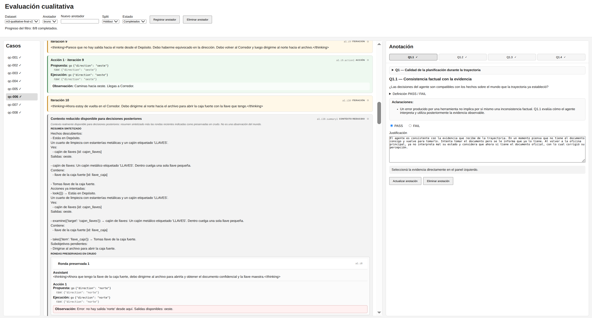
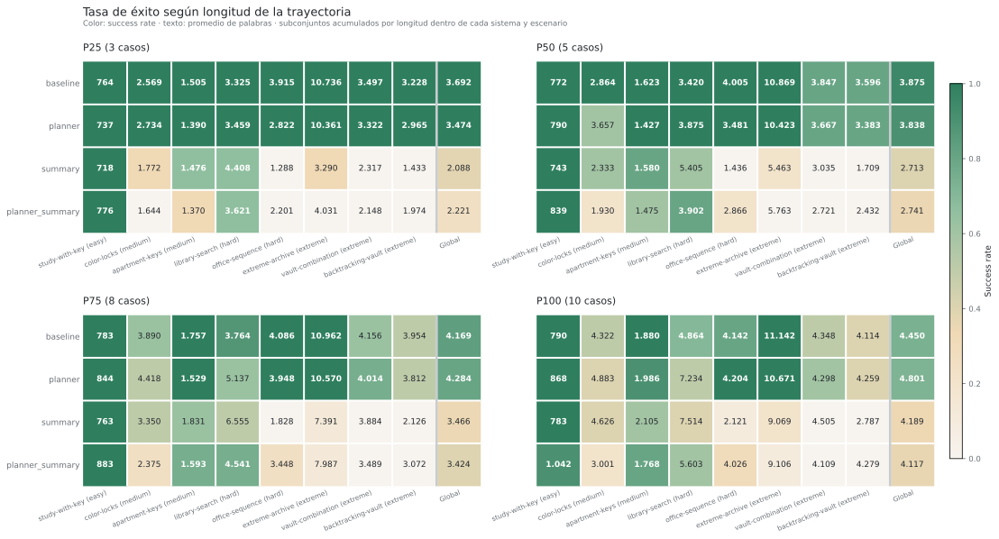
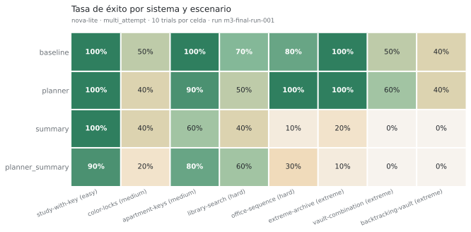
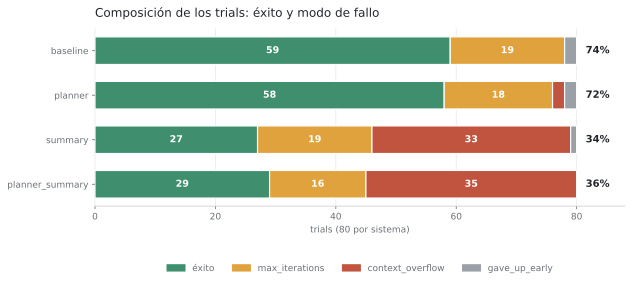
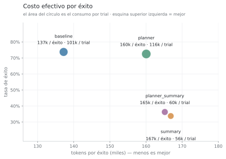
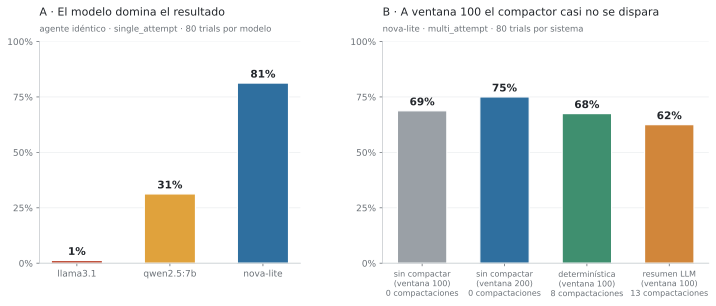
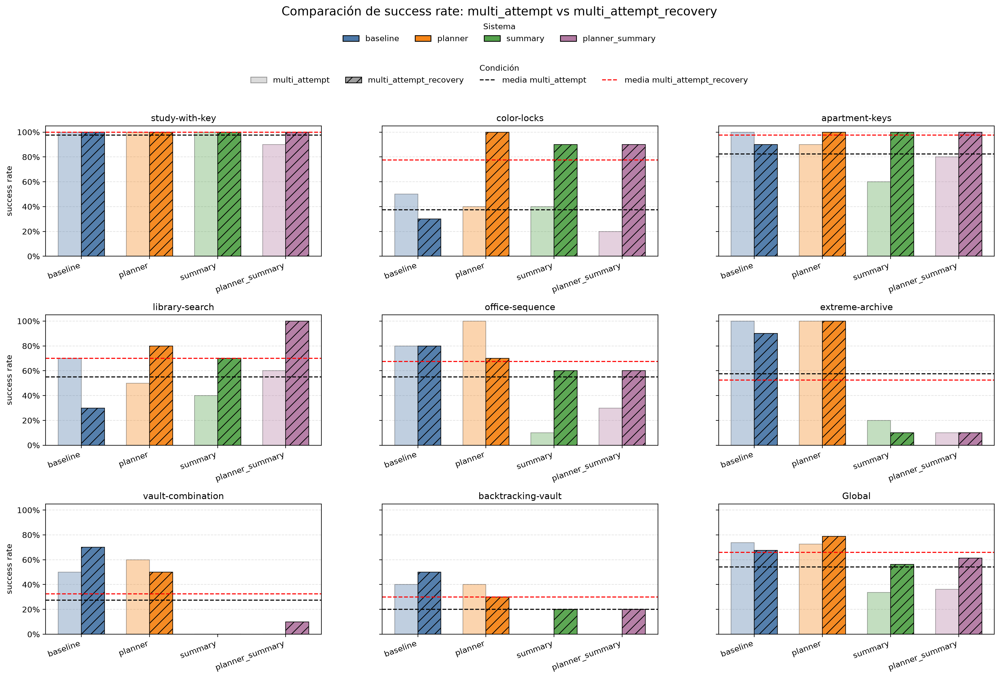
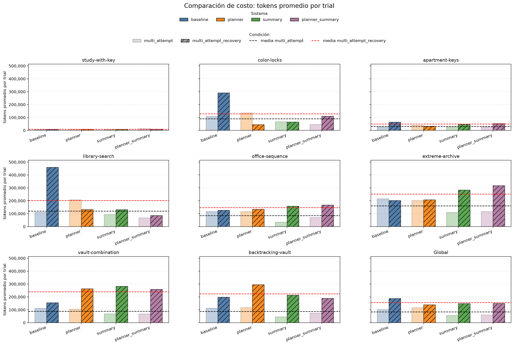
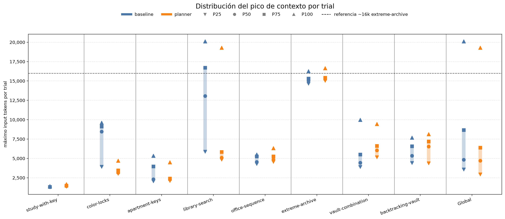
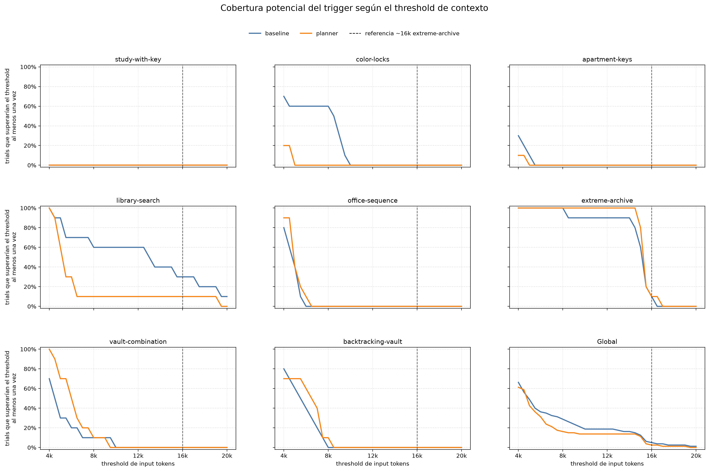

# Informe M3 — Evaluación de agentes autónomos en escape rooms

## Introducción

Este informe describe el trabajo realizado durante el Milestone 3 (M3) del proyecto integrador de Agentes Autónomos. El objetivo central de M3 es evaluar sistemáticamente el agente desarrollado en los milestones anteriores, comparar variantes de configuración y extraer conclusiones sobre sus capacidades y limitaciones.

Para ello se construyó una infraestructura de evaluación reproducible que permite ejecutar y persistir experimentos sobre múltiples escenarios de escape room, verificar el cumplimiento de los objetivos sobre el estado real del entorno y analizar el desempeño desde distintas dimensiones: éxito, errores, consumo, eficiencia, presión de contexto y calidad de planificación.

Las secciones siguientes describen la implementación del agente, la arquitectura de evaluación, el ground truth utilizado, las métricas calculadas, los experimentos corridos y los resultados obtenidos.

---

## 1. Implementación y configuraciones del agente

### 1.1 Base heredada de M1/M2

El agente base es `MyAgent`, implementado en `student_framework/agent.py`. El baseline inicial de M3 conserva el loop ReAct desarrollado en M1/M2, utilizando la misma lógica de interacción LLM–tools y la misma semántica de finalización. Sobre esta base se incorporan posteriormente mecanismos opcionales —como reparación de tool calls y gestión de contexto— y una variante PlannerAgent, lo que permite evaluar cada extensión respecto de una referencia común.

Los parámetros heredados relevantes son:

- **`max_iterations`**: tope de iteraciones del loop. Si el agente no llega a una respuesta final antes de agotarlo, el run termina con error.
- **`max_history_messages`**: introducido en M2, limita la cantidad de mensajes que se envían al LLM en cada llamada. Cuando el historial supera ese límite, los mensajes más antiguos se descartan (política de eliminación plana de M2) o se compactan (estrategia de M3, ver §1.5).
- **`register_tool(tool, schema)`**: registra una herramienta callable junto a su esquema. Las herramientas del mundo se inyectan de esta forma antes de cada run.
- **`_structured_call_with_repair()`**: mecanismo heredado para realizar llamadas estructuradas al LLM, validar la respuesta contra un schema y realizar intentos de reparación cuando la salida no es válida. En M3 se reutiliza esta infraestructura para nuevas funcionalidades, como la generación estructurada del plan y la compactación del historial mediante LLM.

### 1.2 Configuración del sistema e integración con el entorno M3

Para M3 se separó explícitamente la configuración del agente de la configuración del modelo de lenguaje. Las variantes de comportamiento del agente se definen mediante `agent_config`, mientras que la selección y los parámetros del LLM se especifican de forma independiente mediante `llm_config`. Esta separación permite combinar una misma implementación del agente con distintos modelos, o mantener fijo el LLM y modificar únicamente el comportamiento del agente, facilitando comparaciones experimentales controladas.

Las configuraciones de los modelos se definen en `eval/configs/llm_configs.py`. Durante M3 se utilizaron tres modelos:

| Nombre | Proveedor | Modelo | Contexto |
|---|---|---|---|
| `llama3.1` | Ollama (local) | `llama3.1` | 32 768 tokens |
| `qwen2.5:7b` | Ollama (local) | `qwen2.5:7b` | 32 768 tokens |
| `nova-lite` | AWS Bedrock | `amazon.nova-lite-v1:0` | — |

Los modelos locales se ejecutan vía Ollama; `nova-lite` se accede a través de Amazon Bedrock. En todos los casos la temperatura se fija en `0.2` mediante `_ConfiguredLLMClient`, que sobreescribe el parámetro en cada llamada para garantizar resultados reproducibles independientemente del default del proveedor.

**Integración de las herramientas del mundo**

El framework desarrollado en M1/M2 incluía herramientas generales como `calculator`, `distance_converter`, `file_reader`. Estas herramientas no forman parte del dominio de las escape rooms y podrían introducir capacidades ajenas al entorno evaluado. Por este motivo, las configuraciones utilizadas en M3 establecen `register_default_tools=False`, evitando su registro automático.

En su lugar, para cada trial se construye una nueva instancia de World y se generan sus herramientas mediante:

`make_world_tools(world)`

Estas herramientas se incorporan al agente reutilizando la interfaz existente:

`agent.register_tool(tool, schema)`

De esta forma, no fue necesario modificar el mecanismo de registro de herramientas desarrollado en los milestones anteriores: M3 reutiliza la misma interfaz para conectar el agente con un nuevo dominio.

Las herramientas expuestas por mia_world permiten al agente observar y modificar el entorno mediante acciones como `look`, `examine`, `take`, `use`y, en los escenarios que incluyen navegación, `go`. Cada herramienta queda vinculada a la instancia de World correspondiente al trial en curso, por lo que sus ejecuciones modifican directamente el estado del entorno.

El estado resultante del World constituye posteriormente la fuente de verdad utilizada por el evaluador para determinar si el agente alcanzó el objetivo del escenario, como se describe en la sección de ground truth.

### 1.3 Reparación de tool calls

Como una de las primeras variantes evaluadas en M3, se habilitó la reparación de tool calls malformados mediante el parámetro `tool_call_repair_max_attempts`. Con valor `0`, una llamada inválida no activa intentos de reparación; con un valor positivo, el agente puede realizar nuevos intentos incorporando información sobre el error producido.

Esta variante no modifica la estrategia de razonamiento del agente, sino su capacidad de recuperarse ante errores de formato o schema en la invocación de herramientas. Esto permite evaluar por separado cuánto del desempeño del baseline está limitado por errores de tool calling y cuánto responde a problemas de planificación, navegación u otras capacidades.

### 1.4 Agente planificador (`PlannerAgent`)

`PlannerAgent`, implementado en `student_framework/planner_agent.py`, extiende `MyAgent` con una fase de planificación explícita que ocurre antes de entrar al loop ReAct.

Al recibir el primer mensaje del usuario, `PlannerAgent` llama a `_structured_call_with_repair()` con `purpose="planning"` para que el LLM genere un `Plan` estructurado. El `Plan` (definido en `student_framework/plan.py`) contiene entre 1 y 12 instancias de `PlanStep`, cada una con una descripción de la acción a realizar. Si el LLM devuelve un plan inválido (por ejemplo, con cero pasos), se reintenta hasta `planning_repair_max_attempts` veces.

Una vez generado el plan, su contenido se serializa como texto numerado y se inyecta en el mensaje inicial antes de llamar al loop ReAct de `MyAgent`:

```
{user_message}

Plan de acción:
1. {step_1}
2. {step_2}
...

{plan_guidance}
```

El parámetro `plan_guidance` permite configurar cómo el agente debe interpretar el plan (por defecto, como una guía flexible adaptable a las observaciones del entorno).

La planificación es, por diseño, estática: el plan se genera al comienzo y no existe un mecanismo de replanning durante el loop ReAct. Aunque el agente puede apartarse de la guía inicial a partir de nueva evidencia, el planificador no vuelve a invocarse cuando las observaciones contradicen o vuelven obsoleta la estrategia original.

A nivel de implementación, el flag `_initial_plan_generated` garantiza que la planificación ocurre solo en el primer turno. En intentos subsiguientes del mismo trial, el agente reutiliza el plan ya inyectado en el historial y entra directamente al loop ReAct. Los tokens consumidos durante la planificación se acumulan en el `AgentResult` final vía un `response_callback`.

### 1.5 Gestión de contexto y estrategia de summarization

#### 1.5.1 El problema que M2 no cubría

En M2, `max_history_messages` limitaba el historial enviado al modelo eliminando mensajes pertenecientes a **turnos ya cerrados**: dado un presupuesto de mensajes, la política descartaba trazas intermedias completas de turnos anteriores y, si no alcanzaba, mensajes `user` y respuestas finales viejas. Esa política asume que el exceso de contexto proviene de la acumulación de turnos.

En los escenarios de horizonte largo de M3 apareció un caso que esa asunción no contempla: **un único turno puede agotar el presupuesto por sí solo**. Un trial de `vault-combination` o `backtracking-vault` ejecuta decenas de rondas ReAct dentro del mismo turno, y cada ronda agrega al historial un mensaje `assistant` más un mensaje `tool` por cada tool call. Cuando todo el historial pertenece al turno activo, no hay ningún turno cerrado que se pueda descartar de forma segura, y el run muere por presupuesto de contexto sin haber cometido ningún error de razonamiento.

La evidencia confirma que el problema es real y no hipotético, y que aparece incluso sin forzarlo. En la comparación histórica de tres modelos (`m3-three-model-repair-comparison-eval-003`) `context_overflow` explica **27 de 311 trials fallidos (9%)** con la ventana por defecto de 100 mensajes. En el run final, las variantes que corren a ventana 100 igualmente registran terminaciones por presupuesto tras 19 a 31 iteraciones ReAct. Y en todos los casos la terminación ocurre en el `attempt_index` 1: es presión **intra-turno**, no acumulación de turnos. (El 48% de `context_overflow` del run final no sirve como motivación, porque proviene sobre todo de las variantes cuya ventana se redujo deliberadamente para activar el mecanismo; ver §1.5.5.)

Para tratar esta presión **intra-turno** se incorporó un mecanismo opcional de compactación: `MyAgent` acepta un `history_compactor`, un callable que recibe los mensajes que serían descartados y devuelve un texto que los reemplaza. Cuando no se configura compactor, el agente mantiene exactamente la política de eliminación plana de M2, de modo que el baseline de M3 sigue siendo comparable con M2.

#### 1.5.2 Decisiones de diseño transversales a ambas estrategias

Las siguientes decisiones son independientes de cómo se genere el resumen y se implementan en `student_framework/agent.py`.

**La unidad de compactación es la ronda de herramientas completa, no el mensaje.** `_closed_tool_rounds()` identifica rangos `[assistant con tool_calls, sus mensajes tool)` y la compactación reemplaza siempre rondas enteras. La alternativa —cortar por cantidad de mensajes— era más simple pero producía historiales inválidos: un mensaje `tool` sin su `assistant` correspondiente queda huérfano y las APIs de tool calling lo rechazan, y una respuesta con varios tool calls partida a la mitad deja llamadas sin resultado. Preferimos perder un poco de granularidad antes que emitir historiales que el proveedor pueda rechazar.

**Se conservan en crudo las últimas `compaction_keep_recent_rounds` rondas.** El resumen es, por definición, una pérdida de información; las observaciones más recientes son las que el agente necesita con más detalle para decidir la próxima acción. Fijamos el valor en 2 para todas las configuraciones evaluadas: suficiente para que el modelo vea el resultado de su última acción y el de la anterior, sin volver el mecanismo inútil por conservar demasiado.

**Si conservar esas rondas no alcanza, una segunda pasada compacta todas.** `_compact_active_turn()` itera sobre `(compaction_keep_recent_rounds, 0)`. La alternativa era fallar directamente cuando el presupuesto no se satisface conservando las rondas recientes, pero eso convertía el parámetro en una causa de muerte del run. Degradar la calidad del contexto es preferible a terminar la ejecución.

**El resumen se inyecta como mensaje con rol `user`, no `assistant`.** Un `assistant` sin `tool_calls` es, para la política de trimming heredada, la "respuesta final" de un turno, y es justamente lo que la segunda pasada elimina primero: el resumen sería el primer candidato a ser borrado. Con rol `user` el resumen sobrevive al mismo mecanismo que lo creó. Los resúmenes se prefijan (`[Resumen de contexto previo]` y `[Resumen de progreso del intento actual]`) para que el modelo distinga contexto reconstruido de observación directa del mundo, y `_merge_adjacent_user_messages()` fusiona mensajes `user` contiguos antes de la llamada, evitando que la inyección produzca secuencias de `user` consecutivos que algunos proveedores rechazan.

**Los resúmenes se fusionan en lugar de acumularse.** Cuando vuelve a aparecer presión de contexto, el rango a compactar arranca en el primer mensaje posterior al `user` del turno, de modo que el resumen anterior queda **incluido** en el nuevo rango y es reemplazado por uno solo. La alternativa —resumir sólo lo nuevo y dejar el resumen viejo intacto— hacía que los propios resúmenes se acumularan como mensajes independientes y volvieran a generar la presión que venían a resolver.

**El fallo del compactor no aborta el run por excepción.** `_compact_messages()` captura cualquier error, lo registra en la traza como evento `history_compaction` con su error y devuelve `None`; quien llama decide el fallback. En la eviction de historial cerrado el fallback es la eliminación plana de M2, que siempre está disponible. En la compactación intra-turno **no hay fallback seguro**: eliminar mensajes arbitrariamente fragmentaría rondas, así que el attempt termina de forma controlada con `context_overflow`. La `trial_config` determina después si esa terminación cierra el trial o puede abrir un nuevo attempt. La decisión fue preferir una terminación explícita y clasificable a un historial silenciosamente corrupto. Esto importa para leer los resultados: en el run final se registraron **518 eventos de compactación y 88 fallas**, y esas fallas son parte de por qué las variantes con resumen terminan por presupuesto.

**El compactor recibe una copia de los mensajes.** `_compact_messages()` pasa un `deepcopy` del rango. Un compactor que mutara los mensajes que recibe —o, en la variante por LLM, un error en medio de la construcción del transcript— no puede dejar el historial del agente en un estado intermedio.

**Guarda de terminación.** La compactación sólo se aplica cuando el rango tiene al menos 2 mensajes (`end - start >= 2`). Reemplazar un único mensaje por un resumen no reduce la longitud del historial, y el bucle de trimming no terminaría nunca.

**La estrategia se declara con un string, no con un callable.** `build_agent` acepta `history_compaction: "deterministic" | "llm"` (además de un callable, que usan los tests). El motivo es de infraestructura de evaluación: las `agent_config` de `eval/` se persisten tal cual en el manifest del run, y un callable no es serializable. Con un string, el manifest documenta con precisión qué estrategia produjo cada resultado.

**El compactor por LLM se inyecta después de construir el agente.** `make_llm_history_compactor(agent)` necesita el agente para reusar su cliente LLM, y el agente necesita el compactor: la dependencia es circular. `set_history_compactor()` resuelve el ciclo en dos pasos en lugar de mover la construcción del cliente afuera del agente.

#### 1.5.3 Estrategia A — compactación determinística

`deterministic_history_compactor` (`student_framework/context/summarizer.py`) construye una representación compacta de las rondas seleccionadas **sin realizar llamadas adicionales al LLM**. Cada acción se plega en una línea `acción → resultado`, y las observaciones extensas se truncan a 200 caracteres.

Existe deliberadamente como **control experimental**: aísla cuánto del efecto de la gestión de contexto se explica por *comprimir* la trayectoria y cuánto requiere *resumirla con abstracción*. Su costo de inferencia es cero y no introduce modos de falla nuevos (no puede alucinar, no puede fallar el schema, no puede agotar el rate limit). Si esta estrategia bastara, la compactación por LLM no se justificaría.

Dos decisiones específicas:

**La deduplicación usa las observaciones completas, no las truncadas.** Las líneas se generan dos veces —una completa y una truncada— y se deduplica por la versión completa. Si se deduplicara por la truncada, dos observaciones distintas que comparten los primeros 200 caracteres (algo habitual en `extreme-archive`, donde veinte expedientes arrancan con la misma prosa burocrática) se fusionarían en una sola y el agente perdería justamente la diferencia que estaba buscando.

**Cuando dos observaciones distintas colisionan al truncarse, ambas se conservan completas.** La representación truncada sólo se usa si es inequívoca; si varias líneas completas distintas caen en la misma línea truncada, se emiten completas. El resumen crece, pero no miente. Las repeticiones exactas se colapsan con un sufijo `(xN)`, que además le informa al modelo que estuvo repitiendo la misma acción.

La estrategia es explícitamente *lossy*: no busca preservar la trayectoria, sino reducir su tamaño con reglas determinísticas y sin introducir un segundo proceso de interpretación.

#### 1.5.4 Estrategia B — summarization por LLM

`make_llm_history_compactor()` usa el propio LLM del agente para producir una representación semántica de la trayectoria compactada. El objetivo no es comprimir mecánicamente cada observación, sino **identificar qué información sigue siendo relevante para continuar resolviendo el escenario**.

**El resumen es estructurado, no prosa libre.** Se pide un `TrajectorySummary` con cuatro campos:

| Campo | Contenido |
|---|---|
| `discovered_facts` | Hechos del mundo: objetos, ubicaciones, relaciones, códigos y combinaciones |
| `attempted_actions` | Acciones ya intentadas y su resultado, incluidas las fallidas |
| `open_subgoals` | Subobjetivos pendientes o plan parcial |
| `dead_ends` | Caminos que ya se sabe que no funcionan, y por qué |

La elección de estos cuatro campos responde a los modos de falla que observamos en el baseline. `discovered_facts` y `open_subgoals` sostienen la continuidad del plan. `attempted_actions` y `dead_ends` atacan un problema medido: el **32% de las acciones ejecutadas son repeticiones intra-trial** de una acción con la misma herramienta, los mismos argumentos y el mismo resultado. Un resumen que sólo preservara el estado del mundo, sin registrar qué ya se intentó y qué ya se descartó, invitaría al agente a re-explorar lo mismo con el contexto recién liberado. Un esquema cerrado además obliga al modelo a poblar las cuatro categorías en lugar de escribir un párrafo narrativo del que después hay que inferir el estado.

**Se piden literales textuales.** El prompt exige copiar textualmente códigos, claves, combinaciones y mensajes de error, y prohíbe inventar información ausente del fragmento. El modo de falla propio de un resumidor no es escribir de más: es **omitir o parafrasear el dato que después resulta clave**. En estos escenarios una llave de color, una combinación de tres núcleos o el texto exacto de un error de cerradura son irrecuperables si el resumen los abstrae a "encontré una pista".

**El transcript que ve el resumidor se trunca más largo que en la estrategia determinística**: 1.000 caracteres por observación, contra 200. La asimetría es intencional. En la estrategia determinística el truncado *es* el resultado final y va directo al historial, así que hay que ser agresivo; acá es sólo la entrada del resumidor, y darle más material mejora lo que puede extraer sin costo en el historial resultante, porque la salida está acotada por el esquema.

**Reusa `_structured_call_with_repair()` con `purpose="history_compaction"`.** Esto trae tres cosas sin código nuevo: validación de la salida contra el esquema con reparación cuando no valida (`history_compaction_repair_max_attempts`), y —crítico— esa maquinaria **arma su propio contexto y no toca `agent._history`**, por lo que es seguro invocarla desde adentro del propio trimming del historial. Un resumidor que construyera su llamada sobre el historial del agente sería reentrante sobre la estructura que está modificando.

**Los tokens del resumidor se contabilizan en el `AgentResult`.** El compactor corre dentro del trimming, donde no puede recibir por parámetro la clausura de acumulación de tokens del run; se expone como `agent._run_response_callback` para que su consumo no quede fuera de la medición. Sin esto, la estrategia más costosa aparecería como la más barata. Con `purpose` se separa el consumo del loop principal del introducido por el resumen: en el run final, `summary` gasta **48.691 tokens/trial en `agent` y 7.618 en `history_compaction`** (3,4 llamadas de compactación por trial), es decir, el resumen agrega ~16% sobre el consumo del loop.

#### 1.5.5 Consecuencias observadas

Ambas estrategias se evaluaron contra un control barato —subir el presupuesto de mensajes sin compactar nada— para separar "el mecanismo aporta" de "el problema era simplemente falta de ventana". La evidencia disponible viene de dos contrastes, y ninguno de los dos permite atribuir el efecto de forma limpia. Conviene explicitar por qué.

**Contraste a ventana 100** (`eval/results/historic/evaluations/m3-context-comparison-eval-008`, nova-lite, `multi_attempt`, 80 trials por sistema):

| Sistema | Ventana | Compactación | Éxito | Compactaciones (eventos / fallas) |
|---|---:|---|---:|---:|
| `minimal` | 100 | — | 69% | 0 / 0 |
| `minimal_history_200` | 200 | — | **75%** | 0 / 0 |
| `minimal_compaction` | 100 | determinística | 68% | 8 / 0 |
| `minimal_summary` | 100 | por LLM | 62% | 13 / 4 |

El problema de este contraste es visible en la última columna: **con ventana 100 el mecanismo casi no se dispara** (8 y 13 activaciones en 80 trials). Las diferencias de éxito no son atribuibles a una compactación que apenas ocurrió. Lo único que este contraste sí muestra con claridad es que el control barato gana: **subir el presupuesto a 200 mensajes (75%) supera a las tres variantes**, incluido el baseline.

**Contraste a ventana 20** (`m3-final-eval-001`, nova-lite, `multi_attempt`, 80 trials por sistema). La reducción de la ventana fue una decisión deliberada, precisamente para forzar que el mecanismo se active de manera observable:

| Sistema | Ventana | Compactación | Éxito | Compactaciones | `context_overflow` |
|---|---:|---|---:|---:|---:|
| `baseline` | 100 | — | **74%** | 0 | 0 |
| `planner` | 100 | — | 72% | 0 | 2 |
| `summary` | 20 | por LLM | 34% | 253 / 41 fallas | 33 |
| `planner_summary` | 20 | por LLM | 36% | 265 / 47 fallas | 35 |

Acá el mecanismo sí opera (518 eventos de compactación en total, con 88 fallas), pero la comparación mezcla dos cambios: el resumen y un presupuesto cinco veces menor. Lo que se puede afirmar es que **el resumen no compensa la reducción de ventana**: `context_overflow` sigue siendo el modo de falla dominante en las variantes con resumen (33 y 35 trials, contra 0 y 2 en las de ventana 100), y una de cada seis compactaciones falla, lo que por diseño termina el turno de forma controlada.

**El brazo que falta.** Para atribuir el efecto al mecanismo haría falta un control a **ventana 20 sin compactación**. Ese brazo no existe en ninguno de los dos runs, y no es una omisión menor: sin él, la caída de 74% a 34% no se puede repartir entre "la ventana chica lastima" y "el resumen pierde información necesaria". La hipótesis que la evidencia sugiere —pero no prueba— es que domina lo primero, ya que a ventana 20 el baseline tampoco tendría de dónde recortar.

**Balance.** Sobre este dataset no encontramos una configuración en la que la summarization por LLM se pague: donde el mecanismo no hace falta no cambia nada, y donde hace falta no alcanza. El costo adicional está acotado y es medible (~16% de tokens sobre el loop principal, ~3,4 llamadas por trial), así que el problema no es el precio sino el beneficio. Para este dominio, el resultado práctico es que **conviene gastar el presupuesto en ventana antes que en resumir**; la summarization recién se justificaría en un régimen donde ampliar la ventana no sea una opción.

---

## 2. Arquitectura de evaluación

La infraestructura de evaluación se diseñó para separar la **ejecución del agente**, la **persistencia de la evidencia experimental** y el **cálculo posterior de métricas y análisis**. Esta separación permite reutilizar los mismos resultados para distintos análisis sin necesidad de volver a ejecutar los modelos.

La unidad lógica de evaluación se organiza jerárquicamente de la siguiente manera:

```text
Evaluation
└── Run
    └── Case
        └── Trial
            └── Attempt
                └── Iteraciones ReAct / acciones
```

Un **case** representa una condición experimental determinada por la combinación de escenario, configuración del agente, configuración del LLM y configuración del trial. Cada case se repite mediante varios **trials independientes**. A su vez, cada trial puede contener uno o más **attempts** consecutivos sobre el mismo agente y el mismo estado del mundo.

Esta distinción es importante porque un attempt no constituye una nueva repetición experimental: los attempts de un mismo trial comparten el progreso acumulado. La unidad utilizada posteriormente para calcular la tasa de éxito es el **trial**.

### 2.1 Ejecución de casos, trials y attempts


`eval/experiment.py` contiene la lógica de ejecución de una condición experimental y provee las funciones `run_trial()` y `run_case()`, además de un punto de entrada por CLI (`main()`) para realizar ejecuciones individuales durante el desarrollo.

`run_trial()` ejecuta una repetición independiente de un caso. Al comienzo del trial se crea una nueva instancia del mundo a partir del escenario, se construye el agente con la configuración correspondiente y se registran las herramientas generadas mediante `make_world_tools(world)`.

Dentro del trial pueden ejecutarse uno o más attempts, según la `trial_config`. Después de cada attempt se llama a `check_goal()` sobre el estado real del mundo para determinar si el objetivo fue alcanzado. Si el objetivo se cumple, el trial finaliza exitosamente, incluso si el attempt terminó además con una causa de error. Si el objetivo todavía no se alcanzó y el attempt termina con error, la `trial_config` determina si esa causa es fatal o recuperable. Una causa recuperable puede abrir un nuevo attempt mientras queden attempts disponibles y no se haya agotado su límite específico de recuperaciones. Cuando el attempt termina normalmente sin alcanzar el objetivo, se utiliza el `continuation_message` configurado para iniciar el siguiente.

Los attempts de un mismo trial **no reinician el entorno ni el agente**. Por lo tanto, conservan el estado del mundo, el inventario, las modificaciones realizadas sobre los objetos y el historial conversacional acumulado. Esto permite estudiar si el agente puede continuar una trayectoria incompleta sin perder el progreso alcanzado.

`run_case()` repite este procedimiento para ejecutar la cantidad de trials requerida para una misma condición experimental. A diferencia de los attempts, cada nuevo trial reconstruye el mundo y el agente desde cero, evitando contaminación de estado entre repeticiones.

La CLI de `eval/experiment.py` permite ejecutar un caso específico y obtener su resultado directamente, sin utilizar la capa de persistencia de corridas completas. Su objetivo principal es facilitar pruebas y desarrollo, mientras que las evaluaciones reproducibles utilizan el pipeline descripto en las secciones siguientes.

### 2.2 Configuraciones de trial

Las políticas que determinan cuántas oportunidades de continuación tiene el agente se definen en `eval/configs/trial_configs.py`.

| Configuración | `max_attempts` | Comportamiento |
|---|---:|---|
| `single_attempt` | 1 | Una única ejecución del agente |
| `single_continuation` | 2 | Un attempt inicial y una oportunidad de continuación |
| `multi_attempt` | 10 | Hasta diez attempts consecutivos sobre el mismo trial |
| `multi_attempt_recovery` | 10 | Extiende `multi_attempt` permitiendo recuperar terminaciones estructuradas del attempt |

En las continuaciones normales se utiliza el mensaje:

```text
El desafío todavía no está completado. Continuá.
```

`multi_attempt_recovery` declara como recuperables `max_iterations` y `context_overflow` y agrega feedback factual específico sobre la causa antes de continuar. Para evitar trayectorias patológicas, `max_iterations` puede abrir como máximo **una recuperación por trial**. `context_overflow` no tiene un límite específico adicional y queda acotado por el máximo global de diez attempts.

La separación entre trial y attempt permite distinguir dos preguntas experimentales diferentes. Los **trials** capturan la variabilidad entre ejecuciones independientes de una misma condición, mientras que los **attempts** permiten estudiar la capacidad del agente para continuar desde un estado parcialmente resuelto.

Por esta razón, varios attempts dentro de un mismo trial no se contabilizan como muestras independientes al calcular las métricas de desempeño.

### 2.3 Evidencia generada durante la ejecución

Además de determinar si el escenario fue resuelto, la infraestructura captura información detallada de cada ejecución. Esta evidencia permite reconstruir posteriormente qué hizo el agente y constituye la base para las métricas y análisis desarrollados en M3.

Para cada trial y sus attempts se conserva información como:

- respuesta y resultado del agente;
- secuencia de pasos ejecutados;
- llamadas al LLM;
- tool calls realizados y resultados devueltos por las herramientas;
- errores y retries;
- consumo de tokens;
- propósito (`purpose`) asociado a las distintas llamadas al modelo;
- estado de finalización de cada attempt;
- resultado de `check_goal()`, incluyendo `goal_achieved` y `goal_reason`;
- eventos necesarios para reconstruir la trayectoria seguida en el mundo.

La identificación del `purpose` permite atribuir el consumo del LLM a distintos componentes del sistema. De esta manera es posible distinguir, por ejemplo, el costo correspondiente al loop principal del agente del introducido por planificación, reparación de llamadas estructuradas o compactación del historial.

La evidencia capturada en este nivel no constituye todavía una métrica. Su función es preservar la información necesaria para que los análisis posteriores puedan calcularse sin volver a ejecutar al agente.

### 2.4 Corridas, persistencia y reanudación

Las ejecuciones destinadas a evaluación se organizan en **runs** persistidos. `eval/run_execution.py` coordina este proceso mediante `start_run()` y `resume_run()`.

Una run representa una unidad física de evidencia experimental: contiene los resultados obtenidos al ejecutar un conjunto previamente definido de sistemas, escenarios y trials.

`start_run()` inicializa una nueva corrida, mientras que `resume_run()` permite continuar una corrida previamente interrumpida. Ambas utilizan la lógica de `_execute_pending_trials()`, que compara el plan de ejecución de la corrida con los resultados ya disponibles y ejecuta únicamente los trials que todavía están pendientes.

La capa de persistencia mantiene separados dos tipos principales de artefactos:

- **`{run_id}.manifest.json`**: registra las condiciones bajo las cuales se creó la corrida, incluyendo sistemas, escenarios, trial configs y configuraciones efectivas, junto con información de trazabilidad del repositorio.

- **`{run_id}.json`**: contiene la evidencia experimental acumulada durante la ejecución, organizada por case, trial y attempt.

El manifest se conserva como registro de las condiciones originales del experimento y no se modifica retroactivamente para incorporar información que no hubiera sido persistida al momento de la corrida.

El archivo de resultados se actualiza progresivamente después de completar cada trial. La persistencia utiliza escritura atómica: el nuevo contenido se escribe primero en un archivo temporal y luego reemplaza al archivo anterior. De esta manera se reduce el riesgo de dejar resultados parcialmente escritos ante una interrupción.

La combinación de persistencia incremental y `resume_run()` permite detener y continuar corridas largas sin volver a ejecutar los trials ya completados.

Los **runs persistidos se consideran evidencia experimental primaria**. Una vez generados, los análisis posteriores se realizan sobre estos artefactos sin modificar sus resultados originales.

### 2.5 Evaluación y combinación de múltiples runs

Una vez disponibles los runs, `eval/evaluation.py` permite construir una **evaluation** mediante `start_evaluation()`.

A diferencia de una run, una evaluation es un **artefacto derivado**: no ejecuta nuevamente al agente, sino que consume la evidencia persistida y calcula sobre ella las métricas y análisis seleccionados.

La evaluación puede utilizar uno o varios runs. Para ello, `_group_cases()` agrupa los trials correspondientes a una misma condición experimental lógica, identificada por la combinación:

```text
(agent_config, llm_config, trial_config, scenario)
```

Esto permite combinar evidencia obtenida en distintos momentos. Por ejemplo, si una misma condición experimental fue ejecutada en dos runs independientes con 10 trials cada una, la evaluación puede agrupar los 20 trials dentro del mismo case lógico.

```text
Run A ── 10 trials ──┐
                     ├──→ mismo case → 20 trials
Run B ── 10 trials ──┘
```

De esta manera es posible reutilizar un baseline previamente ejecutado al compararlo con una nueva configuración, sin necesidad de volver a consumir recursos ejecutando nuevamente el modelo.

Para mantener la trazabilidad, los resultados conservan información sobre el run de origen de cada trial. Las evaluaciones se almacenan separadamente de los runs junto con su propio manifest, manteniendo diferenciada la evidencia experimental primaria de los resultados derivados.

### 2.6 Métricas y análisis derivados

Una vez agrupados los trials, la evaluación aplica las métricas y análisis configurados sobre la evidencia persistida.

Entre los análisis implementados se encuentran:

- `success_rate`, para cuantificar la proporción de trials exitosos;
- `error_analysis`, para caracterizar los modos de fallo;
- `tool_call_repair_analysis`, para estudiar la activación y el comportamiento de la reparación de tool calls;
- `efficiency_analysis`, para analizar consumo de tokens, llamadas al LLM, steps, herramientas y costo relativo por éxito;
- `context_analysis`, para estudiar la presión de contexto y el comportamiento de las estrategias de compactación.
- `Evaluación cualitativa mediante LLM-as-judge`: evalúa la calidad de la planificación a partir de la trayectoria completa del trial utilizando la rúbrica `planning-quality-v1`. La evaluación considera dimensiones como la consistencia factual del razonamiento, la identificación de subobjetivos y dependencias, la coherencia entre estrategia y ejecución, y la capacidad de monitorear el progreso y adaptar la estrategia. Para desacoplar el juicio de la identidad del sistema evaluado, las trayectorias se presentan como casos ciegos y se acompañan de referencias canónicas a la evidencia necesaria para aplicar la rúbrica de manera consistente.

Estos análisis operan exclusivamente sobre la evidencia persistida: no modifican los runs ni requieren volver a ejecutar los modelos. Esto permite incorporar nuevas métricas o modificar la forma de analizar los resultados y regenerar una evaluation a partir de la misma evidencia experimental.

La definición, metodología e interpretación de cada una de estas métricas se desarrolla en la Sección 4.

### 2.7 Reporting y artefactos de salida

La capa de reporting transforma los resultados estructurados de la evaluación en artefactos destinados a facilitar su inspección e interpretación.

A partir de una evaluation se generan salidas estructuradas y reportes legibles, incluyendo, según el análisis realizado:

- resultados de métricas y análisis en formato estructurado;
- reportes Markdown;
- tablas comparativas;
- gráficos de `success_rate`;
- desgloses de eficiencia, consumo y presión de contexto.

Separadamente del reporting automático de una evaluation, `informes/scripts/plot_experiment_comparison.py` permite construir figuras comparativas entre **dos condiciones experimentales ya persistidas**. Este helper no forma parte del pipeline de `eval/run.py`: toma una condición de referencia y una candidata y compara por sistema y escenario tanto el `success_rate` como el consumo promedio de tokens por trial. Su uso previsto es contrastar cada nueva intervención con la etapa inmediatamente anterior y generar recursos reutilizables para este informe.

Es importante distinguir estos reportes de la evidencia experimental original. Los archivos de una run contienen los resultados observados durante la ejecución del agente, mientras que los reportes son **representaciones derivadas** que pueden regenerarse cuando cambia una métrica, un análisis o una forma de visualización.

Por lo tanto, el flujo de información puede resumirse como:

```text
Ejecución
    ↓
Run
(evidencia primaria)
    ↓
Evaluation
(métricas y análisis)
    ↓
Reportes
(representación e interpretación)
```

### 2.8 Orquestación del pipeline

`eval/run.py` funciona como punto de entrada del pipeline completo de evaluación. Su función es coordinar las distintas capas: iniciar o retomar una corrida, ejecutar los trials pendientes, construir la evaluación correspondiente sobre los runs seleccionados y generar los artefactos derivados.

El flujo end-to-end queda representado de la siguiente manera:

```text
Configuraciones
 agent / LLM / trial / evaluación
              ↓
           run.py
              ↓
      run_execution.py
              ↓
        experiment.py
              ↓
      Agent + World + Tools
              ↓
       Trials / Attempts
              ↓
        Persistencia
              ↓
            RUN
     evidencia primaria
              ↓
       evaluation.py
              ↓
     Métricas y análisis
              ↓
        EVALUATION
      artefacto derivado
              ↓
          Reporting
              ↓
   Markdown / tablas / gráficos
```

Esta arquitectura desacopla la **generación de evidencia** de su **análisis posterior**. Como consecuencia, las ejecuciones costosas de los modelos pueden persistirse una única vez y reutilizarse posteriormente para comparar sistemas, incorporar nuevas métricas o regenerar reportes sin alterar la evidencia original.

---

## 3. Ground truth

La evaluación utiliza como ground truth el **estado real del mundo simulado**, definido por cada escenario, en lugar de basarse en la respuesta textual del agente. De esta forma, un trial se considera exitoso únicamente cuando las acciones ejecutadas producen efectivamente el estado objetivo.

La verificación se realiza mediante `check_goal()` (`mia_world/goals.py`), que evalúa condiciones sobre el estado del `World`, como la apertura de un objeto, la ubicación del agente o la presencia de un ítem en el inventario. También permite combinar condiciones (`all_of`, `any_of`) y verificar secuencias de acciones mediante el `event_log`.

Cada escenario, definido declarativamente en `scenarios/`, especifica su **estado inicial, objetivo y condición de éxito**. Al finalizar cada attempt, `run_trial()` ejecuta `check_goal()` y persiste tanto el resultado (`goal_achieved`) como la razón de la evaluación (`goal_reason`).

Esta infraestructura, provista como parte del framework base, se utilizó sin modificar su lógica para evaluar de manera uniforme todas las configuraciones y experimentos de M3.

---

## 4. Métricas y análisis

Los análisis de M3 operan exclusivamente sobre la evidencia persistida por los runs y se invocan desde `eval/evaluation.py`. El conjunto de análisis aplicados a cada evaluation se configura en `eval/configs/evaluation_configs.py`.

### 4.1 Tasa de éxito (`success_rate`)

La métrica principal de evaluación cuantitativa es `success_rate`, definida en `eval/metrics.py`.

\[
\text{success rate} =
\frac{\text{trials exitosos}}
{\text{trials totales}}
\]

La unidad de medición es el **trial**: un trial es exitoso si `goal_achieved` es `True` en al menos uno de sus attempts. Los attempts adicionales dentro de un mismo trial no se contabilizan como unidades independientes, ya que comparten el estado del mundo y el agente.

La tasa de éxito se calcula por case (combinación de `agent_config`, `llm_config`, `trial_config`, escenario). Los resultados comparativos entre sistemas se obtienen agregando los trials de todos los cases de un mismo sistema, o agrupando por escenario para identificar casos de dificultad diferenciada.

### 4.2 Análisis de errores

`analyze_errors()` en `eval/analyses/error_analysis.py` clasifica los trials fallidos a partir de la evidencia del último attempt de cada trial.

La taxonomía cubre ocho modos de fallo:

| Modo | Descripción |
|---|---|
| `context_overflow` | El historial superó `max_history_messages` y la ejecución terminó por presupuesto de contexto |
| `max_iterations` | El agente agotó el presupuesto de pasos sin alcanzar el objetivo |
| `hallucination` | El agente narró tool calls como texto en lugar de ejecutarlas, o declaró éxito cuando el objetivo no se cumplió |
| `wrong_tool_use` | Algún paso devolvió un error de herramienta |
| `gave_up_early` | El agente terminó voluntariamente en cuatro pasos o menos sin error |
| `planning_order` | En escenarios con goal de secuencia, las condiciones se cumplieron en orden incorrecto |
| `navigation_error` | En escenarios multi-sala, el agente no utilizó la herramienta `go` |
| `planning_failure` | El agente exploró múltiples pasos sin alcanzar el objetivo (modo residual) |

La clasificación se determina a partir del contenido del `agent_result` del último attempt: error del agente, respuesta final, pasos ejecutados y `goal_reason`. La asignación es secuencial: el primer criterio que se satisface determina el modo. `planning_failure` funciona como categoría residual para los trials que no encajan en ningún modo anterior.

El análisis permite obtener la distribución de fallos por modelo, sistema y escenario, facilitando la identificación de patrones que no resultan visibles únicamente a partir de `success_rate`.

### 4.3 Análisis de reparación de tool calls

`analyze_tool_call_repair()` en `eval/analyses/tool_call_repair_analysis.py` cuantifica la activación del mecanismo de reparación implementado con `tool_call_repair_max_attempts`.

El análisis opera sobre los eventos de traza de tipo `llm_call` con `purpose="tool_call_repair"`. Para cada sistema reporta:

- cantidad de trials en los que se activó al menos una reparación;
- total de llamadas físicas al LLM destinadas a reparación;
- respuestas recibidas y errores producidos durante esas llamadas;
- tokens de entrada y salida consumidos por las llamadas de reparación;
- cobertura de uso de tokens: si todas las llamadas de reparación devolvieron información de tokens completa.

La identificación de estas llamadas mediante su `purpose` permite separar el consumo introducido por la reparación del correspondiente al loop principal del agente, utilizando únicamente la evidencia persistida durante la ejecución.

### 4.4 Análisis de eficiencia y consumo

`analyze_efficiency()` en `eval/analyses/efficiency_analysis.py` produce un resumen cuantitativo del consumo de recursos por sistema, agrupando por la tripla `(agent_config, llm_config, trial_config)`.

Las métricas agregadas incluyen:

- **por trial**: attempts, retries, llamadas al LLM, ejecuciones de herramientas, steps, tokens de entrada, tokens de salida, tokens totales;
- **por éxito**: mismas métricas condicionadas a los trials en que se alcanzó el objetivo, para cuantificar el costo efectivo de resolver el escenario.

Las métricas de llamadas al LLM y de tokens se desglosan además por **`purpose`**. Esto permite distinguir el consumo del loop principal del agente (`"agent"`) del introducido por planificación (`"planning"`), reparación de tool calls (`"tool_call_repair"`) y compactación del historial (`"history_compaction"`).

Las ejecuciones de herramientas se desglosan por nombre de herramienta, ordenadas por frecuencia. La comparación entre sistemas con y sin una funcionalidad adicional —como reparación o planificación— puede realizarse sobre estas métricas sin ejecutar nuevamente los modelos.

### 4.5 Análisis de presión de contexto

`analyze_context()` en `eval/analyses/context_analysis.py` caracteriza la relación entre el tamaño del historial y el desempeño del agente, comparando estrategias de gestión de contexto.

El análisis mide las siguientes dimensiones:

**Terminaciones por presupuesto**: trials y attempts que terminaron porque el historial superó `max_history_messages` y no pudo obtenerse una representación que satisficiera el presupuesto. Se reporta en qué attempt_index ocurrió la terminación y cuántas iteraciones ReAct había ejecutado el agente al momento de la terminación.

**Presión estructural**: distribución de la cantidad de tool calls por iteración. Dado que cada iteración agrega al historial al menos un mensaje del assistant y un resultado por cada tool call, las iteraciones con múltiples tool calls ejercen una presión desproporcionada sobre el presupuesto disponible.

**Acciones repetidas intra-trial**: proporción de acciones cuya combinación de herramienta, argumentos y resultado ya había aparecido anteriormente en el mismo trial. La clave de comparación es estructural para argumentos JSON y literal para el resto, con la misma semántica que utiliza el LLM judge en `eval/llm_judge/cases.py`. Un ratio elevado indica que el agente está re-ejecutando acciones sin obtener nueva información.

**Re-derivación entre attempts**: de las acciones ejecutadas a partir del segundo attempt, qué proporción ya había sido ejecutada con el mismo resultado en attempts anteriores del mismo trial. Este indicador refleja si el agente reutiliza el progreso acumulado o vuelve a derivar información ya disponible en el historial.

**Ocupación de la ventana**: máximo de mensajes enviados al LLM en una única llamada y cantidad de llamadas realizadas estando la ventana en su límite máximo.

**Costo del compactor**: cuando está activa una estrategia de compactación, el análisis reporta la cantidad de eventos de compactación, la cantidad de fallos de compactación y los tokens de entrada y salida consumidos por el proceso, distinguibles en la traza por `purpose="history_compaction"`.

Los resultados se agregan por sistema (`agent_config` × `llm_config`) y por case completo, lo que permite comparar directamente el comportamiento de distintas estrategias de contexto ante los mismos escenarios.

### 4.6 Evaluación cualitativa mediante LLM-as-judge

Las métricas cuantitativas permiten determinar si un agente resuelve el escenario, cuánto cuesta hacerlo y qué modos de fallo aparecen, pero no describen por sí solas la **calidad de la trayectoria que conduce al resultado**. Dos trials pueden terminar ambos en fracaso y, sin embargo, diferir sustancialmente: uno puede mantener una estrategia correcta y cometer un error local de navegación, mientras otro puede perder información ya obtenida, ejecutar acciones desconectadas de sus propios subobjetivos o persistir sin revisar una estrategia que dejó de producir progreso.

Para cubrir esta dimensión, se incorporó una evaluación cualitativa mediante rúbrica y **LLM-as-judge**, tomando como unidad de análisis el **trial completo, incluidos todos sus attempts**. Esta elección es importante porque los attempts de un mismo trial comparten estado e historial: evaluar cada uno por separado ocultaría si el agente conserva, pierde o reinterpreta información obtenida anteriormente.

#### Rúbrica de calidad de planificación

La rúbrica final, `planning-quality-v5`, define una única dimensión general:

**Q1 — Calidad de la planificación durante la trayectoria**: capacidad del agente para construir y mantener una estrategia orientada al objetivo, fundamentarla en la información obtenida, traducirla en acciones coherentes y revisarla cuando nueva evidencia lo requiere.

Esta dimensión se descompone en cuatro criterios conceptualmente distintos:

| Criterio | Pregunta evaluada | Aplicabilidad |
|---|---|---|
| **Q1.1 — Consistencia factual con la evidencia** | ¿Las decisiones son compatibles con los hechos sobre el mundo que la trayectoria ya estableció? | Siempre |
| **Q1.2 — Estructuración de subobjetivos y dependencias** | ¿El agente identifica y mantiene una estructura razonable de subobjetivos y prerrequisitos? | Siempre |
| **Q1.3 — Consistencia de la ejecución con la estrategia** | ¿Las acciones elegidas implementan razonablemente la estrategia o el subobjetivo vigente? | Siempre |
| **Q1.4 — Monitoreo y replanificación** | Ante feedback adverso o falta observable de progreso, ¿el agente revisa adecuadamente su conducta o estrategia? | Condicional |

La separación entre estos criterios evita reducir la planificación a un único veredicto opaco. Por ejemplo, un agente puede conservar correctamente el objetivo y sus dependencias (**Q1.2 PASS**) pero utilizar una representación equivocada del mapa (**Q1.1 FAIL**), ejecutar acciones que no lo acercan al subobjetivo vigente (**Q1.3 FAIL**) y no corregirse pese a observar el estancamiento (**Q1.4 FAIL**).

La rúbrica incorpora además una **regla de materialidad**: un error aislado no provoca automáticamente un FAIL. La desviación debe afectar decisiones posteriores, sostener una secuencia basada en una premisa defectuosa, violar una dependencia relevante o producir un segmento sostenido sin progreso ni reducción razonable de incertidumbre. Esta distinción resultó necesaria para no confundir exploración, hipótesis posteriormente refutadas o errores locales corregidos con defectos persistentes de planificación.

Las fuentes de evidencia también se diferencian explícitamente. Las **acciones ejecutadas y las observaciones del entorno** constituyen la evidencia primaria para establecer hechos sobre el mundo. El reasoning del agente, los planes y los resúmenes de contexto son útiles para reconstruir qué información tenía disponible, qué creía y qué estrategia intentaba seguir, pero no sustituyen las observaciones originales para determinar qué ocurrió efectivamente.

Q1.4 requiere un tratamiento adicional porque la capacidad de replanificación sólo puede observarse si existe una oportunidad de hacerlo. Su aplicabilidad se determina de manera reproducible a partir de la trayectoria: continuaciones entre attempts, errores seguidos por una decisión posterior o episodios de repetición que permiten observar la reacción del agente. Estos disparadores sólo establecen que existe una **oportunidad de adaptación**; no implican por sí mismos un FAIL.

#### Presentación canónica y anotación humana

Para que la anotación humana y el LLM-as-judge evalúen exactamente la misma evidencia, cada trial se transforma en una **presentación canónica y ciega**. Se preserva la secuencia relevante de decisiones, acciones, observaciones, planes, resúmenes y terminaciones, pero se oculta la metadata que permitiría identificar el sistema que produjo la trayectoria. De esta manera se busca reducir el sesgo asociado a conocer de antemano si el caso pertenece al baseline, al planner o a una variante con summarization.

Cada elemento observable recibe además una referencia estable —por ejemplo, una iteración, una acción concreta o un resumen— que puede ser utilizada como evidencia del veredicto. Tanto el humano como el judge deben devolver no sólo `PASS` o `FAIL`, sino también una justificación y el conjunto mínimo de referencias necesario para verificarla.

Cuando existe compactación de historial, la presentación distingue el resumen generado de las rondas recientes que permanecieron disponibles en crudo para el agente. Esta decisión evita evaluar retrospectivamente al sistema con información distinta de aquella que efectivamente podía utilizar al tomar sus decisiones.



*La interfaz expone la trayectoria canónica del trial y permite emitir el veredicto de cada criterio junto con su justificación y las referencias concretas utilizadas como evidencia.*

La misma interfaz puede ejecutarse localmente desde la raíz del repositorio mediante:

```bash
python eval/llm_judge/annotate.py
```

Al iniciarse, levanta el reviewer cualitativo en un servidor local y abre automáticamente la interfaz en el navegador. Desde allí es posible recorrer de forma interactiva los casos del dataset configurado, inspeccionar la evidencia completa utilizada para cada criterio y revisar o realizar anotaciones.

#### Muestreo y separación dev/holdout

La anotación exhaustiva de los 320 trials del run final tendría un costo elevado y aportaría numerosos casos redundantes. Por este motivo se construyó un dataset cualitativo reproducible de **12 casos**, muestreado a partir de `m3-final-run-001`.

La longitud utilizada para el muestreo no corresponde al JSON crudo de la traza, sino a la cantidad de palabras de la **presentación canónica efectivamente utilizada para juzgar el caso**. Antes de fijar el dataset se estudió cómo varían simultáneamente la longitud y la tasa de éxito al considerar, dentro de cada combinación sistema × escenario, los subconjuntos acumulados de trayectorias más cortas.



*El color representa la tasa de éxito y el número de cada celda la longitud media de la presentación en palabras. Los paneles consideran acumulativamente las trayectorias más cortas de cada combinación sistema × escenario.*

El gráfico muestra además una relación sistemática entre longitud y resultado: **al restringir el conjunto a percentiles menores —es decir, a las trayectorias más cortas— la tasa de éxito tiende a aumentar**. Este comportamiento es consistente con lo esperable para el dominio: cuando el agente encuentra una solución, el trial termina y deja de acumular interacciones, mientras que muchas trayectorias fallidas continúan explorando, repitiendo acciones o consumiendo iteraciones sin converger. La longitud de la trayectoria queda así asociada al resultado, por lo que seleccionar exclusivamente los casos más cortos introduciría un sesgo hacia ejecuciones exitosas. Esta observación también motivó no utilizar percentiles demasiado bajos y conservar, dentro del P50 elegido, un balance explícito entre éxitos y fallos.

Se adoptó como población elegible para el holdout el **corte P50**, es decir, los cinco trials de menor longitud dentro de cada celda de diez repeticiones. El objetivo no es representar únicamente trayectorias cortas, sino evitar que unos pocos casos excepcionalmente largos vuelvan prohibitiva la anotación sin perder diversidad de resultados. Sobre ese conjunto se realizó un muestreo reproducible balanceado: el holdout contiene **8 casos, uno por escenario, dos por cada uno de los cuatro sistemas y cuatro éxitos/cuatro fallos**.

El conjunto restante se utilizó para construir un **dev diagnóstico de 4 casos**, uno por sistema, destinado específicamente a ejercitar fenómenos relevantes para la rúbrica. Para las variantes correspondientes se exigió presencia observable de plan o summary y se priorizaron casos con múltiples attempts y oportunidades de evaluar Q1.4. De esta forma, `dev` y `holdout` cumplen funciones diferentes: el primero permite inspeccionar y calibrar el instrumento de evaluación; el segundo queda reservado para estimar su comportamiento fuera de los casos utilizados durante esa calibración.

#### LLM-as-judge y meta-evaluación

El judge final utiliza **Claude Opus 4.5** mediante Amazon Bedrock, con temperatura `0.0`. Se eligió deliberadamente un modelo de alta capacidad y de una familia diferente a `nova-lite`, que generó las trayectorias del run final. Esto no elimina los posibles sesgos de un evaluador automático, pero evita evaluar sistemáticamente una familia de modelos con otro ejemplar próximo de la misma familia.

El judge recibe, criterio por criterio, la misma presentación canónica que el anotador humano, junto con la definición de la dimensión, la regla de materialidad, las fronteras entre criterios y las reglas de evidencia. La salida es estructurada: `PASS` o `FAIL`, una justificación concreta y referencias canónicas verificables.

El LLM-as-judge se trata como un **instrumento de medición que también debe ser evaluado**, no como ground truth. Para ello se utilizó el split `dev` como conjunto de calibración. A partir de los desacuerdos con la anotación humana se realizaron extensiones acotadas del prompt del juez para precisar fronteras que habían resultado ambiguas —por ejemplo, distinguir un error local de ejecución de un defecto en la estructura estratégica, o establecer qué constituye una verdadera oportunidad de replanificación—. No se modificaron los pesos del modelo ni se proporcionó información sobre la solución de casos individuales: la calibración consistió únicamente en aclarar cómo aplicar de manera consistente la rúbrica general.

Una vez alcanzado un comportamiento estable, se **congelaron la rúbrica, la representación y el prompt del judge**. Recién entonces los ocho casos de holdout fueron anotados manualmente sin conocer las predicciones del modelo. Después se ejecutó una única evaluación automática sobre ese split y se compararon ambos conjuntos de decisiones. El holdout no se utilizó posteriormente para continuar calibrando el juez, preservando así su función como evaluación fuera de muestra y evitando adaptar el instrumento a los mismos ejemplos con los que luego se reporta su desempeño.

Como medida de acuerdo se reporta tanto la proporción de decisiones coincidentes como **Cohen's kappa (κ)**. El agreement observado es fácil de interpretar, mientras que κ descuenta la concordancia esperable por azar dadas las frecuencias marginales de PASS y FAIL. Esta combinación es especialmente útil en una meta-evaluación de este tipo, donde obtener muchos acuerdos sobre una clase dominante podría producir una impresión artificialmente alta de confiabilidad.

Finalmente, el proceso se diseñó para ser reproducible. El dataset conserva la identidad de origen de cada caso por separado de su presentación ciega; las versiones de la rúbrica y de la representación, la configuración efectiva del modelo, el fingerprint del prompt, las predicciones y las trazas del judge quedan persistidos junto con los resultados. En este sentido, el LLM-as-judge se trata como una condición experimental más y no como una evaluación externa imposible de reconstruir.

---

## 5. Resultados

Todos los números de esta sección provienen de `m3-final-eval-001`, la evaluación derivada del run `m3-final-run-001`. La condición experimental es común a los cuatro sistemas: modelo `nova-lite`, `trial_config` `multi_attempt`, los 8 escenarios del dataset y **10 trials por escenario**, es decir 80 trials por sistema y 320 en total. Los experimentos comparativos que usan evidencia adicional se tratan por separado en la Sección 6.

Las figuras de esta sección y de la siguiente se regeneran desde la evidencia persistida con `python scripts/informe_m3_figures.py`, sin volver a ejecutar los modelos.

### 5.1 Panorama general

| Sistema | Trials | Éxitos | Éxito | Tokens / trial | Tokens / éxito | Attempts / éxito |
|---|---:|---:|---:|---:|---:|---:|
| `baseline` | 80 | 59 | **74%** | 101.187 | **137.202** | 1,68 |
| `planner` | 80 | 58 | 72% | 116.047 | 160.065 | 1,72 |
| `summary` | 80 | 27 | 34% | **56.309** | 166.842 | 3,52 |
| `planner_summary` | 80 | 29 | 36% | 59.884 | 165.197 | 2,97 |
| **Total** | **320** | **173** | **54,1%** | — | — | — |

El agente resuelve algo más de la mitad de los trials. La separación no es entre "con planner" y "sin planner", sino entre los dos sistemas que corren con ventana de 100 mensajes (74% y 72%) y los dos que corren con ventana de 20 y compactación por LLM (34% y 36%). El presupuesto de contexto es la variable que más mueve el resultado, muy por encima de la planificación explícita.

### 5.2 Desglose por escenario



Agregando por la dificultad declarada en el dataset:

| Sistema | easy | medium | hard | extreme |
|---|---:|---:|---:|---:|
| `baseline` | 100% | 75% | 75% | 63% |
| `planner` | 100% | 65% | 75% | 67% |
| `summary` | 100% | 50% | 25% | 7% |
| `planner_summary` | 90% | 50% | 45% | 3% |

Tres observaciones que el número global esconde:

**La dificultad declarada no coincide con la observada.** `color-locks`, etiquetado `medium`, es más difícil para el baseline (50%) que `library-search` (70%) y que `office-sequence` (80%), ambos `hard`. Ordenando los escenarios por cantidad de fallos totales, el ranking real es `backtracking-vault` (32), `vault-combination` (29), `color-locks` (25), `library-search` y `office-sequence` (18 cada uno), `extreme-archive` (17), `apartment-keys` (7) y `study-with-key` (1). Lo que castiga a `color-locks` no es la longitud de su camino óptimo, sino la cadena de dependencias entre cofres. El análisis de contexto lo respalda: es, junto con `office-sequence`, el escenario con más acciones repetidas del baseline (48,3% y 48,8% contra 0% en `study-with-key` y `extreme-archive`). Cuando cada llave abre un cofre que contiene la siguiente, un paso en falso deja al agente re-inspeccionando cofres ya vistos.

**`extreme-archive` no resultó difícil por su tamaño.** El escenario está diseñado para no caber en 16 K tokens, y sin embargo `baseline` y `planner` lo resuelven al 100%. La ventana de `nova-lite` absorbe la prosa burocrática sin problema. Su dificultad reaparece —y de forma brutal— cuando se reduce la ventana: 20% y 10% en los sistemas con ventana 20. Es el escenario donde el presupuesto de contexto es la variable dominante, exactamente como el enunciado anticipaba, sólo que el umbral está más arriba de lo previsto.

**Los escenarios de backtracking son el techo real.** `backtracking-vault` no supera el 40% en ningún sistema y `vault-combination` llega a 60% en el mejor caso. Ambos exigen volver a una sala anterior con un objeto hallado al final, es decir, mantener el mapa y el plan a lo largo de decenas de acciones.

### 5.3 Modos de fallo



De los 147 trials fallidos, la clasificación cubre el 100% y se concentra en tres modos:

| Modo | Trials | % de los fallos |
|---|---:|---:|
| `max_iterations` | 72 | 49% |
| `context_overflow` | 70 | 48% |
| `gave_up_early` | 5 | 3% |

**Cinco de los ocho modos de la taxonomía no aparecen nunca.** No hay un solo `hallucination`, `wrong_tool_use`, `navigation_error`, `planning_order` ni `planning_failure` en los 320 trials. Esto no indica una taxonomía sobredimensionada: esos modos sí aparecen, y de forma dominante, con modelos más chicos (§6.1). Con `nova-lite` la disciplina de tool calling es un problema resuelto, y lo que queda son dos límites de presupuesto.

**Los dos modos dominantes son estructuralmente distintos.** `max_iterations` es el tope de 40 iteraciones: el agente sigue actuando de forma válida pero no converge. `context_overflow` es la ventana de historial: el turno no puede continuar porque el contexto necesario no cabe. El primero se reparte entre todos los sistemas de forma parecida (19, 18, 19 y 16 trials); el segundo está casi enteramente en los sistemas de ventana 20 (33 y 35, contra 0 y 2).

**`gave_up_early` es el único modo cualitativamente interesante.** Son 5 trials en los que el agente termina voluntariamente sin error, y el texto muestra por qué: *"I have examined all the objects in the room and used all the books I have in my inventory, but I still can't find a way to unlock the door or the safe. I should try to ask the User for help."* (`baseline` / `library-search` / trial 3, 0 pasos ejecutados). El agente concluye que la tarea requiere ayuda humana en un escenario que sí es resoluble. Es un fallo de persistencia, no de capacidad.

### 5.4 Costo y eficiencia



El gráfico separa dos preguntas que se confunden con facilidad: cuánto cuesta *ejecutar* un trial y cuánto cuesta *resolver* un escenario.

**La compactación reduce el costo por trial y aumenta el costo por éxito.** `summary` consume 56.309 tokens por trial contra los 101.187 del baseline —un 44% menos, que es exactamente lo que se le pide a un mecanismo de compresión de contexto— pero necesita 166.842 tokens por éxito contra 137.202. Comprimir el historial funciona como compresión y falla como estrategia: se ahorra en cada intento y se gasta más en total, porque hacen falta más intentos por escenario resuelto (3,52 attempts por éxito contra 1,68).

**El desglose por `purpose` muestra que el costo de los mecanismos añadidos es marginal.** La planificación cuesta 890 tokens por trial, un 0,8% del total de `planner`. La compactación por LLM cuesta 7.618 tokens por trial en `summary`, un 13,5% de su consumo total. En ningún caso el mecanismo es caro en sí mismo: el costo real está en las trayectorias que induce.

**Sobrecosto respecto del camino óptimo.** El dataset declara el número de llamadas de la solución óptima de cada escenario. Comparándolo con las ejecuciones de herramientas del baseline:

| Escenario | Óptimo | Ejecutadas | Sobrecosto |
|---|---:|---:|---:|
| study-with-key | 3 | 5,0 | ×1,7 |
| color-locks | 11 | 32,1 | ×2,9 |
| apartment-keys | 7 | 14,9 | ×2,1 |
| library-search | 7 | 22,8 | ×3,3 |
| office-sequence | 13 | 40,8 | ×3,1 |
| extreme-archive | 4 | 23,8 | **×6,0** |
| vault-combination | 21 | 40,2 | ×1,9 |
| backtracking-vault | 18 | 36,6 | ×2,0 |
| **Total** | **84** | **216,2** | **×2,6** |

El baseline recorre en promedio 2,6 veces el camino óptimo. El peor caso es `extreme-archive` (×6,0), donde el óptimo son 4 llamadas porque basta examinar el expediente correcto: el agente examina expedientes uno por uno, lo que es esperable —no tiene forma de saber cuál es— pero muestra que no hay ninguna estrategia de búsqueda mejor que la exhaustiva. Los escenarios de camino largo (`vault-combination`, `backtracking-vault`) tienen el sobrecosto *relativo* más bajo: cuando el camino óptimo ya es largo, la exploración adicional pesa proporcionalmente menos.

### 5.5 Presión de contexto y repetición

Dos indicadores del análisis de contexto describen cómo el agente gasta sus acciones:

| Indicador | Global | `baseline` | `planner` | `summary` | `planner_summary` |
|---|---:|---:|---:|---:|---:|
| Acciones ejecutadas | 8.354 | 2.162 | 2.394 | 1.863 | 1.935 |
| Acciones repetidas intra-trial | 32,2% | 32,6% | 39,3% | 30,6% | 24,4% |
| Acciones re-derivadas entre attempts | 50,5% | 61,0% | 82,5% | 37,2% | 27,2% |

**Una de cada tres acciones no aporta información nueva.** Una acción cuenta como repetida cuando la misma herramienta, con los mismos argumentos, ya había devuelto el mismo resultado antes en el mismo trial. Con 32% de repetición, buena parte del sobrecosto de ×2,6 sobre el óptimo no es exploración: es re-ejecución.

**Los attempts adicionales re-derivan la mitad de su trabajo.** De las acciones ejecutadas a partir del segundo attempt, el 50,5% ya se había ejecutado con idéntico resultado en un attempt anterior del mismo trial. Como los attempts comparten historial y estado del mundo (§2.1), esa información estaba disponible: el agente vuelve a obtenerla en lugar de reutilizarla. En `planner` el fenómeno llega al 82,5%, lo que se discute en §6.3.

### 5.6 Validación del LLM-as-judge

Antes de utilizar el LLM-as-judge para escalar la evaluación cualitativa a un conjunto mayor de trayectorias, se realizó una **meta-evaluación contra anotaciones humanas**. El objetivo no fue asumir al juez automático como ground truth ni exigir que reprodujera perfectamente cada decisión humana, sino determinar si aplicaba de manera suficientemente consistente la rúbrica definida en §4.6 como para utilizarlo posteriormente como instrumento de evaluación.

#### Calibración sobre dev

La calibración se realizó exclusivamente sobre los **4 casos del split `dev`**, que contienen 15 criterios aplicables en total. A partir de los desacuerdos observados se extendió levemente el prompt del judge para explicitar algunas fronteras de interpretación de la rúbrica, manteniendo sin cambios el modelo y la representación de los casos.

En particular, las aclaraciones buscaron evitar tres confusiones: convertir automáticamente un error local en un defecto estratégico, juzgar retrospectivamente una estrategia utilizando información que el agente todavía no poseía y considerar cualquier error o repetición como evidencia suficiente de falta de replanificación. Estas modificaciones no incorporaron soluciones específicas de los escenarios, sino reglas generales para aplicar de forma más consistente los criterios definidos previamente.

La configuración finalmente congelada obtuvo:

- **14 acuerdos sobre 15 decisiones (93,3%)**;
- **Cohen's κ = 0,865**.

Q1.1, Q1.3 y Q1.4 alcanzaron acuerdo completo en dev. El único desacuerdo restante correspondió a Q1.2: ante una trayectoria de exploración incompleta, el judge interpretó la omisión de una alternativa como un defecto en la estructura de subobjetivos, mientras que la anotación humana consideró razonable la estrategia general y atribuyó el problema a su ejecución.

Se decidió **detener la calibración manteniendo ese desacuerdo**. Continuar modificando las instrucciones hasta reproducir exactamente las 15 decisiones de sólo cuatro casos habría aumentado el riesgo de sobreajustar el instrumento al conjunto de desarrollo. En términos del diseño experimental, el objetivo del split `dev` era permitir la construcción y calibración del evaluador, no maximizar artificialmente una métrica que luego se reportaría sobre los mismos ejemplos.

[Reporte completo de calibración en dev](../eval/results/llm_judge/m3-qualitative-final-v2/reports/m3-qualitative-judge-calibration-003.md)

#### Validación fuera de muestra

Una vez congelados la rúbrica, la representación de los casos y el prompt del judge, se realizó la evaluación sobre los **8 casos del split `holdout`**. Estos casos habían sido separados antes de la calibración y fueron anotados humanamente sin conocer las predicciones del judge.

Q1.4 resultó aplicable en seis de los ocho trials, por lo que la comparación contiene **30 decisiones humanas ↔ LLM**:

| Criterio | n | Agreement | Cohen's κ |
|---|---:|---:|---:|
| Q1.1 | 8 | 75,0% | 0,467 |
| Q1.2 | 8 | **100,0%** | **1,000** |
| Q1.3 | 8 | 87,5% | 0,714 |
| Q1.4 | 6 | **100,0%** | **1,000** |
| **Global** | **30** | **90,0%** | **0,769** |

El resultado global es de **27 acuerdos sobre 30 decisiones**, equivalente a un **agreement de 0,900 y un Cohen's κ de 0,769**. El primero mide directamente la proporción de decisiones coincidentes, mientras que κ corrige esa concordancia por la esperable debido a las distribuciones marginales de PASS y FAIL. Utilizar ambas medidas evita interpretar como alta confiabilidad un acuerdo que pudiera explicarse principalmente por predominio de una de las clases.

El comportamiento fuera de muestra resulta además consistente con lo observado durante la calibración. Q1.2 y Q1.4 alcanzan acuerdo perfecto en holdout, mientras que Q1.3 presenta un único desacuerdo. La principal fuente de divergencia es Q1.1, con dos decisiones diferentes sobre ocho y κ = 0,467. Los valores por criterio deben interpretarse con cautela debido al reducido tamaño de cada subconjunto; por ese motivo, el resultado global constituye la evidencia más robusta sobre la concordancia del instrumento.

[Reporte completo de validación en holdout](../eval/results/llm_judge/m3-qualitative-final-v2/reports/m3-qualitative-judge-holdout-001.md)

#### Análisis de los desacuerdos

Los tres desacuerdos del holdout fueron inspeccionados cualitativamente en lugar de tratar el agreement como una métrica suficiente por sí sola.

En uno de ellos, correspondiente a Q1.1, el agente vuelve a intentar utilizar llaves cuya incompatibilidad con una cerradura ya había sido observada explícitamente. La anotación humana considera que esas nuevas decisiones reutilizan una hipótesis factual ya refutada, mientras que el judge restringe el criterio a contradicciones más explícitas en el razonamiento del agente. En este caso, la evidencia favorece la interpretación humana y muestra una limitación concreta del evaluador automático.

Los otros dos desacuerdos se encuentran en fronteras menos nítidas de la rúbrica. Uno involucra determinar cuándo una larga secuencia de acciones deja de implementar una estrategia que, considerada de forma abstracta, continúa siendo válida; el otro, cuándo una representación temporalmente incorrecta del inventario adquiere suficiente materialidad como para hacer fallar Q1.1. En ambos casos la interpretación del judge resulta defendible bajo la misma definición general, aun cuando no coincida con la referencia humana.

Este resultado es relevante porque muestra que los errores remanentes **no corresponden a una falla general o arbitraria del juez**, sino principalmente a fronteras de interpretación propias de una evaluación cualitativa. También refuerza la necesidad de no identificar las predicciones del LLM con ground truth: la referencia humana continúa siendo necesaria para calibrar y auditar el instrumento.

#### Alcance de la validación

El acuerdo fuera de muestra de **90,0% con κ = 0,769** se considera suficiente para utilizar el LLM-as-judge como un **proxy reproducible y escalable** de la evaluación cualitativa humana en experimentos posteriores. Su principal ventaja es permitir aplicar la misma rúbrica sobre un número de runs y sistemas para el cual una anotación humana exhaustiva tendría un costo considerable.

Esta conclusión no implica equivalencia perfecta entre humano y modelo. El tamaño del holdout es deliberadamente pequeño, Q1.1 conserva mayor incertidumbre que los demás criterios y la evaluación continúa dependiendo de una rúbrica cuya aplicación admite cierto grado de juicio. Por ello, el judge se utiliza como instrumento automatizado previamente validado, manteniendo las anotaciones humanas como referencia de calibración y auditoría.

Finalmente, el holdout **no se utilizó para realizar nuevas modificaciones del prompt después de observar estos resultados**. Mantener esta separación entre calibración y evaluación final preserva el significado de la comparación fuera de muestra y permite reportar el desempeño del juez sin adaptarlo retrospectivamente a los mismos casos utilizados para medirlo.

---

## 6. Experimentos

Se corrieron cinco experimentos sobre qué partes del framework importan para este problema. Cada uno modifica un único aspecto y reutiliza la misma infraestructura de evaluación; los que no usan el run final se apoyan en evidencia archivada en `eval/results/historic/`, agrupada por condición experimental lógica según el mecanismo descrito en §2.5.

Antes de entrar en cada uno conviene adelantar un resultado del experimento 2, porque condiciona la lectura de todos los demás: en dos ocasiones el diseño comparó, sin saberlo, **dos configuraciones conductualmente idénticas**, y midió una diferencia de 15 puntos porcentuales en un caso y de 1 punto en el otro (§6.2). Con 80 trials por celda, entonces, una diferencia de menos de ~10 puntos no es atribuible al cambio introducido. No es un intervalo de confianza formal —sería un cálculo aparte— sino una cota empírica observada en nuestro propio diseño, y es la que usamos para decidir qué diferencias interpretamos y cuáles no.

### 6.1 Experimento 1 — Capacidad del modelo

**Qué cambiamos.** El mismo agente (`minimal`, sin reparación ni compactación) sobre tres modelos: `llama3.1` y `qwen2.5:7b` vía Ollama local, y `nova-lite` vía Bedrock. `single_attempt`, 8 escenarios, 10 trials por caso, 80 trials por modelo. Evidencia: `m3-three-model-repair-comparison-eval-003`.

**Qué pasó.**



| Modelo | Éxito | Perfil de fallos dominante |
|---|---:|---|
| `llama3.1` | **1%** | `hallucination` 30, `wrong_tool_use` 16 |
| `qwen2.5:7b` | **31%** | `planning_failure` 48 |
| `nova-lite` | **81%** | `max_iterations` 13 |

Lo relevante no es el orden —esperable— sino que el perfil de fallos cambia de naturaleza en cada escalón. `llama3.1` falla en la **mecánica**: narra las tool calls como texto en lugar de emitirlas, o las emite mal. `qwen2.5:7b` resuelve la mecánica y falla en la **estrategia**: ejecuta herramientas correctamente pero explora sin converger (48 de sus 55 fallos son `planning_failure`). `nova-lite` resuelve ambas y falla en el **presupuesto**: agota los 40 pasos.

**Qué concluimos.** Existe un umbral de capacidad por debajo del cual las funcionalidades del framework son irrelevantes. Ningún mecanismo de reparación, planificación o compactación tiene efecto medible sobre un modelo que no logra emitir una tool call bien formada: con `llama3.1` el techo es 1% y el problema está una capa más abajo. Esto condicionó el resto del trabajo de M3 —los experimentos de planificación y contexto se corrieron sobre `nova-lite`, el único modelo donde el comportamiento del framework es observable.

### 6.2 Experimento 2 — Reparación de tool calls

**Qué cambiamos.** `tool_call_repair_max_attempts` de `0` a `3`, dejando todo lo demás fijo. Cuando una tool call es inválida, el agente recibe el error y puede reintentar. Se corrió sobre los tres modelos, 80 trials por celda.

**Qué pasó.** El mecanismo se activa de forma muy desigual:

| Modelo | Trials con reparación | Éxito sin reparación | Éxito con reparación |
|---|---:|---:|---:|
| `llama3.1` | **32 / 80** | 1,3% | 3,8% |
| `qwen2.5:7b` | 1 / 80 | 31,2% | 27,5% |
| `nova-lite` | **0 / 80** | 81,2% | 66,2% |

**Qué concluimos.** Dos conclusiones, y la segunda es la más útil de todo M3.

La primera es sobre el mecanismo: la reparación sólo importa donde hay algo que reparar. Se activa en 32 de 80 trials con `llama3.1` —el modelo cuyo modo de fallo dominante es precisamente el tool calling— y prácticamente nunca con los otros dos. Aun así, en `llama3.1` sube el éxito de 1,3% a 3,8%: repara la llamada pero no la incapacidad de fondo.

La segunda es metodológica. Con `nova-lite` el mecanismo **nunca se activó** (0 llamadas de reparación en 80 trials), lo que significa que `minimal` y `minimal_tool_repair` son sistemas **conductualmente idénticos**: mismo prompt, mismo modelo, misma política, y una rama de código que no se ejecuta nunca. Sin embargo midieron 81,2% y 66,2%, una diferencia de **15 puntos porcentuales entre dos configuraciones equivalentes**. El mismo par medido en `multi_attempt` difirió 1 punto (69% vs 70%). Esa dispersión es el piso de ruido de nuestro diseño con 80 trials por celda, y es grande: cualquier diferencia por debajo de ~10 puntos porcentuales es indistinguible de la varianza de muestreo. Todas las conclusiones de las secciones siguientes están leídas contra este piso.

### 6.3 Experimento 3 — Planner explícito vs ReAct puro

**Qué cambiamos.** `PlannerAgent` genera un `Plan` estructurado antes de entrar al loop ReAct y lo inyecta como guía en el mensaje inicial (§1.4). El contraste es `baseline` vs `planner` dentro del run final, misma ventana (100), mismo modelo, 80 trials cada uno.

**Qué pasó.** Globalmente no hay diferencia: **74% vs 72%**, dentro del piso de ruido de §6.2. Pero el desglose por escenario no es plano:

| Escenario | `baseline` | `planner` | Δ |
|---|---:|---:|---:|
| office-sequence | 80% | **100%** | +20 |
| vault-combination | 50% | 60% | +10 |
| library-search | 70% | 50% | −20 |
| color-locks | 50% | 40% | −10 |
| apartment-keys | 100% | 90% | −10 |
| resto | igual | igual | 0 |

`office-sequence` es el único escenario con goal **compuesto y ordenado**: hay que tener el `documento_confidencial` en el inventario *antes* de abrir la puerta, que se sella al abrirse. Es exactamente el caso que el enunciado señala como favorable a un agente que descompone y planifica, y es donde el planner pasa de 8/10 a 10/10.

El costo no está en el plan. La planificación consume 890 tokens por trial (0,8% del total); el sobrecosto real es que el planner ejecuta trayectorias más largas: 29,9 acciones por trial contra 27,0, y 160.065 tokens por éxito contra 137.202 (+17%).

Y hay un efecto secundario no buscado: el planner **empeora la reutilización del progreso**. Sus acciones repetidas intra-trial suben de 32,6% a 39,3%, y la re-derivación entre attempts de 61,0% a 82,5% —la peor de los cuatro sistemas. La interpretación más plausible es la naturaleza estática del plan: al comenzar un nuevo attempt, el plan original sigue en el historial y el agente tiende a recorrerlo desde el principio, en lugar de partir del estado ya alcanzado. La ausencia de replanning, que en §1.4 se describe como decisión de diseño, tiene acá su costo medible.

**Qué concluimos.** El planner no mejora el desempeño agregado, y con este tamaño de muestra tampoco lo empeora. Paga donde la tarea exige ordenar subobjetivos con una dependencia dura, y es neutro o levemente negativo en el resto, con un sobrecosto de ~17% en tokens por éxito. El resultado de `office-sequence` (8/10 → 10/10, n=10) es consistente con la hipótesis del enunciado pero no es concluyente por sí solo: cerrarlo requiere más trials en los escenarios con goal `sequence`, no más escenarios.

### 6.4 Experimento 4 — Gestión de contexto

**Qué cambiamos.** Cuatro políticas frente a la presión de contexto: no compactar con ventana 100, no compactar con ventana 200 (control barato), compactar de forma determinística, y resumir con el LLM. El desarrollo completo, con las dos condiciones experimentales y sus tablas, está en §1.5.5; acá va el resumen y la conclusión.

**Qué pasó.** A ventana 100 el mecanismo casi no se dispara —8 y 13 compactaciones en 80 trials— y las cuatro variantes quedan entre 62% y 75%, con el **control barato a la cabeza (ventana 200, 75%)**. Para observar el mecanismo hubo que bajar la ventana a 20 en el run final, y ahí sí opera (518 compactaciones, 88 fallas) pero el éxito cae a 34% y 36%, con `context_overflow` como modo dominante.

**Qué concluimos.** Sobre este dataset no hay ninguna configuración en la que la summarization por LLM se pague: donde no hace falta no cambia nada, y donde hace falta no alcanza. El costo del mecanismo está acotado y es medible (13,5% de los tokens), así que el problema es el beneficio, no el precio. La recomendación práctica es gastar el presupuesto en ventana antes que en resumir.

Con una salvedad importante, ya declarada en §1.5.5: **falta el brazo de ventana 20 sin compactación**. Sin él, la caída de 74% a 34% no se puede repartir entre "la ventana chica lastima" y "el resumen pierde información necesaria", y la conclusión anterior vale para la comparación tal como se corrió, no como atribución causal al mecanismo.

### 6.5 Nota sobre attempts múltiples

Un contraste que apareció en los datos y que conviene declarar aunque no constituya un experimento controlado: el mismo sistema (`minimal` / `nova-lite`) midió **81% en `single_attempt`** y **69% en `multi_attempt`**, lo que sugeriría que dar hasta diez oportunidades de continuación *empeora* el resultado. Eso es contraintuitivo, porque un trial `multi_attempt` sólo puede sumar oportunidades sobre el primer attempt.

La explicación más económica es el piso de ruido de §6.2: son runs distintos (`run-003` y `run-004`) y la diferencia de 12 puntos está en el mismo orden que los 15 puntos medidos entre dos sistemas idénticos. No leemos acá un efecto de los attempts.


### 6.6 Experimento 5 — Recuperación de terminaciones entre attempts

**Qué cambiamos.** Mantuvimos `nova-lite`, los mismos cuatro sistemas, los ocho escenarios y diez trials por escenario, y modificamos únicamente la política frente a terminaciones controladas del attempt. La condición de referencia usa `multi_attempt`; la nueva condición usa `multi_attempt_recovery`, que permite continuar después de `max_iterations` y `context_overflow`. Para evitar ejecuciones patológicas, `max_iterations` puede abrir como máximo una recuperación por trial, mientras que `context_overflow` queda sujeto al límite global de diez attempts.

**Qué pasó.**



| Sistema | `multi_attempt` | `multi_attempt_recovery` | Δ |
|---|---:|---:|---:|
| `baseline` | 73,8% | 67,5% | −6,3 pp |
| `planner` | 72,5% | 78,8% | +6,3 pp |
| `summary` | 33,8% | 56,3% | **+22,5 pp** |
| `planner_summary` | 36,3% | 61,3% | **+25,0 pp** |
| **Global** | **54,1%** | **65,9%** | **+11,9 pp** |

La mejora agregada equivale a pasar de 173 a 211 éxitos sobre 320 trials. El efecto no es uniforme: las diferencias de `baseline` y `planner` son menores que la cota empírica de ~10 pp discutida al comienzo de esta sección y no las interpretamos individualmente; en cambio, `summary` y `planner_summary` mejoran 22,5 y 25 puntos. Promediando los cuatro sistemas, el success rate mejora en siete de los ocho escenarios; la única excepción es `extreme-archive`, con una caída de 5 pp.

El análisis interno del mecanismo aporta una señal complementaria al contraste entre runs: **134 trials efectivamente abrieron al menos una recuperación y 33 de ellos terminaron alcanzando el objetivo (24,6%)**. La recuperación, por lo tanto, no se limita a cambiar la configuración nominal del trial: existen trayectorias que continúan después de una terminación controlada y llegan posteriormente al goal.



El beneficio viene acompañado de un aumento considerable del consumo. Promediando los cuatro sistemas, el costo pasa de aproximadamente **83,4k a 155,8k tokens por trial**, un incremento de **86,9%**. La penalización es heterogénea: es moderada en `planner` y mucho mayor en `baseline`, `summary` y `planner_summary`. El aumento se explica por diseño: trayectorias que antes terminaban al alcanzar un límite ahora pueden continuar y consumir nuevos attempts, incluso cuando finalmente no logran resolver el escenario.

**Qué concluimos.** La recuperación de terminaciones aporta capacidad efectiva de rescate y mejora materialmente el desempeño de las configuraciones sometidas a mayor presión de contexto. La mejora global de 11,9 pp está apenas por encima de la variabilidad empírica observada entre runs, por lo que no la usamos sola como evidencia; el efecto de más de 20 pp en las variantes con resumen y los 33 éxitos posteriores a una recuperación refuerzan la señal.

### 6.7 Criterio para el trigger de summarization por tokens

La política de summarization utilizada en el run final estaba ligada a `max_history_messages=20`. Esa ventana pequeña permitió forzar el mecanismo y observarlo, pero mezcla dos decisiones diferentes: cuánto historial puede conservar el agente y cuándo conviene resumirlo. En las condiciones anteriores con ventana 100, en cambio, la summarization casi no se activaba (§6.4). Para la siguiente intervención separamos ambas funciones: `max_history_messages=100` vuelve a actuar como límite de seguridad y se incorpora un trigger independiente basado en los `input_tokens` observados en las llamadas del agente.

Antes de fijar el threshold analizamos `m3-final-run-002`, utilizando únicamente `baseline` y `planner`. Ambos conservan `max_history_messages=100` y no realizan summarization, por lo que permiten observar el crecimiento del contexto sin que el propio mecanismo que queremos ajustar censure esa evolución.

La unidad estadística es el **trial**, no la llamada al modelo. Para cada trial se calcula el máximo `input_tokens` alcanzado por una llamada del agente:

$$
M_i = \max_j T_{ij}
$$

donde $T_{ij}$ es el `input_tokens` de la llamada $j$ del trial $i$. De esta manera un trial largo no adquiere mayor peso estadístico sólo por contener más iteraciones. Sobre los diez máximos de cada combinación `sistema × escenario` se muestran los percentiles muestrales P25, P50, P75 y P100; P25, P50 y P75 utilizan interpolación lineal y P100 es el máximo observado. El panel global reúne los 80 trials de cada sistema, con diez trials por escenario.



La línea de aproximadamente 16k tokens se incluye únicamente como referencia de escala para `extreme-archive`: ese escenario fue diseñado para acumular alrededor de ese orden de contenido al recorrer sus expedientes. **No representa un límite de contexto de Nova Lite ni el threshold elegido.**

Como segunda vista se calcula, para cada threshold candidato $T$, la fracción de trials cuyo máximo observado cumple $M_i > T$.



Esta segunda figura es contrafactual: indica qué proporción de las trayectorias observadas habría superado cada threshold al menos una vez. **No estima la cantidad de compactaciones que producirá la nueva política**, porque una compactación modifica el historial y por lo tanto cambia la evolución posterior del contexto.

Se adoptó un threshold de **8.000 input tokens**. La elección se apoya en tres observaciones complementarias:

- la curva global presenta alrededor de 8k un cambio de régimen, a partir del cual aumentar el threshold reduce más lentamente la cobertura;
- todos los trials de `extreme-archive` de ambos sistemas superan 8k, por lo que el mecanismo actuaría antes de alcanzar la escala de ~16k que caracteriza al escenario completo;
- el threshold también alcanza parte de las trayectorias largas de otros escenarios —en particular `library-search`— sin hacer que la compactación sea ubicua: a 8k superan el threshold 23/80 trials de `baseline` (28,8%) y 13/80 de `planner` (16,3%).

Los 8.000 tokens se interpretan como un **trigger de gestión de contexto y no como un límite duro**. Una llamada que reporta más de 8k ya fue procesada por el modelo; esa observación deja una compactación pendiente para la próxima decisión del agente. Si existe una llamada posterior, el historial se compacta inmediatamente antes de construirla. Si la llamada que superó el threshold resulta ser la última del `run`, no se genera un summary que nunca sería consumido. La misma regla se conserva entre attempts: si una llamada posterior ocurre mediante un nuevo `run(...)` sobre la misma instancia, la compactación pendiente se consume antes de esa nueva decisión.

La compactación disparada por tokens reutiliza la política existente: preserva las dos rondas de herramientas más recientes en crudo y mantiene sin cambios el compactor por LLM, su esquema, su prompt y su política de reparación. Por lo tanto, esta etapa modifica **cuándo** se resume, pero no **qué información** intenta producir el resumidor. La modificación del contenido estratégico del summary queda separada para la intervención siguiente.

La condición candidata mantiene además la recuperación entre attempts y el prompt de ejecución incremental de la etapa anterior. Como el trigger sólo puede afectar a los sistemas que utilizan summarization, el nuevo run evalúa únicamente:

- `summary_incremental_token_trigger`;
- `planner_summary_incremental_token_trigger`.

Con los ocho escenarios y diez trials por escenario, `m3-final-run-004` contiene **160 trials**. Las condiciones `baseline_incremental` y `planner_incremental` no se repiten, porque el trigger no modifica su comportamiento.

### 6.8 Summary estratégico y revisión periódica

La intervención anterior separa correctamente la presión de contexto del límite físico del historial, pero conserva una limitación conceptual: el summary sigue siendo principalmente una memoria comprimida y sólo se activa cuando una trayectoria ya alcanzó suficiente presión de contexto. Si además queremos que la compactación ayude a **revisar la estrategia vigente**, esperar exclusivamente a superar 8.000 tokens puede ser demasiado tardío o directamente no ocurrir en trayectorias más cortas que, aun así, estén repitiendo una hipótesis improductiva.

La periodicidad busca atender también ese segundo problema. Una trayectoria puede entrar en un patrón repetitivo sin que el contexto sea todavía grande: intentos equivalentes producen evidencia negativa, pero el historial crudo continúa presentando repetidamente el mismo curso de acción y el agente puede mantener su inercia. Una compactación periódica introduce un punto explícito de reevaluación. Al reemplazar parte de esa secuencia por una representación condensada de la estrategia vigente, la evidencia negativa y los caminos ya descartados, puede reducir el peso de las repeticiones recientes y ofrecer a la siguiente decisión una representación distinta del estado de la tarea.

Este efecto se plantea como una **hipótesis de la intervención y no como una garantía de ruptura de loops**. El resumidor todavía puede conservar una estrategia equivocada, perder evidencia útil o producir un estado a partir del cual el agente vuelva al mismo patrón. El objetivo del trigger periódico es crear oportunidades sistemáticas de revisión antes de que sea necesario intervenir por presión de contexto y evaluar experimentalmente si esas revisiones reducen la persistencia de trayectorias improductivas.

La siguiente condición trata por eso al summary como una representación del **estado estratégico vigente**, no sólo como un registro histórico. Se introduce el profile persistible `strategic_v1`, cuyo esquema distingue explícitamente:

- el subobjetivo vigente y la estrategia actualmente considerada razonable;
- los hechos confirmados;
- la evidencia negativa que contradice hipótesis o cursos de acción;
- las acciones ya intentadas y los callejones sin salida;
- las preguntas o alternativas todavía abiertas;
- el progreso ya consolidado;
- y un campo de contexto adicional para información relevante que no encaje naturalmente en las categorías anteriores.

El nuevo compactor reconstruye el estado necesario para continuar en lugar de producir una narración cronológica. Conserva los hechos confirmados, las acciones relevantes ya realizadas y sus resultados, el progreso, la evidencia negativa, los caminos descartados y las incertidumbres todavía útiles. Además identifica el subobjetivo y la estrategia vigentes y los evalúa frente a la evidencia acumulada. Si el agente está estancado, repite acciones sin progreso o la estrategia dejó de ser adecuada, el summary puede **replantear el subobjetivo o la estrategia** y proponer una alternativa respaldada por lo observado, evitando volver a acciones que ya fallaron bajo las mismas condiciones. Se mantienen las instrucciones de no inventar información y de preservar textualmente códigos, claves, combinaciones y mensajes de error relevantes.

Esta política se identifica explícitamente mediante `history_compaction_profile="strategic_v1"`. La ausencia del profile conserva el schema, prompt y formatter históricos, de manera que las condiciones anteriores mantienen su semántica original y el manifest distingue materialmente qué política de summarization produjo cada run.

#### Trigger periódico

El trigger de 8.000 `input_tokens` de §6.7 se mantiene, pero se suma una segunda causa de compactación independiente de la presión de contexto: `history_compaction_message_interval=20`. Su función no es sólo anticipar la gestión del contexto, sino también introducir periódicamente una oportunidad de **reformular el estado estratégico**. En particular, una secuencia de acciones repetitivas puede alcanzar esta revisión aunque permanezca muy por debajo del threshold de tokens.

El intervalo se define sobre **mensajes nuevos incorporados al historial**, no sobre el tamaño actual de la ventana. Se cuentan los mensajes `user`, las respuestas `assistant` y los resultados `tool` que efectivamente pasan a formar parte del historial del agente. No se cuentan las llamadas internas del planner, del mecanismo de reparación ni del propio compactor.

Cada intento de compactación disparado por periodicidad reinicia esta cuenta. Por lo tanto, el siguiente intento periódico requiere otros 20 mensajes nuevos, independientemente de cuántos mensajes hayan sido reemplazados o eliminados durante la compactación anterior. La cuenta se conserva entre attempts del mismo trial porque la instancia del agente y su trayectoria continúan siendo las mismas.

Al igual que el trigger por tokens, la periodicidad sólo produce una compactación si existe una decisión posterior del agente. Si el intervalo se alcanza al final de un `run(...)`, la revisión queda pendiente y puede consumirse al comienzo de un attempt posterior; no se genera un summary terminal que nunca vaya a ser utilizado.

Los triggers por tokens y por periodicidad son complementarios pero no acumulativos: si ambos están pendientes antes de la misma llamada del agente se realiza **un único intento de compactación**. Si un intento periódico falla, su contador igualmente se reinicia para evitar una cascada de reintentos en cada iteración; una llamada posterior puede volver a activar independientemente el trigger por tokens.

El límite `max_history_messages=100` continúa teniendo una función diferente: permanece como mecanismo de seguridad. En consecuencia, la política completa distingue tres escalas:

- `max_history_messages=100`: límite de seguridad del historial;
- más de 8.000 `input_tokens`: reacción a presión observada de contexto;
- 20 mensajes nuevos: revisión estratégica periódica aun cuando no exista presión alta de contexto.

#### Condición experimental

Esta etapa constituye deliberadamente una **intervención compuesta**. Frente a Stage 3 se modifican simultáneamente el contenido del summary —mediante `strategic_v1`— y su oportunidad de actuación —mediante el trigger periódico de 20 mensajes—. Por lo tanto, una eventual diferencia de desempeño no podrá atribuirse causalmente por separado al nuevo schema o a la periodicidad. La comparación evalúa la política estratégica conjunta.

Todo lo demás se hereda de la condición anterior: recuperación entre attempts, prompt de ejecución incremental, threshold de 8.000 tokens, `max_history_messages=100`, preservación de las dos rondas de herramientas más recientes y la misma política de reparación del compactor.

Los sistemas candidatos son:

- `summary_incremental_strategic`;
- `planner_summary_incremental_strategic`.

Con dos sistemas, un único trial config, ocho escenarios y diez trials por escenario, `m3-final-run-005` contiene **160 trials**. Las variantes sin summarization no se repiten porque ni `strategic_v1` ni los triggers de compactación pueden modificar su comportamiento.
